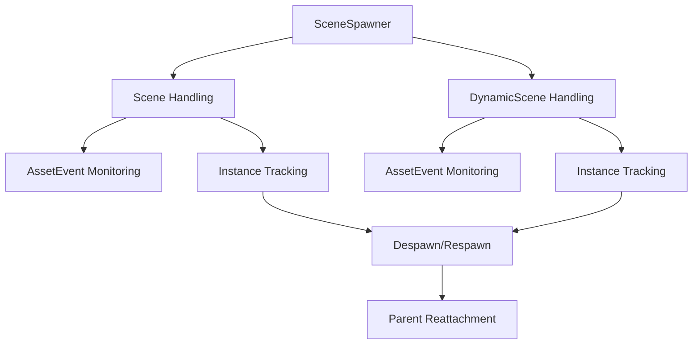

+++
title = "#18358 Fix Scene hot reloading."
date = "2025-07-21T00:00:00"
draft = false
template = "pull_request_page.html"
in_search_index = true

[taxonomies]
list_display = ["show"]

[extra]
current_language = "en"
available_languages = {"en" = { name = "English", url = "/pull_request/bevy/2025-07/pr-18358-en-20250721" }, "zh-cn" = { name = "中文", url = "/pull_request/bevy/2025-07/pr-18358-zh-cn-20250721" }}
labels = ["C-Bug", "A-Scenes", "D-Modest"]
+++

# Fix Scene hot reloading.

## Basic Information
- **Title**: Fix Scene hot reloading.
- **PR Link**: https://github.com/bevyengine/bevy/pull/18358
- **Author**: andriyDev
- **Status**: MERGED
- **Labels**: C-Bug, S-Ready-For-Final-Review, A-Scenes, M-Needs-Migration-Guide, D-Modest
- **Created**: 2025-03-17T07:44:21Z
- **Merged**: 2025-07-21T22:30:42Z
- **Merged By**: alice-i-cecile

## Description Translation
# Objective

- Fixes #14698

## Solution

- Refactor all the `SceneSpawner` functions to include a `_dynamic` suffix where appropriate.
- Add non-DynamicScene versions of functions on `SceneSpawner`.
- Listen for `Scene` `AssetEvent`s and update the corresponding spawned scenes.
- Despawn scenes before respawning them.
- Store the parent of a scene in its `InstanceInfo`, so that we know where to parent the new entities from a hot-reloaded scene.
- Make `InstanceInfo` private (none of our APIs returned it anyway).

## Testing

- Ran the `hot_asset_reloading` example and mutated the GLTF to see it be updated. It works! Moving around meshes works in Blender works, deleting meshes also seems to work.
- Wrote a test for scene and dynamic scene to ensure they continue to hot-reload.

---

## Migration Guide

- Some of the methods on `SceneSpawner` have been renamed:
    - `despawn` -> `despawn_dynamic`
    - `despawn_sync` -> `despawn_dynamic_sync`
    - `update_spawned_scenes` -> `update_spawned_dynamic_scenes`
- In their place, we've also added `despawn`, `despawn_sync`, and `update_spawned_scenes` which all act on `Scene`s (as opposed to `DynamicScene`s).

## The Story of This Pull Request

### The Problem and Context
Scene hot reloading wasn't working correctly in Bevy. When developers modified scene assets at runtime, existing scene instances wouldn't update to reflect the changes. This was particularly problematic for workflows requiring iterative design changes, where seeing immediate updates without restarting the application is crucial. The core issue was that the scene management system wasn't properly listening for asset modifications and lacked mechanisms to update existing scene instances.

### The Solution Approach
The solution involved several coordinated changes to the scene spawning system. First, we needed to distinguish between regular `Scene` and `DynamicScene` operations in the API. Second, we implemented proper asset event handling for both scene types. Third, we modified the update process to completely despawn old scene instances before respawning updated versions to avoid entity duplication and hierarchy corruption. Finally, we added parent tracking to ensure reloaded scenes maintain their original hierarchy positions.

### The Implementation
The implementation centered around refactoring `SceneSpawner` to handle both scene types separately. We added dedicated tracking for regular scenes alongside existing dynamic scene handling. The key changes included:

1. **API Refactoring**: We renamed dynamic scene methods (`despawn`, `despawn_sync`, `update_spawned_scenes`) with `_dynamic` suffixes and added parallel methods for regular scenes:
   ```rust
   // Before:
   pub fn despawn(&mut self, id: impl Into<AssetId<DynamicScene>>)
   
   // After:
   pub fn despawn_dynamic(&mut self, id: impl Into<AssetId<DynamicScene>>)
   pub fn despawn(&mut self, id: impl Into<AssetId<Scene>>)
   ```

2. **Asset Event Handling**: We added separate event readers for `Scene` and `DynamicScene` asset events:
   ```rust
   struct SceneSpawner {
       scene_asset_event_reader: EventCursor<AssetEvent<Scene>>,
       dynamic_scene_asset_event_reader: EventCursor<AssetEvent<DynamicScene>>,
       // ...
   }
   ```

3. **Instance Management**: We modified `InstanceInfo` to store parent relationships and made it private since it wasn't part of the public API:
   ```rust
   struct InstanceInfo {
       entity_map: EntityHashMap<Entity>,
       parent: Option<Entity>,  // New parent tracking
   }
   ```

4. **Hot Reload Process**: When detecting scene modifications, we now fully despawn existing instances before respawning:
   ```rust
   Self::despawn_instance_internal(world, instance_info);
   Self::spawn_sync_internal(world, *id, &mut instance_info.entity_map)?;
   ```

### Technical Insights
The complete despawn/respawn approach ensures clean state transitions but has performance implications for large scenes. The parent tracking in `InstanceInfo` solves hierarchy preservation during reloads. Making `InstanceInfo` private simplifies the API surface while allowing internal implementation flexibility. The test coverage for both scene types ensures consistent behavior across different scene representations.

### The Impact
This fix enables reliable scene hot-reloading for iterative workflows. Developers can now modify scene assets at runtime and see immediate updates in running applications. The API changes clarify the separation between regular and dynamic scenes, though they require minor migration for existing dynamic scene users. The solution maintains Bevy's ECS consistency by properly cleaning up entities during reloads.

## Visual Representation



## Key Files Changed

1. `crates/bevy_scene/src/lib.rs` (+303/-0)  
   Added comprehensive tests for scene hot-reloading:
   ```rust
   #[test]
   fn scene_spawns_and_respawns_after_change() {
       // Setup scene with Rectangle and Circle
       // ... 
       
       // Modify scene asset
       app.world_mut().resource_mut::<Assets<Scene>>().insert(&scene_handle, scene_2);
       
       // Verify update
       let children = app.world().entity(child_root).get::<Children>();
       assert_eq!(children.len(), 1);  // Now contains Triangle
   }
   ```

2. `crates/bevy_scene/src/scene_spawner.rs` (+175/-89)  
   Core scene management changes:
   ```rust
   // Before:
   pub fn update_spawned_scenes(world: &mut World, scene_ids: &[AssetId<DynamicScene>]) 
   
   // After:
   pub fn update_spawned_scenes(world: &mut World, scene_ids: &[AssetId<Scene>])
   pub fn update_spawned_dynamic_scenes(world: &mut World, scene_ids: &[AssetId<DynamicScene>])
   
   // Internal despawning logic:
   fn despawn_instance_internal(world: &mut World, instance: &mut InstanceInfo) {
       for &entity in instance.entity_map.values() {
           if let Ok(entity_mut) = world.get_entity_mut(entity) {
               entity_mut.despawn();
           };
       }
   }
   ```

3. `release-content/migration-guides/scene_spawner_api.md` (+12/-0)  
   Added migration documentation:
   ```markdown
   Some methods on `SceneSpawner` have been renamed:
       - `despawn` -> `despawn_dynamic`
       - `despawn_sync` -> `despawn_dynamic_sync`
       - `update_spawned_scenes` -> `update_spawned_dynamic_scenes`
   
   In their place, we've added `despawn`, `despawn_sync`, and `update_spawned_scenes` which all act on
   `Scene`s (as opposed to `DynamicScene`s).
   ```

## Further Reading
- [Bevy Assets Documentation](https://bevyengine.org/learn/book/getting-started/assets/)
- [Entity Component System Architecture](https://en.wikipedia.org/wiki/Entity_component_system)
- [Hot Reloading Patterns in Game Engines](https://gameprogrammingpatterns.com/)