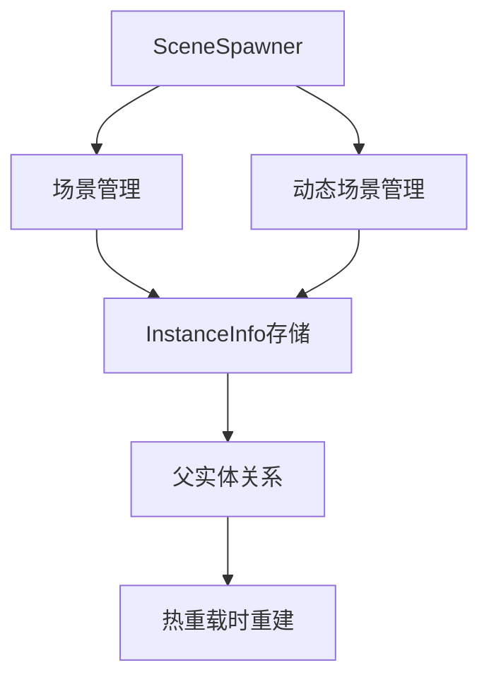

+++
title = "#18358 Fix Scene hot reloading"
date = "2025-07-21T00:00:00"
draft = false
template = "pull_request_page.html"
in_search_index = false

[extra]
current_language = "zh-cn"
available_languages = {"en" = { name = "English", url = "/pull_request/bevy/2025-07/pr-18358-en-20250721" }, "zh-cn" = { name = "中文", url = "/pull_request/bevy/2025-07/pr-18358-zh-cn-20250721" }}
+++

### 修复场景热重载功能的技术分析报告

#### 基础信息
- **标题**: Fix Scene hot reloading
- **PR链接**: https://github.com/bevyengine/bevy/pull/18358
- **作者**: andriyDev
- **状态**: 已合并
- **标签**: C-Bug, S-Ready-For-Final-Review, A-Scenes, M-Needs-Migration-Guide, D-Modest
- **创建时间**: 2025-03-17T07:44:21Z
- **合并时间**: 2025-07-21T22:30:42Z
- **合并人**: alice-i-cecile

#### 描述翻译
**目标**
- 修复 #14698

**解决方案**
- 为所有`SceneSpawner`函数添加`_dynamic`后缀以区分动态场景
- 在`SceneSpawner`上添加非动态场景版本的方法
- 监听`Scene`的`AssetEvent`事件并更新对应的已生成场景
- 在重新生成前先销毁场景
- 在`InstanceInfo`中存储场景的父实体信息，用于热重载时重新设置父子关系
- 将`InstanceInfo`设为私有（API从未返回过该结构）

**测试**
- 运行`hot_asset_reloading`示例并修改GLTF验证更新功能
- 添加场景和动态场景的热重载测试

---

**迁移指南**
- `SceneSpawner`部分方法重命名：
  - `despawn` → `despawn_dynamic`
  - `despawn_sync` → `despawn_dynamic_sync`
  - `update_spawned_scenes` → `update_spawned_dynamic_scenes`
- 新增对应`Scene`操作的方法：
  - `despawn`（操作`Scene`）
  - `despawn_sync`（操作`Scene`）
  - `update_spawned_scenes`（操作`Scene`）

---

### PR技术分析

#### 问题背景
场景热重载功能存在缺陷（#14698），当场景资产修改后，引擎无法正确更新已生成的场景实例。主要问题包括：
1. 动态场景(DynamicScene)和普通场景(Scene)的处理逻辑混杂
2. 缺少场景更新时的父子关系维护
3. 热重载时未先销毁旧实体，导致实体残留
4. 事件监听机制不完善，无法捕获场景资产修改事件

#### 解决方案
采用分层处理策略：
1. **逻辑分离**：明确区分普通场景和动态场景的处理逻辑
2. **状态跟踪**：在`InstanceInfo`中存储父实体信息
3. **销毁优先**：热重载时先完全销毁旧场景再生成新场景
4. **事件扩展**：同时监听`Scene`和`DynamicScene`的资产修改事件

关键决策点：
- 选择完全销毁而非增量更新，确保实体状态一致性
- 将`InstanceInfo`设为私有，简化API边界
- 新增非动态场景专用API，避免命名冲突

#### 实现细节
核心修改集中在`SceneSpawner`系统：

1. **数据结构重构**：
```rust
// 修改前：
pub(crate) spawned_dynamic_scenes: HashMap<AssetId<DynamicScene>, HashSet<InstanceId>>
// 修改后：
pub(crate) spawned_scenes: HashMap<AssetId<Scene>, HashSet<InstanceId>>  // 新增普通场景跟踪
spawned_dynamic_scenes: HashMap<AssetId<DynamicScene>, HashSet<InstanceId>>  // 保留动态场景
```

2. **热重载流程优化**：
```rust
fn update_spawned_scenes(
    &mut self,
    world: &mut World,
    scene_ids: &[AssetId<Scene>]
) -> Result<(), SceneSpawnError> {
    for id in scene_ids {
        // 关键步骤：先销毁旧场景
        Self::despawn_instance_internal(world, instance_info);
        // 重新生成场景
        Self::spawn_sync_internal(world, *id, &mut instance_info.entity_map)?;
        // 重建父子关系
        Self::set_scene_instance_parent_sync(world, instance_info);
    }
}
```

3. **父子关系维护**：
```rust
fn set_scene_instance_parent_sync(world: &mut World, instance: &InstanceInfo) {
    if let Some(parent) = instance.parent {
        for &entity in instance.entity_map.values() {
            if !world.get_entity(entity).map_or(false, |e| e.contains::<ChildOf>()) {
                world.entity_mut(parent).add_child(entity);  // 重建父子链接
            }
        }
    }
}
```

4. **事件监听扩展**：
```rust
// 同时监听两种场景类型的事件
let scene_asset_events = world.resource::<Events<AssetEvent<Scene>>>();
let dynamic_scene_asset_events = world.resource::<Events<AssetEvent<DynamicScene>>>();

// 分别处理普通场景和动态场景的更新
for event in scene_spawner.scene_asset_event_reader.read(scene_asset_events) {
    // 触发普通场景更新
}

for event in scene_spawner.dynamic_scene_asset_event_reader.read(dynamic_scene_asset_events) {
    // 触发动态场景更新
}
```

#### 技术影响
1. **功能修复**：
   - 热重载现在正确处理实体删除/修改（验证通过Blender修改测试）
   - 父子关系在热重载后保持正确

2. **API改进**：
   ```markdown
   - `despawn` → `despawn_dynamic`
   - `despawn_sync` → `despawn_dynamic_sync`
   + 新增`despawn`/`despawn_sync`操作普通场景
   ```

3. **性能权衡**：
   - 销毁-重建策略确保状态一致性，但增加瞬时开销
   - 新增哈希表维护场景映射，内存占用略微增加

4. **测试覆盖**：
   - 新增两个集成测试验证场景/动态场景热重载
   - 覆盖父子关系、组件更新等关键路径

#### 组件关系图


#### 关键文件变更
1. **场景核心逻辑 (`crates/bevy_scene/src/scene_spawner.rs`)**
```rust
// 修改前：
pub struct InstanceInfo {
    pub entity_map: EntityHashMap<Entity>,
}

// 修改后：
struct InstanceInfo {  // 改为私有
    entity_map: EntityHashMap<Entity>,
    parent: Option<Entity>,  // 新增父实体存储
}

// 新增普通场景支持：
pub fn despawn(&mut self, id: impl Into<AssetId<Scene>>) {
    self.scenes_to_despawn.push(id.into());
}

pub fn update_spawned_scenes(  // 普通场景更新
    &mut self,
    world: &mut World,
    scene_ids: &[AssetId<Scene>]
) { /* ... */ }
```

2. **测试用例 (`crates/bevy_scene/src/lib.rs`)**
```rust
#[test]
fn scene_spawns_and_respawns_after_change() {
    // 创建测试场景
    let mut scene_1 = Scene { world: World::new() };
    scene_1.world.spawn((Rectangle { width: 10.0, ... }, ChildOf(root)));
    
    // 首次生成验证
    assert_eq!(children.len(), 2);
    
    // 修改场景资产
    let mut scene_2 = Scene { world: World::new() };
    scene_2.world.spawn((Triangle { base: 1.0, ... }, ChildOf(root)));
    
    // 热重载验证
    assert_eq!(children.len(), 1);  // 确认实体更新
}
```

3. **迁移指南 (`release-content/migration-guides/scene_spawner_api.md`)**
```markdown
---
title: `SceneSpawner`方法重命名
---

Some methods on `SceneSpawner` have been renamed:
    - `despawn` -> `despawn_dynamic`
    - `despawn_sync` -> `despawn_dynamic_sync`
    - `update_spawned_scenes` -> `update_spawned_dynamic_scenes`
```

#### 延伸阅读
1. [Bevy场景系统文档](https://bevyengine.org/learn/book/features/scene/)
2. [实体组件系统(ECS)设计模式](https://github.com/SanderMertens/ecs-faq)
3. [资产热重载原理](https://bevyengine.org/learn/book/features/assets/)