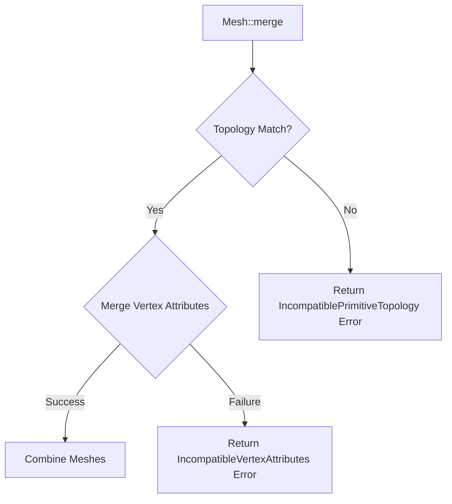

+++
title = "#18561 Expand MergeMeshError to include IncompatiblePrimitiveTopology variant"
date = "2025-07-16T00:00:00"
draft = false
template = "pull_request_page.html"
in_search_index = true

[taxonomies]
list_display = ["show"]

[extra]
current_language = "en"
available_languages = {"en" = { name = "English", url = "/pull_request/bevy/2025-07/pr-18561-en-20250716" }, "zh-cn" = { name = "中文", url = "/pull_request/bevy/2025-07/pr-18561-zh-cn-20250716" }}
labels = ["C-Bug", "A-Rendering", "D-Straightforward"]
+++

# Expand MergeMeshError to include IncompatiblePrimitiveTopology variant

## Basic Information
- **Title**: Expand MergeMeshError to include IncompatiblePrimitiveTopology variant
- **PR Link**: https://github.com/bevyengine/bevy/pull/18561
- **Author**: Pnoenix
- **Status**: MERGED
- **Labels**: C-Bug, A-Rendering, S-Ready-For-Final-Review, M-Needs-Migration-Guide, D-Straightforward
- **Created**: 2025-03-26T16:37:40Z
- **Merged**: 2025-07-16T20:56:58Z
- **Merged By**: alice-i-cecile

## Description Translation
# Objective

Fix #18546 by adding a variant to `MergeMeshError`, for incompatible primitive topologies.

## Solution

Made `MergeMeshError` into an enum with two variants; `IncompatibleVertexAttributes` and `IncompatiblePrimitiveTopology`.  
Added an if statement in `Mesh::merge` to check if the `primitive_topology` field of `self` matches `other`.  
Also renamed `MergeMeshError` to `MeshMergeError` to align with the two other `MeshSomethingError`'s.

## Testing

Didn't do any.

## The Story of This Pull Request

This PR addresses a gap in Bevy's mesh merging functionality. The `Mesh::merge` method previously only validated vertex attribute compatibility when combining meshes, but didn't check if the primitive topologies matched. This could result in invalid merged meshes when attempting to combine meshes with different rendering topologies like `TriangleList` and `LineList`.

The solution involves two key changes to the error handling system. First, we transformed the existing `MergeMeshError` struct into a more expressive enum. The new `MeshMergeError` enum now contains two distinct variants:
- `IncompatibleVertexAttributes` (the original error case)
- `IncompatiblePrimitiveTopology` (the new validation case)

The implementation adds a topology check at the start of the merge operation:

```rust
if self.primitive_topology != other.primitive_topology {
    return Err(MeshMergeError::IncompatiblePrimitiveTopology {
        self_primitive_topology: self.primitive_topology,
        other_primitive_topology: other.primitive_topology,
    });
}
```

This early return ensures we don't proceed with invalid merges. The error includes both topologies in its payload, giving developers clear debugging information.

The PR also includes a naming improvement: `MergeMeshError` was renamed to `MeshMergeError` to maintain consistency with other mesh-related error types like `MeshVertexAttributeNotFoundError`. This follows Bevy's established naming conventions for error types.

Since this change modifies a public API, it includes a migration guide that explains:
- The type rename from `MergeMeshError` to `MeshMergeError`
- The new error variant for topology mismatches
- Updated return type for `Mesh::merge`

The changes are localized to the mesh module and don't affect other systems. The implementation maintains backward compatibility where possible while adding necessary validation to prevent invalid mesh states.

## Visual Representation



## Key Files Changed

### `crates/bevy_mesh/src/mesh.rs`
**Changes**:  
1. Added primitive topology check in `Mesh::merge`  
2. Converted `MergeMeshError` struct to `MeshMergeError` enum  
3. Updated error handling to use new enum variants  

**Code Snippets**:  
Before (error type):
```rust
#[derive(Error, Debug, Clone)]
#[error("Incompatible vertex attribute types {} and {}", self_attribute.name, other_attribute.map(|a| a.name).unwrap_or("None"))]
pub struct MergeMeshError {
    pub self_attribute: MeshVertexAttribute,
    pub other_attribute: Option<MeshVertexAttribute>,
}
```

After (error type):
```rust
#[derive(Error, Debug, Clone)]
pub enum MeshMergeError {
    #[error("Incompatible vertex attribute types: {} and {}", self_attribute.name, other_attribute.map(|a| a.name).unwrap_or("None"))]
    IncompatibleVertexAttributes {
        self_attribute: MeshVertexAttribute,
        other_attribute: Option<MeshVertexAttribute>,
    },
    #[error(
        "Incompatible primitive topologies: {:?} and {:?}",
        self_primitive_topology,
        other_primitive_topology
    )]
    IncompatiblePrimitiveTopology {
        self_primitive_topology: PrimitiveTopology,
        other_primitive_topology: PrimitiveTopology,
    },
}
```

New topology check in merge method:
```rust
if self.primitive_topology != other.primitive_topology {
    return Err(MeshMergeError::IncompatiblePrimitiveTopology {
        self_primitive_topology: self.primitive_topology,
        other_primitive_topology: other.primitive_topology,
    });
}
```

### `release-content/migration-guides/rework_merge_mesh_error.md`
**Changes**: Added migration guide for the breaking API changes  

**Content**:
```markdown
---
title: Rework `MergeMeshError`
pull_requests: [18561]
---

`MergeMeshError` was reworked to account for the possibility of the meshes being merged having two different `PrimitiveTopology`'s, and was renamed to `MeshMergeError` to align with the naming of other mesh errors.

- Users will need to rename `MergeMeshError` to `MeshMergeError`
- When handling `MergeMeshError` (now `MeshMergeError`), users will need to account for the new `IncompatiblePrimitiveTopology` variant, as it has been changed from a struct to an enum
- `Mesh::merge` now returns `Result<(), MeshMergeError>` instead of the previous `Result<(), MergeMeshError>`
```

## Further Reading
- [Primitive Topology Documentation](https://docs.rs/bevy_render/latest/bevy_render/mesh/enum.PrimitiveTopology.html)  
- [Error Handling in Rust](https://doc.rust-lang.org/book/ch09-00-error-handling.html)  
- [Rust Enums for State Management](https://doc.rust-lang.org/book/ch06-01-defining-an-enum.html)  
- [Bevy Mesh API](https://docs.rs/bevy_render/latest/bevy_render/mesh/struct.Mesh.html)