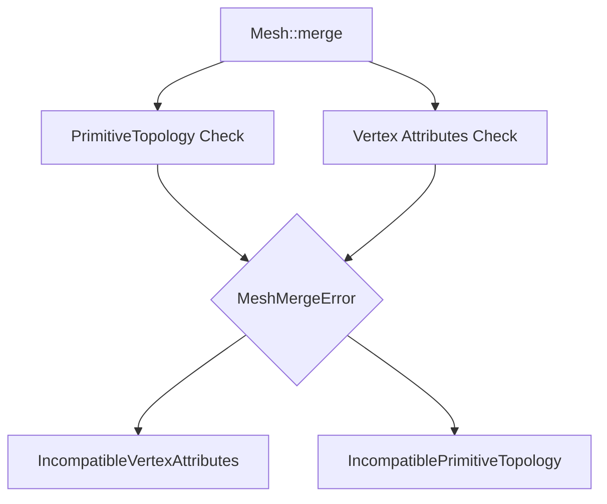

+++
title = "#18561 Expand MergeMeshError to include IncompatiblePrimitiveTopology variant"
date = "2025-07-16T00:00:00"
draft = false
template = "pull_request_page.html"
in_search_index = false

[extra]
current_language = "zh-cn"
available_languages = {"en" = { name = "English", url = "/pull_request/bevy/2025-07/pr-18561-en-20250716" }, "zh-cn" = { name = "中文", url = "/pull_request/bevy/2025-07/pr-18561-zh-cn-20250716" }}
+++

# 分析报告：PR #18561 - Expand MergeMeshError to include IncompatiblePrimitiveTopology variant

## 基本信息
- **标题**: Expand MergeMeshError to include IncompatiblePrimitiveTopology variant
- **PR链接**: https://github.com/bevyengine/bevy/pull/18561
- **作者**: Pnoenix
- **状态**: MERGED
- **标签**: C-Bug, A-Rendering, S-Ready-For-Final-Review, M-Needs-Migration-Guide, D-Straightforward
- **创建时间**: 2025-03-26T16:37:40Z
- **合并时间**: 2025-07-16T20:56:58Z
- **合并者**: alice-i-cecile

## 描述翻译
### Objective
修复 #18546，通过为`MergeMeshError`添加一个变体来处理不兼容的图元拓扑。

### Solution
将`MergeMeshError`改为包含两个变体的枚举：`IncompatibleVertexAttributes`和`IncompatiblePrimitiveTopology`。
在`Mesh::merge`中添加if语句检查`self`的`primitive_topology`字段是否匹配`other`。
同时将`MergeMeshError`重命名为`MeshMergeError`，与其他`MeshSomethingError`命名保持一致。

### Testing
未进行测试。

## 本次PR的技术分析

### 问题背景
在Bevy的网格系统中，`Mesh::merge`方法用于合并两个网格。原实现只检查顶点属性的兼容性，但忽略了图元拓扑(primitive topology)的一致性。当用户尝试合并具有不同图元拓扑的网格时，会导致无效结果或崩溃。问题#18546具体描述了这种情况。

### 解决方案
开发者采用了直接扩展错误处理机制的方法：
1. 将`MergeMeshError`从struct改为enum
2. 添加`IncompatiblePrimitiveTopology`变体
3. 在合并操作前添加拓扑检查
4. 重命名错误类型以保持命名一致性

### 实现细节
关键改动在`Mesh::merge`方法中添加了前置检查：

```rust
// Before:
pub fn merge(&mut self, other: &Mesh) -> Result<(), MergeMeshError> {
    use VertexAttributeValues::*;
    // 直接进行属性合并
```

```rust
// After:
pub fn merge(&mut self, other: &Mesh) -> Result<(), MeshMergeError> {
    use VertexAttributeValues::*;

    // 新增拓扑检查
    if self.primitive_topology != other.primitive_topology {
        return Err(MeshMergeError::IncompatiblePrimitiveTopology {
            self_primitive_topology: self.primitive_topology,
            other_primitive_topology: other.primitive_topology,
        });
    }
```

错误类型被重构为包含两种可能情况的枚举：

```rust
// Before:
#[derive(Error, Debug, Clone)]
#[error("Incompatible vertex attribute types {} and {}", self_attribute.name, other_attribute.map(|a| a.name).unwrap_or("None"))]
pub struct MergeMeshError {
    pub self_attribute: MeshVertexAttribute,
    pub other_attribute: Option<MeshVertexAttribute>,
}
```

```rust
// After:
#[derive(Error, Debug, Clone)]
pub enum MeshMergeError {
    #[error("Incompatible vertex attribute types: {} and {}", self_attribute.name, other_attribute.map(|a| a.name).unwrap_or("None"))]
    IncompatibleVertexAttributes {
        self_attribute: MeshVertexAttribute,
        other_attribute: Option<MeshVertexAttribute>,
    },
    #[error(
        "Incompatible primitive topologies: {:?} and {:?}",
        self_primitive_topology,
        other_primitive_topology
    )]
    IncompatiblePrimitiveTopology {
        self_primitive_topology: PrimitiveTopology,
        other_primitive_topology: PrimitiveTopology,
    },
}
```

### 技术考量
1. **错误处理设计**：使用枚举而非单独错误类型，保持了错误处理路径的统一性
2. **前置验证**：在合并操作前进行拓扑检查，避免了无效状态下的部分合并
3. **错误信息**：明确包含双方拓扑值，便于调试
4. **命名一致性**：`MeshMergeError`与其他网格错误类型(`MeshSomethingError`)保持统一命名规范

### 影响分析
1. **功能增强**：防止了无效网格合并操作
2. **API变更**：
   - 错误类型重命名(`MergeMeshError` → `MeshMergeError`)
   - 新增错误变体需要用户处理
3. **迁移需求**：需要更新错误处理代码，为此添加了迁移指南

## 关键文件变更

### 1. `crates/bevy_mesh/src/mesh.rs` (+34/-8)
**变更目的**：实现核心错误处理逻辑和拓扑检查

核心代码变更：
```rust
// 错误类型重构
#[derive(Error, Debug, Clone)]
pub enum MeshMergeError {
    #[error("Incompatible vertex attribute types: {} and {}", self_attribute.name, other_attribute.map(|a| a.name).unwrap_or("None"))]
    IncompatibleVertexAttributes {
        self_attribute: MeshVertexAttribute,
        other_attribute: Option<MeshVertexAttribute>,
    },
    #[error(
        "Incompatible primitive topologies: {:?} and {:?}",
        self_primitive_topology,
        other_primitive_topology
    )]
    IncompatiblePrimitiveTopology {
        self_primitive_topology: PrimitiveTopology,
        other_primitive_topology: PrimitiveTopology,
    },
}

// 合并方法中添加拓扑检查
pub fn merge(&mut self, other: &Mesh) -> Result<(), MeshMergeError> {
    if self.primitive_topology != other.primitive_topology {
        return Err(MeshMergeError::IncompatiblePrimitiveTopology {
            self_primitive_topology: self.primitive_topology,
            other_primitive_topology: other.primitive_topology,
        });
    }
    // ...原有属性检查逻辑...
}
```

### 2. `release-content/migration-guides/rework_merge_mesh_error.md` (+10/-0)
**变更目的**：提供用户迁移指南

文件内容：
```markdown
---
title: Rework `MergeMeshError`
pull_requests: [18561]
---

`MergeMeshError` was reworked to account for the possibility of the meshes being merged having two different `PrimitiveTopology`'s, and was renamed to `MeshMergeError` to align with the naming of other mesh errors.

- Users will need to rename `MergeMeshError` to `MeshMergeError`
- When handling `MergeMeshError` (now `MeshMergeError`), users will need to account for the new `IncompatiblePrimitiveTopology` variant, as it has been changed from a struct to an enum
- `Mesh::merge` now returns `Result<(), MeshMergeError>` instead of the previous `Result<(), MergeMeshError>`
```

## 组件关系图



## 延伸阅读
1. Bevy网格系统文档：https://bevyengine.org/learn/book/features/3d#meshes
2. Rust错误处理最佳实践：https://doc.rust-lang.org/book/ch09-00-error-handling.html
3. Primitive Topology类型参考：https://docs.rs/wgpu/latest/wgpu/enum.PrimitiveTopology.html