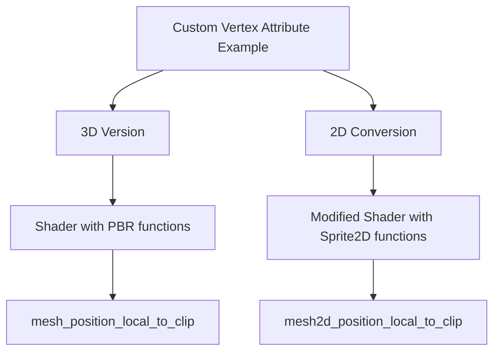

+++
title = "#18603 Add comment to custom vertex attribute example to make it easier to convert to 2D"
date = "2025-07-07T00:00:00"
draft = false
template = "pull_request_page.html"
in_search_index = true

[taxonomies]
list_display = ["show"]

[extra]
current_language = "en"
available_languages = {"en" = { name = "English", url = "/pull_request/bevy/2025-07/pr-18603-en-20250707" }, "zh-cn" = { name = "中文", url = "/pull_request/bevy/2025-07/pr-18603-zh-cn-20250707" }}
labels = ["A-Rendering", "C-Examples", "D-Straightforward"]
+++

# Technical Analysis: Add comment to custom vertex attribute example to make it easier to convert to 2D

## Basic Information
- **Title**: Add comment to custom vertex attribute example to make it easier to convert to 2D
- **PR Link**: https://github.com/bevyengine/bevy/pull/18603
- **Author**: nickyfahey
- **Status**: MERGED
- **Labels**: A-Rendering, C-Examples, S-Ready-For-Final-Review, X-Uncontroversial, D-Straightforward
- **Created**: 2025-03-29T05:29:47Z
- **Merged**: 2025-07-07T19:47:36Z
- **Merged By**: alice-i-cecile

## Description Translation
# Objective

- It's not clear what changes are needed to the shader to convert the example to 2D.
- If you leave the shader unchanged you get a very confusing error (see linked issue).
- Fixes #14077

## Solution

A separate example probably isn't needed as there is little difference between 3D and 2D, but a note saying what changes are needed to the shader would make it a lot easier.

Let me know if you think it is also worth adding some notes to the rust file, but it is mostly trivial changes such as changing `Mesh3d` to `Mesh2d`. I have left the original code in comments next to the changes in the gist linked at the bottom if you wish to compare.

## Testing

- I just spent a long time working it out the hard way. This would have made it a lot quicker.
- I have tested the 2D version of the shader with the changes explained in the suggested comment and it works as expected.
- For testing purposes [here is a complete working 2D example](https://gist.github.com/nickyfahey/647e2a2c45e695f24e288432b811dfc2). (note that as per the original example the shader file needs to go in 'assets/shaders/')

## The Story of This Pull Request

The PR addresses a specific documentation gap in Bevy's rendering examples. When users tried converting the custom vertex attribute example from 3D to 2D, they encountered confusing errors (#14077) because the shader code remained unchanged. The core issue was that Bevy uses different function imports and transformations for 2D versus 3D rendering, but this distinction wasn't documented in the shader file itself.

Instead of duplicating the entire example for 2D, which would create maintenance overhead and code redundancy, the author opted for a minimal but effective solution: adding clear comments directly in the shader file. This approach leverages the fact that the structural differences between 2D and 3D implementations are small but critical. The solution focuses on the exact points where the shader needs modification—specifically, replacing the imported module and the position transformation function.

The implementation consists of just two comment lines at the top of the shader file. These comments precisely indicate:
1. The replacement for the 3D module import (`bevy_pbr::mesh_functions` → `bevy_sprite::mesh2d_functions`)
2. The replacement for the position transformation function (`mesh_position_local_to_clip` → `mesh2d_position_local_to_clip`)

This approach is efficient because it:
- Requires minimal code changes
- Places documentation exactly where users need it
- Avoids fragmenting examples
- Maintains the existing example's integrity while making adaptation straightforward

The author validated the solution by creating a complete working 2D example and testing it end-to-end, confirming that the documented changes produce correct results. The change significantly reduces the trial-and-error process previously required to convert the example, addressing the original issue directly.

## Visual Representation



## Key Files Changed

### `assets/shaders/custom_vertex_attribute.wgsl`
**What changed**: Added two comment lines at the top of the file  
**Why**: To provide clear instructions for converting the shader from 3D to 2D  

```wgsl
// For 2d replace `bevy_pbr::mesh_functions` with `bevy_sprite::mesh2d_functions`
// and `mesh_position_local_to_clip` with `mesh2d_position_local_to_clip`.
#import bevy_pbr::mesh_functions::{get_world_from_local, mesh_position_local_to_clip}

struct CustomMaterial {
```

The comments explicitly state the two required changes:
1. Replace the import path from `bevy_pbr::mesh_functions` to `bevy_sprite::mesh2d_functions`
2. Replace the function call from `mesh_position_local_to_clip` to `mesh2d_position_local_to_clip`

These two lines directly address the core confusion points when adapting the example, providing immediate guidance without altering the working 3D implementation.

## Further Reading
1. [Original issue #14077: Confusing error when using custom_vertex_attribute example in 2D](https://github.com/bevyengine/bevy/issues/14077)
2. [Complete working 2D example implementation](https://gist.github.com/nickyfahey/647e2a2c45e695f24e288432b811dfc2)
3. [Bevy's Shader Documentation](https://github.com/bevyengine/bevy/blob/main/docs/shader.md)
4. [Bevy's Sprite2D Rendering System](https://github.com/bevyengine/bevy/tree/main/crates/bevy_sprite/src)