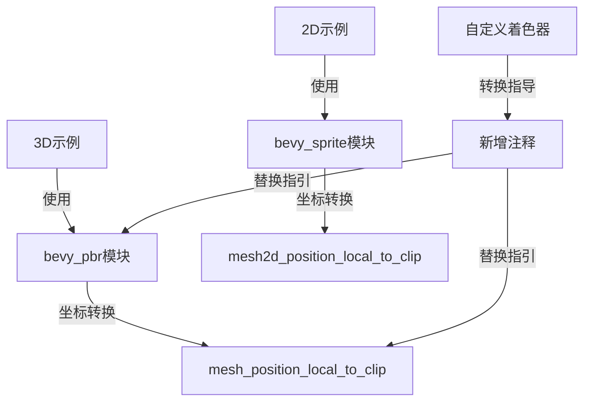

+++
title = "#18603 Add comment to custom vertex attribute example to make it easier to convert to 2D"
date = "2025-07-07T00:00:00"
draft = false
template = "pull_request_page.html"
in_search_index = false

[extra]
current_language = "zh-cn"
available_languages = {"en" = { name = "English", url = "/pull_request/bevy/2025-07/pr-18603-en-20250707" }, "zh-cn" = { name = "中文", url = "/pull_request/bevy/2025-07/pr-18603-zh-cn-20250707" }}
labels = ["A-Rendering", "C-Examples", "D-Straightforward"]
+++

## 技术分析报告

### Basic Information
- **Title**: Add comment to custom vertex attribute example to make it easier to convert to 2D
- **PR Link**: https://github.com/bevyengine/bevy/pull/18603
- **Author**: nickyfahey
- **Status**: MERGED
- **Labels**: A-Rendering, C-Examples, S-Ready-For-Final-Review, X-Uncontroversial, D-Straightforward
- **Created**: 2025-03-29T05:29:47Z
- **Merged**: 2025-07-07T19:47:36Z
- **Merged By**: alice-i-cecile

### Description Translation
#### 目标 (Objective)
- 目前不清楚需要如何修改着色器才能将示例转换为2D版本
- 如果保持着色器不变，会出现令人困惑的错误（参见关联的issue）
- 修复 #14077

#### 解决方案 (Solution)
- 可能不需要单独的2D示例，因为3D和2D版本差异很小
- 添加注释说明着色器需要哪些修改会更实用
- [完整可运行的2D示例](https://gist.github.com/nickyfahey/647e2a2c45e695f24e288432b811dfc2)（着色器文件需放在assets/shaders/目录）

---

### The Story of This Pull Request

#### 问题背景
Bevy引擎的custom_vertex_attribute示例最初设计用于3D渲染场景。当用户尝试将其适配到2D场景时，需要修改着色器代码中的特定函数引用。原始实现没有提供任何转换指导，导致用户直接使用3D着色器时遇到难以理解的错误（issue #14077）。核心问题在于：
- 用户无法直观知道需要修改哪些着色器函数
- 错误信息缺乏足够上下文（"no function matches signature"）
- 调试过程需要深入理解Bevy渲染管线差异

#### 解决方案选择
开发者评估后认为创建完整2D示例并非最优解，因为：
1. 3D和2D实现的核心逻辑高度相似
2. 主要差异仅集中在渲染管线函数引用
3. 维护两个几乎相同的示例会增加代码冗余

最终采用最小化方案：在着色器文件顶部添加两行注释，明确标识出：
- 需要替换的模块引用（bevy_pbr → bevy_sprite）
- 需要替换的坐标转换函数（mesh_position_local_to_clip → mesh2d_position_local_to_clip）

#### 技术实现细节
变更集中在着色器文件的导入部分。原始3D实现使用PBR模块的mesh_functions：
```wgsl
#import bevy_pbr::mesh_functions::{get_world_from_local, mesh_position_local_to_clip}
```
转换为2D时，需要改用sprite模块的2D专用函数：
```wgsl
#import bevy_sprite::mesh2d_functions::{..., mesh2d_position_local_to_clip}
```

新增的注释位于文件起始位置，确保用户修改前就能看到：
```wgsl
// For 2d replace `bevy_pbr::mesh_functions` with `bevy_sprite::mesh2d_functions`
// and `mesh_position_local_to_clip` with `mesh2d_position_local_to_clip`.
```

#### 技术洞察
1. **模块化设计价值**：Bevy将3D(PBR)和2D(sprite)渲染逻辑分离在不同模块，保持核心概念一致（如本地坐标到裁剪空间的转换）
2. **错误预防**：明确指导可避免用户遭遇WGSL的类型签名错误（函数签名不匹配）
3. **维护成本**：单文件注释比维护两份示例代码更轻量，降低同步成本

#### 实际影响
1. **开发体验提升**：减少用户适配2D场景时的试错时间
2. **文档有效性**：在代码使用点直接提供上下文相关指导
3. **错误率降低**：预防因函数签名不匹配导致的编译错误
4. **模式可扩展**：为类似3D/2D适配场景建立注释指导范式

---

### Visual Representation


---

### Key Files Changed

#### assets/shaders/custom_vertex_attribute.wgsl
**变更说明**：添加两行注释说明如何从3D转换到2D版本

```wgsl
// 变更前：
#import bevy_pbr::mesh_functions::{get_world_from_local, mesh_position_local_to_clip}

struct CustomMaterial {
```

```wgsl
// 变更后：
// For 2d replace `bevy_pbr::mesh_functions` with `bevy_sprite::mesh2d_functions`
// and `mesh_position_local_to_clip` with `mesh2d_position_local_to_clip`.
#import bevy_pbr::mesh_functions::{get_world_from_local, mesh_position_local_to_clip}

struct CustomMaterial {
```

**关联性**：直接解决issue #14077，提供明确的2D适配指引

---

### Further Reading
1. [Bevy渲染管线架构](https://bevyengine.org/learn/book/features/rendering)
2. [WGSL着色语言规范](https://www.w3.org/TR/WGSL/)
3. [坐标空间转换原理](https://learnopengl.com/Getting-started/Coordinate-Systems)
4. [Bevy 2D渲染模块文档](https://docs.rs/bevy_sprite/latest/bevy_sprite/)