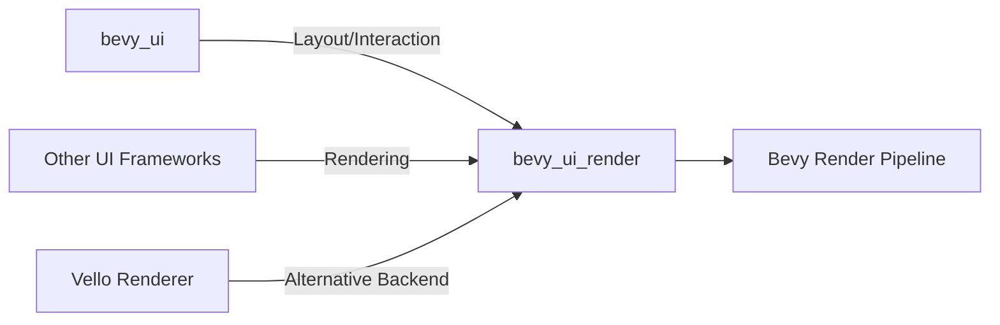

+++
title = "#18703 `bevy_ui_render` crate"
date = "2025-07-05T00:00:00"
draft = false
template = "pull_request_page.html"
in_search_index = true

[taxonomies]
list_display = ["show"]

[extra]
current_language = "en"
available_languages = {"en" = { name = "English", url = "/pull_request/bevy/2025-07/pr-18703-en-20250705" }, "zh-cn" = { name = "中文", url = "/pull_request/bevy/2025-07/pr-18703-zh-cn-20250705" }}
labels = ["A-Rendering", "A-UI", "D-Complex", "X-Blessed"]
+++

# Technical Analysis of PR #18703: `bevy_ui_render` crate

## Basic Information
- **Title**: `bevy_ui_render` crate
- **PR Link**: https://github.com/bevyengine/bevy/pull/18703
- **Author**: ickshonpe
- **Status**: MERGED
- **Labels**: A-Rendering, A-UI, S-Ready-For-Final-Review, M-Needs-Migration-Guide, D-Complex, M-Needs-Release-Note, X-Blessed
- **Created**: 2025-04-03T14:58:15Z
- **Merged**: 2025-07-03T23:55:38Z
- **Merged By**: alice-i-cecile

## Description Translation
# Objective

Move Bevy UI's rendering into a dedicated crate.

Motivations:
* Allow the UI renderer to be used with other UI frameworks than `bevy_ui`.
* Allow for using alternative renderers like Vello with `bevy_ui`.
* It's difficult for rendering contributors to make changes and improvements to the UI renderer as it requires in-depth knowledge of the UI implementation.

## Solution

Move the `render` and `ui_material` modules from `bevy_ui` into a new crate `bevy_ui_render`.

## Testing

Important examples to check are `testbed_ui`, `testbed_full_ui`, `ui_material`, `viewport_node` and `gradients`.

## The Story of This Pull Request

The UI rendering system in Bevy was tightly coupled with the `bevy_ui` crate, making it difficult to reuse the rendering logic with other UI frameworks or alternative renderers. This architectural limitation also created a barrier for rendering contributors who needed deep knowledge of the UI implementation to make improvements. To address these issues, PR #18703 extracts the rendering functionality into a new dedicated crate called `bevy_ui_render`.

The core problem was that UI rendering code was embedded directly within `bevy_ui`, mixing concerns between layout/positioning and actual rendering. This made it challenging to:
1. Use the UI renderer with non-Bevy UI systems
2. Swap in alternative rendering backends like Vello
3. Maintain and evolve the rendering code independently

The solution involved creating a new crate `bevy_ui_render` and moving two key modules:
1. The `render` module containing all rendering pipelines and systems
2. The `ui_material` module for custom UI materials

The implementation required careful separation of responsibilities:
- `bevy_ui` now focuses solely on layout, interaction, and component management
- `bevy_ui_render` handles all rendering concerns including:
  - UI pipeline setup
  - Batch preparation
  - Material systems
  - Box shadow rendering
  - Gradient rendering

Key technical decisions included:
1. Creating a new plugin `UiRenderPlugin` to initialize rendering systems
2. Moving rendering-specific components like `BoxShadowSamples` and `UiAntiAlias` to the new crate
3. Refactoring the `UiPlugin` to remove rendering responsibilities
4. Setting up proper crate dependencies and feature flags

The extraction required updating several systems:
```rust
// Before in bevy_ui:
pub struct UiPlugin {
    pub enable_rendering: bool,
}

// After in bevy_ui:
#[derive(Default)]
pub struct UiPlugin;
```

```rust
// Rendering systems moved to bevy_ui_render:
#[derive(Default)]
pub struct UiRenderPlugin;

impl Plugin for UiRenderPlugin {
    fn build(&self, app: &mut App) {
        // Rendering initialization logic
    }
    
    fn finish(&self, app: &mut App) {
        // Pipeline setup
    }
}
```

The migration required updating multiple areas of the codebase:
- All rendering systems were moved to the new crate
- Component registrations were updated
- Render graph nodes were adjusted
- Example code was updated to use the new structure

An important technical insight is that the `UiCameraMap` system parameter was enhanced to better handle camera mapping for rendering:

```rust
pub struct UiCameraMapper<'w, 's> {
    mapping: &'w Query<'w, 's, RenderEntity>,
    camera_entity: Entity,
    render_entity: Entity,
}

impl<'w, 's> UiCameraMapper<'w, 's> {
    pub fn map(&mut self, computed_target: &ComputedNodeTarget) -> Option<Entity> {
        // Improved camera mapping logic
    }
}
```

The impact of these changes includes:
1. Cleaner separation of concerns between UI logic and rendering
2. Reduced compile times when working on UI systems
3. Foundation for supporting alternative rendering backends
4. Improved maintainability of rendering code
5. Simplified contribution process for rendering specialists

Developers should note that `UiPlugin` no longer controls rendering enablement. Instead, they must explicitly add `UiRenderPlugin` to enable UI rendering.

## Visual Representation



## Key Files Changed

1. `crates/bevy_ui_render/src/lib.rs` (+220/-131)
   - New main file for the UI render crate
   - Defines the `UiRenderPlugin` and core rendering systems
   - Moves rendering components like `UiAntiAlias` and `BoxShadowSamples`

```rust
// Defines the new UI render plugin
#[derive(Default)]
pub struct UiRenderPlugin;

impl Plugin for UiRenderPlugin {
    fn build(&self, app: &mut App) {
        // Initialization logic for UI rendering
    }
}
```

2. `crates/bevy_ui_render/src/ui_material.rs` (+182/-0)
   - Contains the `UiMaterial` trait and related types
   - Defines the `MaterialNode` component for custom UI materials

```rust
pub trait UiMaterial: AsBindGroup + Asset + Clone + Sized {
    fn fragment_shader() -> ShaderRef {
        ShaderRef::Default
    }
}

#[derive(Component, Clone, Debug, Deref, DerefMut, Reflect)]
pub struct MaterialNode<M: UiMaterial>(pub Handle<M>);
```

3. `crates/bevy_ui_render/LICENSE-APACHE` (+176/-0)
   - Added Apache license file for the new crate

4. `crates/bevy_ui/src/ui_node.rs` (+11/-55)
   - Removed rendering-specific components
   - Added conversion for `ResolvedBorderRadius`

```rust
// Before:
pub struct BoxShadowSamples(pub u32);

// After:
// Component moved to bevy_ui_render
```

5. `crates/bevy_ui_render/Cargo.toml` (+60/-0)
   - New Cargo manifest defining dependencies and features

```toml
[package]
name = "bevy_ui_render"
version = "0.17.0-dev"
edition = "2024"

[dependencies]
bevy_app = { path = "../bevy_app", version = "0.17.0-dev" }
# Other dependencies...
```

## Further Reading

1. [Bevy UI Rendering Architecture](https://github.com/bevyengine/bevy/blob/main/crates/bevy_ui_render/README.md)
2. [Custom UI Materials Guide](https://github.com/bevyengine/bevy/blob/main/examples/ui/ui_material.rs)
3. [Box Shadow Rendering Details](https://github.com/bevyengine/bevy/blob/main/crates/bevy_ui_render/src/box_shadow.wgsl)
4. [UI Rendering Pipeline](https://github.com/bevyengine/bevy/blob/main/crates/bevy_ui_render/src/pipeline.rs)