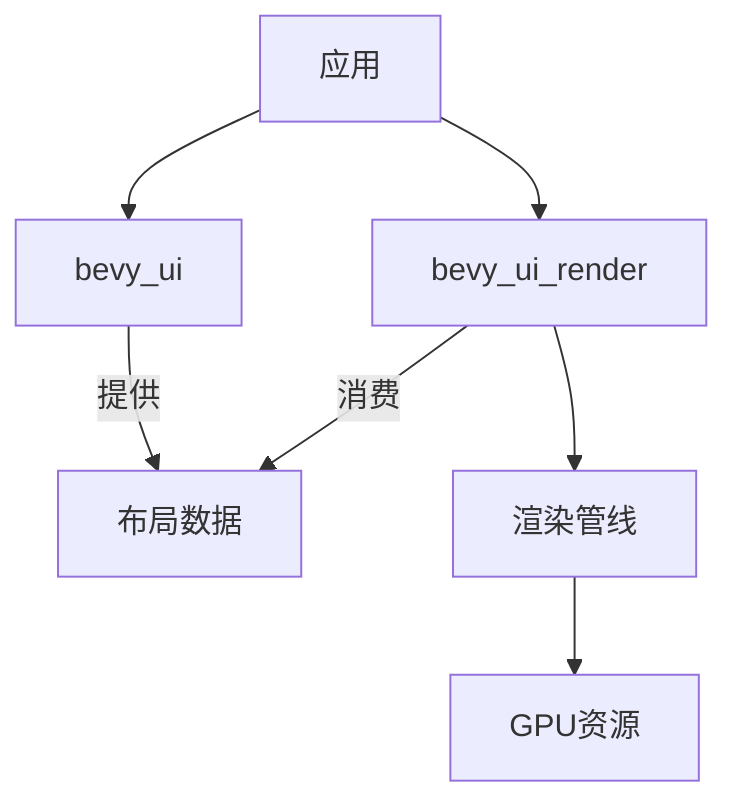

+++
title = "#18703 `bevy_ui_render` crate"
date = "2025-07-05T00:00:00"
draft = false
template = "pull_request_page.html"
in_search_index = false

[extra]
current_language = "zh-cn"
available_languages = {"en" = { name = "English", url = "/pull_request/bevy/2025-07/pr-18703-en-20250705" }, "zh-cn" = { name = "中文", url = "/pull_request/bevy/2025-07/pr-18703-zh-cn-20250705" }}
labels = ["A-Rendering", "A-UI", "D-Complex", "X-Blessed"]
+++

# `bevy_ui_render` crate

## Basic Information
- **Title**: `bevy_ui_render` crate
- **PR Link**: https://github.com/bevyengine/bevy/pull/18703
- **Author**: ickshonpe
- **Status**: MERGED
- **Labels**: A-Rendering, A-UI, S-Ready-For-Final-Review, M-Needs-Migration-Guide, D-Complex, M-Needs-Release-Note, X-Blessed
- **Created**: 2025-04-03T14:58:15Z
- **Merged**: 2025-07-03T23:55:38Z
- **Merged By**: alice-i-cecile

## Description Translation
将 Bevy UI 的渲染功能移至专用 crate。

动机：
* 允许 UI 渲染器用于 `bevy_ui` 以外的其他 UI 框架。
* 允许使用替代渲染器（如 Vello）与 `bevy_ui` 配合使用。
* 由于需要深入了解 UI 实现，渲染贡献者难以对 UI 渲染器进行更改和改进。

## 解决方案

将 `render` 和 `ui_material` 模块从 `bevy_ui` 移至新 crate `bevy_ui_render`。

## 测试

需要检查的重要示例：`testbed_ui`, `testbed_full_ui`, `ui_material`, `viewport_node` 和 `gradients`。

## The Story of This Pull Request

### 问题与背景
Bevy UI 的渲染逻辑直接内嵌在 `bevy_ui` crate 中，导致几个关键问题：
1. UI 渲染器无法被其他 UI 框架复用
2. 难以集成替代渲染后端（如 Vello）
3. 贡献者需要深入理解整个 UI 系统才能修改渲染部分
4. 代码耦合度高，维护复杂度增加

### 解决方案
核心方案是将渲染相关代码提取到独立 crate `bevy_ui_render`：
- 创建新 crate 并迁移所有渲染逻辑
- 重构 `bevy_ui` 仅保留布局/交互逻辑
- 建立清晰的接口定义模块边界
- 保持原有功能完整性和性能特征

### 实现细节
重构涉及多个关键步骤：

1. **新建 crate 结构**：
```toml
# File: crates/bevy_ui_render/Cargo.toml
[package]
name = "bevy_ui_render"
version = "0.17.0-dev"
# ...其他元数据...

[dependencies]
bevy_ui = { path = "../bevy_ui", version = "0.17.0-dev" }
# ...其他依赖...
```

2. **迁移渲染组件**：
```rust
// File: crates/bevy_ui_render/src/lib.rs
pub mod box_shadow;
pub mod gradient;
pub mod pipeline;
pub mod render_pass;
pub mod ui_material;
// ...其他模块...
```

3. **重构 UiPlugin**：
```rust
// File: crates/bevy_ui/src/lib.rs
// 迁移前：
pub struct UiPlugin {
    pub enable_rendering: bool,
}

// 迁移后：
#[derive(Default)]
pub struct UiPlugin; // 渲染功能完全移除
```

4. **新增渲染插件**：
```rust
// File: crates/bevy_ui_render/src/lib.rs
#[derive(Default)]
pub struct UiRenderPlugin;

impl Plugin for UiRenderPlugin {
    fn build(&self, app: &mut App) {
        // 初始化渲染资源
        app.register_type::<BoxShadowSamples>()
            .register_type::<UiAntiAlias>();
        
        // 配置渲染系统
        render_app
            .init_resource::<SpecializedRenderPipelines<UiPipeline>>()
            .add_systems(ExtractSchedule, extract_ui_camera_view)
            // ...其他系统...
    }
}
```

5. **处理跨crate依赖**：
```rust
// File: crates/bevy_internal/src/default_plugins.rs
plugin_group! {
    DefaultPlugins,
    // ...
    #[cfg(feature = "bevy_ui_render")]
    bevy_ui_render:::UiRenderPlugin,
    // ...
}
```

### 技术要点
1. **架构解耦**：
   - `bevy_ui` 负责布局计算和节点管理
   - `bevy_ui_render` 专注渲染管线和GPU资源管理
   - 通过 `ComputedNode` 等数据结构传递布局信息

2. **类型迁移**：
```rust
// File: crates/bevy_ui_render/src/lib.rs
// 从 bevy_ui 迁移的组件
#[derive(Component, Clone, Copy, Default, Debug, Reflect)]
pub enum UiAntiAlias { /* ... */ }

#[derive(Component, Default)]
pub struct BoxShadowSamples(pub u32);
```

3. **渲染管线调整**：
   - 保留原有UI渲染管线设计
   - 优化资源管理边界
   - 分离2D/3D UI渲染图

### 影响与改进
1. **积极影响**：
   - 降低 UI 系统认知复杂度
   - 支持多渲染后端架构
   - 提升代码可维护性
   - 明确模块责任边界

2. **迁移要求**：
   - 用户需添加 `bevy_ui_render` 到依赖
   - 启用 `bevy_ui_render` 特性以获取完整功能
   - 更新插件初始化逻辑

3. **性能考量**：
   - 保持零成本抽象原则
   - 跨crate调用经充分优化
   - 无额外运行时开销

## Visual Representation



## Key Files Changed

### 1. 新建UI渲染crate
**文件**: `crates/bevy_ui_render/src/lib.rs` (+220/-131)  
```rust
pub mod box_shadow;
pub mod gradient;
pub mod pipeline;
// ...其他模块...

#[derive(Default)]
pub struct UiRenderPlugin;

impl Plugin for UiRenderPlugin {
    fn build(&self, app: &mut App) {
        // 初始化逻辑...
    }
}
```

### 2. 迁移UI材质系统
**文件**: `crates/bevy_ui_render/src/ui_material.rs` (+182/-0)  
```rust
pub trait UiMaterial: AsBindGroup + Asset + Clone + Sized {
    fn fragment_shader() -> ShaderRef {
        ShaderRef::Default
    }
    // ...默认实现...
}

#[derive(Component, Reflect)]
pub struct MaterialNode<M: UiMaterial>(pub Handle<M>);
```

### 3. 许可证文件
**文件**: `crates/bevy_ui_render/LICENSE-APACHE` (+176/-0)  
```plaintext
                                 Apache License
                           Version 2.0, January 2004
                        http://www.apache.org/licenses/
// ...标准Apache许可证内容...
```

### 4. 清理原UI模块
**文件**: `crates/bevy_ui/src/ui_node.rs` (+11/-55)  
```rust
// 迁移后：
impl From<ResolvedBorderRadius> for [f32; 4] {
    fn from(radius: ResolvedBorderRadius) -> Self {
        // 转换逻辑...
    }
}

// 移除的组件：
// - UiAntiAlias
// - BoxShadowSamples
```

### 5. 新增Cargo配置
**文件**: `crates/bevy_ui_render/Cargo.toml` (+60/-0)  
```toml
[package]
name = "bevy_ui_render"
version = "0.17.0-dev"
# ...其他配置...

[dependencies]
bevy_ui = { path = "../bevy_ui", version = "0.17.0-dev" }
# ...其他依赖...
```

## Further Reading
1. [Bevy ECS 架构指南](https://bevyengine.org/learn/book/ecs-architecture/)
2. [WGSL 着色器语言规范](https://gpuweb.github.io/gpuweb/wgsl/)
3. [Render Graph 设计模式](https://github.com/bevyengine/bevy/blob/main/docs/render_graph.md)
4. [跨crate模块设计实践](https://doc.rust-lang.org/book/ch07-00-managing-growing-projects-with-packages-crates-and-modules.html)