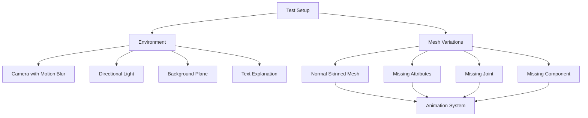

+++
title = "#18763 Add test for invalid skinned meshes"
date = "2025-07-07T00:00:00"
draft = false
template = "pull_request_page.html"
in_search_index = true

[taxonomies]
list_display = ["show"]

[extra]
current_language = "en"
available_languages = {"en" = { name = "English", url = "/pull_request/bevy/2025-07/pr-18763-en-20250707" }, "zh-cn" = { name = "中文", url = "/pull_request/bevy/2025-07/pr-18763-zh-cn-20250707" }}
labels = ["A-Rendering", "A-Animation", "C-Testing", "D-Straightforward"]
+++

# Add test for invalid skinned meshes

## Basic Information
- **Title**: Add test for invalid skinned meshes
- **PR Link**: https://github.com/bevyengine/bevy/pull/18763
- **Author**: greeble-dev
- **Status**: MERGED
- **Labels**: A-Rendering, S-Ready-For-Final-Review, A-Animation, C-Testing, X-Uncontroversial, D-Straightforward
- **Created**: 2025-04-08T15:00:50Z
- **Merged**: 2025-07-07T19:49:27Z
- **Merged By**: alice-i-cecile

## Description
### Objective
Add a test that would have caught #16929 and #18712.

### Solution
The PR adds a `test_invalid_skinned_mesh` example that creates various valid and invalid skinned meshes. This is designed to catch panics via CI, and can be inspected visually. It also tests skinned meshes + motion blur.


The screenshot shows all the tests, but two are currently disabled as they cause panics. #18074 will re-enable them.

### Concerns
- The test is not currently suitable for screenshot comparison.
- I didn't add the test to CI. I'm a bit unsure if this should be part of the PR or a follow up discussion.
- Visual inspection requires understanding why some meshes are deliberately broken and what that looks like.
- I wasn't sure about naming conventions. I put `test` in the name so it's not confused with a real example.

### Testing
```
cargo run --example test_invalid_skinned_mesh
```

Tested on Win10/Nvidia, across Vulkan, WebGL/Chrome, WebGPU/Chrome.

## The Story of This Pull Request

### The Problem and Context
Two critical issues (#16929 and #18712) slipped through Bevy's test suite, causing panics when rendering skinned meshes under specific invalid conditions. These issues revealed a gap in test coverage for error handling in Bevy's skinning system. The lack of dedicated tests for invalid skinned mesh configurations made it difficult to catch regressions in this important rendering feature.

Skinned meshes require several components to work correctly: proper vertex attributes, valid joint entities, and the presence of the `SkinnedMesh` component. When any of these are missing or incorrect, the renderer should handle it gracefully without crashing. The goal was to create a test that would systematically verify the renderer's behavior across these failure scenarios.

### The Solution Approach
The developer created a dedicated test example that generates multiple skinned mesh variations - both valid and invalid - in a single scene. This approach allows:
1. Visual verification of rendering behavior
2. Automatic panic detection through CI systems
3. Testing of edge cases not covered by normal examples

The test includes motion blur to validate compatibility with Bevy's prepass rendering pipeline. An orthographic camera was chosen to provide a clear view of all mesh variations side-by-side. The test deliberately includes two disabled cases that currently cause panics, which will be re-enabled by #18074 once those issues are fixed.

### The Implementation
The implementation creates a comprehensive test scene with four mesh variations:

```rust
enum Variation {
    Normal,
    MissingMeshAttributes,
    MissingJointEntity,
    MissingSkinnedMeshComponent,
}
```

For each variation, the test:
1. Creates a mesh with proper skinning attributes or deliberately incorrect ones
2. Sets up joint hierarchies
3. Conditionally omits required components
4. Adds background planes for visual context

The animation system rotates joints to verify skinning transforms work correctly:

```rust
fn update_animated_joints(time: Res<Time>, query: Query<&mut Transform, With<AnimatedJoint>>) {
    for mut transform in query {
        let angle = TAU * 4.0 * ops::cos((time.elapsed_secs() / 8.0) * TAU);
        let rotation = Quat::from_rotation_z(angle);
        transform.rotation = rotation;
        transform.translation = rotation.mul_vec3(Vec3::new(0.0, 1.3, 0.0));
    }
}
```

Motion blur is explicitly tested with unrealistically high settings to make the effect clearly visible:

```rust
MotionBlur {
    shutter_angle: 3.0,
    samples: 2,
}
```

The test includes an on-screen text explanation for visual verification:

```rust
let description = "(left to right)\n\
    0: Normal skinned mesh.\n\
    1: Mesh asset is missing skinning attributes.\n\
    2: One joint entity is missing.\n\
    3: Mesh entity is missing SkinnedMesh component.";
```

### Technical Insights
Key technical considerations in the implementation:
1. **Orthographic Projection**: Uses `ScalingMode::AutoMin` to ensure all meshes fit in view
2. **Multi-platform Support**: Conditionally disables MSAA for WebGL compatibility
3. **Asset Management**: Creates separate mesh assets for valid/invalid cases
4. **Component Validation**: Tests missing `SkinnedMesh` component case
5. **Joint Hierarchy**: Creates parent-child joint relationships for realistic testing

The test exercises multiple rendering paths:
- Standard skinning
- Motion blur prepass
- Shadow rendering
- WebGL/WebGPU compatibility

### The Impact
This test provides:
1. Automated detection of skinning-related panics
2. Visual verification of rendering behavior
3. Coverage for previously untested error cases
4. Validation of motion blur with skinned meshes
5. Documentation of expected behavior through visual examples

The test will prevent regressions like #16929 and #18712 by catching invalid configurations during CI runs. It also establishes a pattern for testing error conditions in Bevy's rendering pipeline.

## Visual Representation



## Key Files Changed

### `Cargo.toml`
Added the new test example to Bevy's example list:
```toml
[[example]]
name = "test_invalid_skinned_mesh"
path = "tests/3d/test_invalid_skinned_mesh.rs"
doc-scrape-examples = true

[package.metadata.example.test_invalid_skinned_mesh]
hidden = true
```
This registers the test as a runnable example while hiding it from documentation.

### `tests/3d/test_invalid_skinned_mesh.rs`
New file implementing the test case:
```rust
// Core test structure
fn main() {
    App::new()
        .add_plugins(DefaultPlugins)
        .insert_resource(AmbientLight { brightness: 20_000.0, ..default() })
        .add_systems(Startup, (setup_environment, setup_meshes))
        .add_systems(Update, update_animated_joints)
        .run();
}

// Mesh creation with skinning attributes
let skinned_mesh = unskinned_mesh
    .clone()
    .with_inserted_attribute(
        Mesh::ATTRIBUTE_JOINT_INDEX,
        VertexAttributeValues::Uint16x4(vec![...])
    )
    .with_inserted_attribute(
        Mesh::ATTRIBUTE_JOINT_WEIGHT,
        vec![[1.00, 0.00, 0.0, 0.0]; 8]
    );

// Test case variations
for (index, variation) in [
    Variation::Normal,
    Variation::MissingMeshAttributes,
    Variation::MissingJointEntity,
    Variation::MissingSkinnedMeshComponent,
].into_iter().enumerate()
{
    // Conditionally disable broken cases
    if (variation == Variation::MissingSkinnedMeshComponent) 
        || (variation == Variation::MissingMeshAttributes)
    {
        continue;
    }
    
    // Create joints hierarchy
    let joint_0 = commands.spawn(transform).id();
    let joint_1 = commands.spawn((ChildOf(joint_0), AnimatedJoint, Transform::IDENTITY)).id();
    
    // Conditionally remove joints
    if variation == Variation::MissingJointEntity {
        commands.entity(joint_1).despawn();
    }
    
    // Select correct mesh type
    let mesh_handle = match variation {
        Variation::MissingMeshAttributes => &unskinned_mesh_handle,
        _ => &skinned_mesh_handle,
    };
    
    // Conditionally omit SkinnedMesh component
    let mut entity_commands = commands.spawn((...));
    if variation != Variation::MissingSkinnedMeshComponent {
        entity_commands.insert(SkinnedMesh {
            inverse_bindposes: inverse_bindposes_handle.clone(),
            joints: vec![joint_0, joint_1],
        });
    }
}
```
This file implements the core test logic, creating the scene with various skinned mesh configurations and animation system.

## Further Reading
1. [Bevy Skinning Documentation](https://bevyengine.org/learn/book/features/3d/skinning/)
2. [Motion Blur RFC](https://github.com/bevyengine/rfcs/blob/main/rfcs/49-motion-blur.md)
3. [Vertex Attribute Reference](https://docs.rs/bevy/latest/bevy/render/mesh/enum.Mesh.html)
4. Related issues:
   - [#16929: Panic on skinned mesh with missing joints](https://github.com/bevyengine/bevy/issues/16929)
   - [#18712: Skinned mesh panic case](https://github.com/bevyengine/bevy/issues/18712)
   - [#18074: Fixes for disabled test cases](https://github.com/bevyengine/bevy/pull/18074)