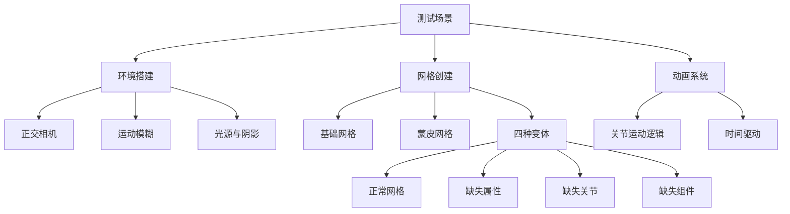

+++
title = "#18763 Add test for invalid skinned meshes"
date = "2025-07-07T00:00:00"
draft = false
template = "pull_request_page.html"
in_search_index = false

[extra]
current_language = "zh-cn"
available_languages = {"en" = { name = "English", url = "/pull_request/bevy/2025-07/pr-18763-en-20250707" }, "zh-cn" = { name = "中文", url = "/pull_request/bevy/2025-07/pr-18763-zh-cn-20250707" }}
labels = ["A-Rendering", "A-Animation", "C-Testing", "D-Straightforward"]
+++

## 技术分析报告：PR #18763 - Add test for invalid skinned meshes

### Basic Information
- **Title**: Add test for invalid skinned meshes
- **PR Link**: https://github.com/bevyengine/bevy/pull/18763
- **Author**: greeble-dev
- **Status**: MERGED
- **Labels**: A-Rendering, S-Ready-For-Final-Review, A-Animation, C-Testing, X-Uncontroversial, D-Straightforward
- **Created**: 2025-04-08T15:00:50Z
- **Merged**: 2025-07-07T19:49:27Z
- **Merged By**: alice-i-cecile

### Description Translation
#### 目标
添加一个能检测 #16929 和 #18712 问题的测试用例。

#### 解决方案
本 PR 添加了一个 `test_invalid_skinned_mesh` 示例，创建多种有效和无效的蒙皮网格。该测试旨在通过 CI 捕获 panic，并支持可视化检查。同时测试蒙皮网格与动态模糊(motion blur)的兼容性。


截图显示所有测试，但其中两个当前被禁用，因为它们会导致 panic。#18074 将重新启用它们。

#### 关注点
- 该测试当前不适合截图比对
- 未将测试加入 CI，需后续讨论
- 视觉检查需要理解网格被故意破坏的原因和表现
- 命名规范：使用 `test` 前缀避免与真实示例混淆

#### 测试方法
```bash
cargo run --example test_invalid_skinned_mesh
```
测试环境：Win10/Nvidia，涵盖 Vulkan、WebGL/Chrome、WebGPU/Chrome。

### The Story of This Pull Request

#### 问题背景
在 Bevy 的骨骼动画系统中，当遇到无效的蒙皮网格数据时，曾出现多个导致程序崩溃的问题（#16929 和 #18712）。这些边界情况包括：
1. 网格资产缺少蒙皮属性
2. 关节(joint)实体缺失
3. 网格实体缺少 SkinnedMesh 组件

这些问题在常规测试中难以覆盖，因为它们涉及非常规数据状态。核心挑战在于创建系统化的测试方法，能主动检测这些边界情况，防止未来回归。

#### 解决方案设计
开发者采用示例测试(exemplar test)模式，在单场景中创建四种网格变体：
1. 正常蒙皮网格
2. 缺少蒙皮属性的网格
3. 缺失关节实体的网格
4. 缺少 SkinnedMesh 组件的网格

测试设计考虑三个验证维度：
1. **功能安全**：通过 CI 捕获 panic
2. **渲染兼容**：验证与动态模糊等高级渲染特性协同工作
3. **视觉验证**：提供直观参考（通过注释说明预期结果）

```rust
enum Variation {
    Normal,
    MissingMeshAttributes,
    MissingJointEntity,
    MissingSkinnedMeshComponent,
}
```

#### 实现细节
测试场景构建采用分层方法：
1. **环境搭建**：
   - 正交相机适配不同网格布局
   - 运动模糊(MotionBlur)高强度配置（快门角度3.0）凸显效果
   - 定向光源启用阴影
   - 背景平面增强视觉对比

```rust
// 相机配置包含运动模糊
MotionBlur {
    shutter_angle: 3.0, // 非常规值增强视觉效果
    samples: 2,
}
```

2. **网格创建**：
   - 基础网格：两个矩形组成的简单结构
   - 蒙皮版本：添加关节索引(JOINT_INDEX)和权重(JOINT_WEIGHT)属性
   - 通过 `inverse_bindposes` 建立关节层级关系

```rust
// 关节权重属性配置示例
.with_inserted_attribute(
    Mesh::ATTRIBUTE_JOINT_WEIGHT,
    vec![[1.00, 0.00, 0.0, 0.0]; 8], // 所有顶点完全绑定到主关节
)
```

3. **变体控制**：
   - 循环创建四种测试用例
   - 动态跳过已知问题变体（MissingMeshAttributes/MissingSkinnedMeshComponent）
   - 精确控制组件装配关系

```rust
if variation != Variation::MissingSkinnedMeshComponent {
    entity_commands.insert(SkinnedMesh {
        inverse_bindposes: inverse_bindposes_handle.clone(),
        joints: vec![joint_0, joint_1],
    });
}
```

4. **动画系统**：
   - `AnimatedJoint` 组件标记需运动的关节
   - 基于时间的三角函数驱动旋转和平移

```rust
// 关节动画更新逻辑
let angle = TAU * 4.0 * ops::cos((time.elapsed_secs() / 8.0) * TAU);
transform.translation = rotation.mul_vec3(Vec3::new(0.0, 1.3, 0.0));
```

#### 技术考量
1. **渲染管线覆盖**：
   - 同时测试前向渲染和预渲染(prepass)路径
   - 阴影渲染验证通过背景平面实现
   - WebGL 兼容处理：禁用 MSAA 避免与运动模糊冲突

2. **问题隔离**：
   - 每个变体独立空间布局（X 轴偏移）
   - 背景色块提供视觉参考系
   - 文本说明直接渲染在场景中

3. **可扩展性**：
   - 变体枚举设计便于添加新测试用例
   - 动画系统与渲染逻辑解耦
   - 已知问题通过条件跳过标记

#### 影响与改进
该测试实现后：
1. 能主动捕获 #16929 和 #18712 类错误
2. 验证骨骼动画与运动模糊的兼容性
3. 提供视觉回归测试基础框架

待跟进事项：
1. 将测试纳入 CI 流水线
2. 修复 #18074 后启用当前跳过的变体
3. 开发自动化截图比对方案

### Key Files Changed

#### 1. `tests/3d/test_invalid_skinned_mesh.rs` (+233/-0)
**目的**：实现蒙皮网格测试场景  
**核心逻辑**：
```rust
// 创建四种测试变体
for (index, variation) in [
    Variation::Normal,
    Variation::MissingMeshAttributes,
    Variation::MissingJointEntity,
    Variation::MissingSkinnedMeshComponent,
].into_iter().enumerate()
{
    // 跳过已知问题变体
    if (variation == Variation::MissingSkinnedMeshComponent) || ... {
        continue;
    }
    
    // 按变体类型选择网格资源
    let mesh_handle = match variation {
        Variation::MissingMeshAttributes => &unskinned_mesh_handle,
        _ => &skinned_mesh_handle,
    };
    
    // 条件装配 SkinnedMesh 组件
    if variation != Variation::MissingSkinnedMeshComponent {
        entity_commands.insert(SkinnedMesh { ... });
    }
}
```

#### 2. `Cargo.toml` (+8/-0)
**目的**：注册新测试示例  
**配置变更**：
```toml
[[example]]
name = "test_invalid_skinned_mesh"
path = "tests/3d/test_invalid_skinned_mesh.rs"
doc-scrape-examples = true

[package.metadata.example.test_invalid_skinned_mesh]
hidden = true  # 隐藏示例避免出现在文档
```

### Visual Representation


### Further Reading
1. [Bevy 骨骼动画系统文档](https://bevyengine.org/learn/book/features/3d/skinning/)
2. [WebGL 与 WebGPU 兼容性指南](https://github.com/bevyengine/bevy/blob/main/docs/plugins_guidelines.md#wasm-compatibility)
3. [运动模糊实现原理](https://en.wikipedia.org/wiki/Motion_blur#Computer_graphics)
4. [测试驱动开发实践](https://github.com/bevyengine/bevy/blob/main/docs/software_engineering/test_strategy.md)