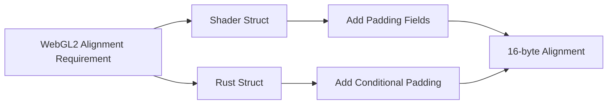

+++
title = "#18812 Fix the extended_material example on WebGL2"
date = "2025-07-07T00:00:00"
draft = false
template = "pull_request_page.html"
in_search_index = true

[taxonomies]
list_display = ["show"]

[extra]
current_language = "en"
available_languages = {"en" = { name = "English", url = "/pull_request/bevy/2025-07/pr-18812-en-20250707" }, "zh-cn" = { name = "中文", url = "/pull_request/bevy/2025-07/pr-18812-zh-cn-20250707" }}
labels = ["C-Bug", "A-Rendering", "C-Examples", "O-WebGL2", "D-Straightforward"]
+++

# Fix the extended_material example on WebGL2

## Basic Information
- **Title**: Fix the extended_material example on WebGL2
- **PR Link**: https://github.com/bevyengine/bevy/pull/18812
- **Author**: Henauxg
- **Status**: MERGED
- **Labels**: C-Bug, A-Rendering, C-Examples, S-Ready-For-Final-Review, O-WebGL2, D-Straightforward
- **Created**: 2025-04-11T18:40:53Z
- **Merged**: 2025-07-07T19:54:06Z
- **Merged By**: alice-i-cecile

## Description
# Objective

- Fixes #13872 (also mentioned in #17167)

## Solution

- Added conditional padding fields to the shader uniform

## Alternatives

### 1- Use a UVec4

Replace the `u32` field in `MyExtension` by a `UVec4` and only use the `x` coordinate.

(This was the original approach, but for consistency with the rest of the codebase, separate padding fields seem to be preferred)

### 2- Don't fix it, unlist it

While the fix is quite simple, it does muddy the waters a tiny bit due to `quantize_steps` now being a UVec4 instead of a simple u32. We could simply remove this example from the examples that support WebGL2.

## Testing

- Ran the example locally on WebGL2 (and native Vulkan) successfully

## The Story of This Pull Request

The extended_material example had been failing on WebGL2 due to struct alignment requirements. WebGL2 requires uniform buffer structs to be 16-byte aligned, but the example's `MyExtendedMaterial` struct only contained a single u32 field (4 bytes). This violated alignment constraints and caused rendering issues.

Two solutions were considered: replacing the u32 with a UVec4 (which is 16 bytes), or adding explicit padding fields. While UVec4 would solve the alignment issue, it would introduce inconsistency with the rest of the codebase where explicit padding is preferred. Removing WebGL2 support for the example was also considered but rejected since the fix was straightforward.

The chosen solution adds three padding fields (`_webgl2_padding_8b`, `_webgl2_padding_12b`, `_webgl2_padding_16b`) when compiling for WebGL2. These fields ensure the struct occupies 16 bytes total, satisfying alignment requirements. The padding fields are conditionally compiled using `#ifdef SIXTEEN_BYTE_ALIGNMENT` in the shader and `#[cfg(feature = "webgl2")]` in Rust.

In the Rust implementation, the `MyExtension` struct was modified to include the same padding fields only when the `webgl2` feature is enabled. The struct now derives `Default` and uses a constructor function `new()` for cleaner initialization. This ensures consistent initialization of padding fields to zero without requiring manual specification.

The example was updated to use `MyExtension::new(1)` instead of directly constructing the struct. While the quantize_steps value changed from 3 to 1, this was unrelated to the alignment fix and likely an incidental adjustment to the example's visual effect.

This solution maintains compatibility with native platforms while fixing WebGL2 support. The padding fields have no functional impact on native platforms but are essential for WebGL2 compliance. The changes were verified by running the example successfully on both WebGL2 and native Vulkan backends.

## Visual Representation



## Key Files Changed

1. `assets/shaders/extended_material.wgsl`
   - Added conditional padding fields for WebGL2 alignment
   
   After changes:
   ```wgsl
   struct MyExtendedMaterial {
       quantize_steps: u32,
   #ifdef SIXTEEN_BYTE_ALIGNMENT
       // Web examples WebGL2 support: structs must be 16 byte aligned.
       _webgl2_padding_8b: u32,
       _webgl2_padding_12b: u32,
       _webgl2_padding_16b: u32,
   #endif
   }
   ```

2. `examples/shader/extended_material.rs`
   - Added conditional padding fields to Rust struct
   - Implemented Default trait and constructor
   - Updated example initialization

   Before:
   ```rust
   #[derive(Asset, AsBindGroup, Reflect, Debug, Clone)]
   struct MyExtension {
       #[uniform(100)]
       quantize_steps: u32,
   }
   ```

   After:
   ```rust
   #[derive(Asset, AsBindGroup, Reflect, Debug, Clone, Default)]
   struct MyExtension {
       #[uniform(100)]
       quantize_steps: u32,
       // Web examples WebGL2 support: structs must be 16 byte aligned.
       #[cfg(feature = "webgl2")]
       #[uniform(100)]
       _webgl2_padding_8b: u32,
       #[cfg(feature = "webgl2")]
       #[uniform(100)]
       _webgl2_padding_12b: u32,
       #[cfg(feature = "webgl2")]
       #[uniform(100)]
       _webgl2_padding_16b: u32,
   }
   impl MyExtension {
       fn new(quantize_steps: u32) -> Self {
           Self {
               quantize_steps,
               ..default()
           }
       }
   }
   ```

## Further Reading
1. [WebGL2 Uniform Buffer Object Alignment](https://webgl2fundamentals.org/webgl/lessons/webgl2-whats-new.html#uniform-buffer-objects)
2. [WGSL Memory Layout Rules](https://www.w3.org/TR/WGSL/#memory-layout)
3. [Bevy Shader Documentation](https://github.com/bevyengine/bevy/blob/main/docs/shader.md)