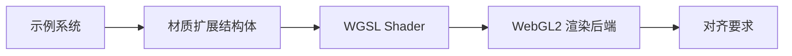

+++
title = "#18812 Fix the extended_material example on WebGL2"
date = "2025-07-07T00:00:00"
draft = false
template = "pull_request_page.html"
in_search_index = false

[extra]
current_language = "zh-cn"
available_languages = {"en" = { name = "English", url = "/pull_request/bevy/2025-07/pr-18812-en-20250707" }, "zh-cn" = { name = "中文", url = "/pull_request/bevy/2025-07/pr-18812-zh-cn-20250707" }}
+++

# 修复 extended_material 示例在 WebGL2 上的问题

## 基本信息
- **标题**: Fix the extended_material example on WebGL2
- **PR链接**: https://github.com/bevyengine/bevy/pull/18812
- **作者**: Henauxg
- **状态**: 已合并
- **标签**: C-Bug, A-Rendering, C-Examples, S-Ready-For-Final-Review, O-WebGL2, D-Straightforward
- **创建时间**: 2025-04-11T18:40:53Z
- **合并时间**: 2025-07-07T19:54:06Z
- **合并人**: alice-i-cecile

## 描述翻译
### 目标
- 修复 #13872 (在 #17167 中也提到过)

### 解决方案
- 在 shader uniform 中添加条件性填充字段(padding fields)

### 替代方案
#### 1- 使用 UVec4
将 `MyExtension` 中的 `u32` 字段替换为 `UVec4` 并仅使用 `x` 坐标。

(这是原始方法，但为保持代码库一致性，似乎更倾向于使用单独的填充字段)

#### 2- 不修复，从列表中移除
虽然修复很简单，但由于 `quantize_steps` 现在从 u32 变为 UVec4，会带来一点复杂性。我们可以直接从支持 WebGL2 的示例中移除此示例。

### 测试
- 在 WebGL2 (和本地 Vulkan) 上成功运行示例

## 问题背景与解决方案

### 问题本质
这个 PR 解决了 extended_material 示例在 WebGL2 环境下的运行问题。核心问题是 WebGL2 对 uniform 缓冲区有严格的 16 字节对齐要求。原始实现中，自定义材质扩展结构体在 WGSL 中定义为：
```wgsl
struct MyExtendedMaterial {
    quantize_steps: u32,
}
```
这个结构体只有 4 字节大小，违反了 WebGL2 的 16 字节对齐要求，导致渲染异常。

### 解决方案实现
修复方案是为 WebGL2 环境添加填充字段(padding fields)：
1. **在 shader 中添加条件填充**：
```wgsl
struct MyExtendedMaterial {
    quantize_steps: u32,
#ifdef SIXTEEN_BYTE_ALIGNMENT
    // Web examples WebGL2 support: structs must be 16 byte aligned.
    _webgl2_padding_8b: u32,
    _webgl2_padding_12b: u32,
    _webgl2_padding_16b: u32,
#endif
}
```
通过 `#ifdef SIXTEEN_BYTE_ALIGNMENT` 条件编译指令，确保仅在需要时添加这些填充字段，不影响其他平台。

2. **在 Rust 结构体中同步修改**：
```rust
#[derive(Asset, AsBindGroup, Reflect, Debug, Clone, Default)]
struct MyExtension {
    #[uniform(100)]
    quantize_steps: u32,
    // Web examples WebGL2 support: structs must be 16 byte aligned.
    #[cfg(feature = "webgl2")]
    #[uniform(100)]
    _webgl2_padding_8b: u32,
    #[cfg(feature = "webgl2")]
    #[uniform(100)]
    _webgl2_padding_12b: u32,
    #[cfg(feature = "webgl2")]
    #[uniform(100)]
    _webgl2_padding_16b: u32,
}
```
使用 `#[cfg(feature = "webgl2")]` 属性确保填充字段只在 WebGL2 构建中存在。

3. **添加构造函数简化初始化**：
```rust
impl MyExtension {
    fn new(quantize_steps: u32) -> Self {
        Self {
            quantize_steps,
            ..default()
        }
    }
}
```
这样在示例代码中可以更清晰地初始化：
```rust
extension: MyExtension::new(1),
```

### 工程权衡
作者考虑过两个替代方案：
1. **使用 UVec4 替代 u32**：技术上可行，但会改变数据类型语义，与代码库惯例不一致
2. **直接移除示例**：简单但会减少 WebGL2 的示例覆盖

最终选择的条件性填充方案：
- 保持原有数据类型不变
- 仅影响目标平台
- 最小化代码变更

### 技术要点
1. **跨平台对齐处理**：通过条件编译实现特定平台的兼容性处理
2. **结构体布局**：WebGL2 要求 uniform 缓冲区对象(UBO)按 16 字节边界对齐
3. **向后兼容**：修改保持了原生平台的原有行为不变
4. **防御性编程**：填充字段使用明确的前缀命名（`_webgl2_padding_`），表明其用途

### 影响验证
- 本地测试确认修复后示例在 WebGL2 和 Vulkan 上均正常运行
- 保持原有功能不变，仅增加平台特定适配

## 组件关系图



## 关键文件变更

### 1. assets/shaders/extended_material.wgsl
**变更原因**：解决 WebGL2 的 16 字节对齐要求  
**关键修改**：
```wgsl
struct MyExtendedMaterial {
    quantize_steps: u32,
+#ifdef SIXTEEN_BYTE_ALIGNMENT
+    // Web examples WebGL2 support: structs must be 16 byte aligned.
+    _webgl2_padding_8b: u32,
+    _webgl2_padding_12b: u32,
+    _webgl2_padding_16b: u32,
+#endif
}
```

### 2. examples/shader/extended_material.rs
**变更原因**：保持 Rust 结构体与 shader 布局一致  
**关键修改**：
```rust
-#[derive(Asset, AsBindGroup, Reflect, Debug, Clone)]
+#[derive(Asset, AsBindGroup, Reflect, Debug, Clone, Default)]
struct MyExtension {
     #[uniform(100)]
     quantize_steps: u32,
+    // Web examples WebGL2 support: structs must be 16 byte aligned.
+    #[cfg(feature = "webgl2")]
+    #[uniform(100)]
+    _webgl2_padding_8b: u32,
+    #[cfg(feature = "webgl2")]
+    #[uniform(100)]
+    _webgl2_padding_12b: u32,
+    #[cfg(feature = "webgl2")]
+    #[uniform(100)]
+    _webgl2_padding_16b: u32,
}
+
+impl MyExtension {
+    fn new(quantize_steps: u32) -> Self {
+        Self {
+            quantize_steps,
+            ..default()
+        }
+    }
+}
```

```rust
-            extension: MyExtension { quantize_steps: 3 },
+            extension: MyExtension::new(1),
```

## 技术总结

此 PR 展示了处理图形 API 对齐要求的实用模式：
1. **条件编译**：使用平台特定特性标志隔离变更
2. **显式填充**：添加命名明确的填充字段满足对齐要求
3. **结构体版本管理**：保持跨语言结构体布局一致
4. **最小影响原则**：变更仅影响目标平台，保持其他环境行为不变

## 扩展阅读
1. [WebGL2 Uniform Buffer Objects 规范](https://registry.khronos.org/webgl/specs/latest/2.0/#5.14)
2. [WGSL 结构布局规则](https://www.w3.org/TR/WGSL/#structure-layout-rules)
3. [Bevy 材质系统文档](https://bevyengine.org/learn/book/materials/)