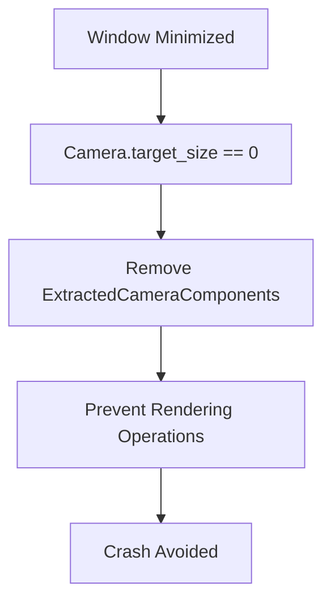

+++
title = "#18916"
date = "2025-07-14T00:00:00"
draft = false
template = "pull_request_page.html"
in_search_index = false

[extra]
current_language = "zh-cn"
available_languages = {"en" = { name = "English", url = "/pull_request/bevy/2025-07/pr-18916-en-20250714" }, "zh-cn" = { name = "中文", url = "/pull_request/bevy/2025-07/pr-18916-zh-cn-20250714" }}
+++

## Fixing a Crash When Minimizing Windows with Custom Viewports

### 基本資訊
- **標題**: Fixing a crash when minimizing a window with custom viewport. (#16704)
- **PR 連結**: https://github.com/bevyengine/bevy/pull/18916
- **作者**: RuelYasa
- **狀態**: MERGED
- **標籤**: C-Bug, A-Rendering, A-Windowing, S-Ready-For-Final-Review, D-Straightforward
- **建立時間**: 2025-04-24T10:51:12Z
- **合併時間**: 2025-07-14T20:30:48Z
- **合併者**: alice-i-cecile

### 描述翻譯
#### Objective
修復最小化視窗時的崩潰問題 (#16704)。該問題發生在視窗包含帶有自訂視口(custom Viewport)的攝影機(Camera)時。

#### Solution
當主世界(main world)中對應的攝影機目標尺寸(target size)為零時，移除 ExtractedCamera。這表示視窗已被最小化。

#### Testing
在 Windows 11 系統中測試驗證。  
先前 split_screen 範例在最小化視窗時會崩潰；套用此修改後不再崩潰。其他行為保持不變。

---

### PR 技術分析

#### 問題背景
在 Bevy 引擎中，當使用者最小化包含自訂視口攝影機的視窗時，會觸發應用程式崩潰 (#16704)。根本原因在於視窗最小化時，渲染管線仍嘗試處理尺寸為零的視口，導致後續渲染操作失敗。

#### 解決方案
核心思路是當偵測到攝影機目標尺寸為零時（視窗最小化的明確標誌），主動移除渲染相關元件，避免後續渲染操作執行：

1. 識別最小化狀態：透過檢查攝影機的 `physical_target_size()` 是否為零
2. 清理渲染元件：移除 `ExtractedCamera` 及相關元件
3. 保持非最小化狀態行為不變

#### 技術實現細節
修改集中在攝影機提取系統(`extract_cameras`)，關鍵改進包括：

1. **引入類型別名(Type Alias)**  
   定義 `ExtractedCameraComponents` 別名簡化元件元組，提升可讀性與維護性：

   ```rust
   type ExtractedCameraComponents = (
       ExtractedCamera,
       ExtractedView,
       RenderVisibleEntities,
       TemporalJitter,
       MipBias,
       RenderLayers,
       Projection,
       NoIndirectDrawing,
       ViewUniformOffset,
   );
   ```

2. **統一元件清理邏輯**  
   重構非啟用狀態(inactive)攝影機的處理，使用類型別名：

   ```rust
   // 修改前
   commands.entity(render_entity).remove::<(ExtractedCamera, ...)>();
   
   // 修改後
   commands.entity(render_entity).remove::<ExtractedCameraComponents>();
   ```

3. **處理最小化狀態**  
   在視窗尺寸檢查分支中，增加元件清理操作：

   ```rust
   if target_size.x == 0 || target_size.y == 0 {
       commands.entity(render_entity).remove::<ExtractedCameraComponents>();
       continue;
   }
   ```

#### 技術影響
1. 解決特定崩潰：完全修復最小化視窗時的崩潰問題
2. 資源管理：及時釋放渲染資源，避免無效操作
3. 行為保持：非最小化狀態的渲染行為不受影響
4. 程式碼改善：透過類型別名減少重複，提升可維護性

#### 潛在改進方向
1. 擴展平台支援：驗證 Linux/macOS 的視窗最小化行為
2. 狀態機整合：考慮將最小化狀態納入攝影機狀態機
3. 資源回收：研究是否需額外清理 GPU 資源

---

### 視覺化元件關係


---

### 關鍵檔案修改
#### `crates/bevy_render/src/camera.rs`
**修改目的**：修復視窗最小化時的崩潰問題  
**主要變更**：
1. 新增類型別名統一處理渲染元件
2. 在尺寸檢查分支增加元件清理邏輯

**程式碼差異**：
```diff
@@ -433,6 +433,17 @@ pub fn extract_cameras(
     mapper: Extract<Query<&RenderEntity>>,
 ) {
     let primary_window = primary_window.iter().next();
+    type ExtractedCameraComponents = (
+        ExtractedCamera,
+        ExtractedView,
+        RenderVisibleEntities,
+        TemporalJitter,
+        MipBias,
+        RenderLayers,
+        Projection,
+        NoIndirectDrawing,
+        ViewUniformOffset,
+    );
     for (
         main_entity,
         render_entity,
@@ -452,17 +463,9 @@ pub fn extract_cameras(
     ) in query.iter()
     {
         if !camera.is_active {
-            commands.entity(render_entity).remove::<(
-                ExtractedCamera,
-                ExtractedView,
-                RenderVisibleEntities,
-                TemporalJitter,
-                MipBias,
-                RenderLayers,
-                Projection,
-                NoIndirectDrawing,
-                ViewUniformOffset,
-            )>();
+            commands
+                .entity(render_entity)
+                .remove::<ExtractedCameraComponents>();
             continue;
         }
 
@@ -481,6 +484,9 @@ pub fn extract_cameras(
             camera.physical_target_size(),
         ) {
             if target_size.x == 0 || target_size.y == 0 {
+                commands
+                    .entity(render_entity)
+                    .remove::<ExtractedCameraComponents>();
                 continue;
             }
```

---

### 延伸閱讀
1. [Bevy 攝影機系統文件](https://bevyengine.org/learn/book/getting-started/camera/)
2. [wgpu 表面管理](https://docs.rs/wgpu/latest/wgpu/struct.Surface.html) (底層圖形 API)
3. [視窗管理最佳實踐](https://github.com/rust-windowing/winit/blob/main/README.md) (winit 文件)