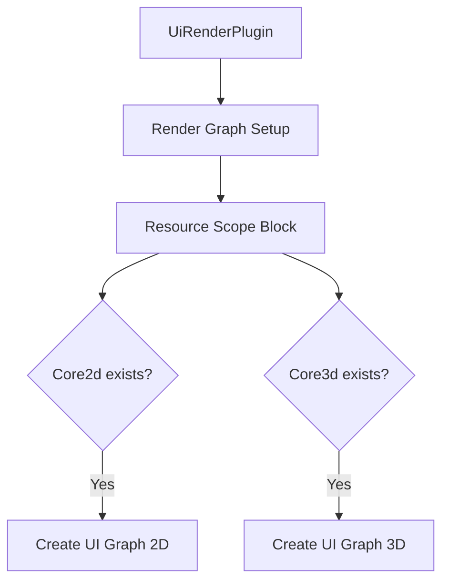

+++
title = "#18983 UI render graph setup refactor"
date = "2025-07-21T00:00:00"
draft = false
template = "pull_request_page.html"
in_search_index = true

[taxonomies]
list_display = ["show"]

[extra]
current_language = "en"
available_languages = {"en" = { name = "English", url = "/pull_request/bevy/2025-07/pr-18983-en-20250721" }, "zh-cn" = { name = "中文", url = "/pull_request/bevy/2025-07/pr-18983-zh-cn-20250721" }}
labels = ["D-Trivial", "A-Rendering", "A-UI", "C-Code-Quality"]
+++

## UI render Graph Setup Refactor: Optimizing Bevy's UI Rendering Initialization

### Basic Information
- **Title**: UI render graph setup refactor
- **PR Link**: https://github.com/bevyengine/bevy/pull/18983
- **Author**: ickshonpe
- **Status**: MERGED
- **Labels**: D-Trivial, A-Rendering, A-UI, C-Code-Quality, S-Ready-For-Final-Review
- **Created**: 2025-04-29T15:30:07Z
- **Merged**: 2025-07-21T22:38:59Z
- **Merged By**: alice-i-cecile

### Description Translation
The original description is in English and remains unchanged:

# Objective

* The `get_ui_graph` function in bevy_ui's render module is misnamed. It doesn't get the graph, it creates a new one.
* `get_ui_graph` shouldn't be called until after we've retrieved each subgraph, otherwise the new UI graph is created for nothing.

## Solution

* Rename `get_ui_graph` to `new_ui_graph`
* Call `new_ui_graph` only after each subgraph is successful retrieved from the render graph.

### The Story of This Pull Request

**The Problem and Context**  
In Bevy's UI rendering system, the `get_ui_graph` function was poorly named and inefficiently used. Despite its name suggesting it retrieves an existing graph, it actually creates a new UI render graph from scratch. This naming mismatch could confuse developers maintaining the code. More importantly, the function was being called unconditionally before checking if the target subgraphs (Core2d and Core3d) existed in the render graph. This meant UI graphs were always created, even when they wouldn't be used - a wasteful operation especially in configurations where either 2D or 3D rendering might be disabled.

**The Solution Approach**  
The solution required two coordinated changes: First, renaming the function to accurately reflect its purpose (creation rather than retrieval). Second, restructuring the render graph initialization logic to only create UI graphs when they're actually needed. This involved moving the graph creation inside the conditional blocks that check for the existence of the Core2d/Core3d subgraphs. The `resource_scope` method was leveraged to safely manage mutable access to the render graph resource while creating the UI subgraphs.

**The Implementation**  
The implementation centered around two key modifications to `crates/bevy_ui_render/src/lib.rs`:

1. **Function Renaming**: The misnamed `get_ui_graph` was changed to `new_ui_graph` throughout:
```rust
// Before:
fn get_ui_graph(render_app: &mut SubApp) -> RenderGraph { ... }

// After:
fn new_ui_graph(world: &mut World) -> RenderGraph { ... }
```

2. **Conditional Graph Creation**: The render graph setup was refactored to:
```rust
render_app.world_mut().resource_scope(|world, mut graph: Mut<RenderGraph>| {
    if let Some(graph_2d) = graph.get_sub_graph_mut(Core2d) {
        let ui_graph_2d = new_ui_graph(world);
        // Add to Core2d subgraph
    }
    
    if let Some(graph_3d) = graph.get_sub_graph_mut(Core3d) {
        let ui_graph_3d = new_ui_graph(world);
        // Add to Core3d subgraph
    }
});
```
This restructuring ensures UI graphs are only created after confirming their target subgraphs exist. The parameter type was changed from `&mut SubApp` to `&mut World` to match the available context within the resource scope.

**Technical Insights**  
This change demonstrates several important patterns in Rust game engine development:
1. **Resource Scoping**: Using `resource_scope` ensures proper borrow checking when multiple resources need to be accessed
2. **Lazy Initialization**: Creating resources only when they're needed optimizes startup performance
3. **Accurate Naming**: Precise function names (`new_ui_graph` vs `get_ui_graph`) prevent misunderstandings about resource ownership and creation

The parameter change from `SubApp` to `World` reflects a more focused dependency - since only world access was needed, using the narrower interface follows Rust's principle of requiring only necessary capabilities.

**The Impact**  
These changes provide concrete benefits:
1. **Performance Improvement**: Eliminates unnecessary UI graph creation in configurations where either Core2d or Core3d subgraphs are absent
2. **Code Clarity**: The renamed function immediately communicates its purpose to maintainers
3. **Resource Efficiency**: Reduces memory allocations and setup time for unused render graphs
4. **Architectural Consistency**: Aligns with Bevy's patterns for conditional resource initialization

### Visual Representation



### Key Files Changed

**File**: `crates/bevy_ui_render/src/lib.rs`  
Changes focus on optimizing UI render graph initialization:

1. Render graph setup refactored into resource scope block:
```rust
// Before:
let ui_graph_2d = get_ui_graph(render_app);
let ui_graph_3d = get_ui_graph(render_app);
let mut graph = render_app.world_mut().resource_mut::<RenderGraph>();

if let Some(graph_2d) = graph.get_sub_graph_mut(Core2d) {
    graph_2d.add_sub_graph(SubGraphUi, ui_graph_2d);
    // ... rest of setup
}

// After:
render_app.world_mut().resource_scope(|world, mut graph: Mut<RenderGraph>| {
    if let Some(graph_2d) = graph.get_sub_graph_mut(Core2d) {
        let ui_graph_2d = new_ui_graph(world);
        graph_2d.add_sub_graph(SubGraphUi, ui_graph_2d);
        // ... rest of setup
    }
    // Similar for Core3d
});
```

2. Function renamed and signature updated:
```rust
// Before:
fn get_ui_graph(render_app: &mut SubApp) -> RenderGraph {
    let ui_pass_node = UiPassNode::new(render_app.world_mut());
    // ...
}

// After:
fn new_ui_graph(world: &mut World) -> RenderGraph {
    let ui_pass_node = UiPassNode::new(world);
    // ...
}
```

### Further Reading
1. [Bevy Render Graph Documentation](https://bevyengine.org/learn/book/getting-started/rendering/#render-graph)
2. [Rust API Guidelines on Naming](https://rust-lang.github.io/api-guidelines/naming.html)
3. [Resource Management in ECS](https://bevyengine.org/learn/book/getting-started/resources/)
4. [Bevy SubApps Architecture](https://github.com/bevyengine/bevy/blob/main/docs/plugins_guidelines.md#app-vs-subapp)

### Full Code Diff
```diff
diff --git a/crates/bevy_ui_render/src/lib.rs b/crates/bevy_ui_render/src/lib.rs
index 74617a726919d..f2d03b6f8b7da 100644
--- a/crates/bevy_ui_render/src/lib.rs
+++ b/crates/bevy_ui_render/src/lib.rs
@@ -269,25 +269,27 @@ impl Plugin for UiRenderPlugin {
             );
 
         // Render graph
-        let ui_graph_2d = get_ui_graph(render_app);
-        let ui_graph_3d = get_ui_graph(render_app);
-        let mut graph = render_app.world_mut().resource_mut::<RenderGraph>();
-
-        if let Some(graph_2d) = graph.get_sub_graph_mut(Core2d) {
-            graph_2d.add_sub_graph(SubGraphUi, ui_graph_2d);
-            graph_2d.add_node(NodeUi::UiPass, RunUiSubgraphOnUiViewNode);
-            graph_2d.add_node_edge(Node2d::EndMainPass, NodeUi::UiPass);
-            graph_2d.add_node_edge(Node2d::EndMainPassPostProcessing, NodeUi::UiPass);
-            graph_2d.add_node_edge(NodeUi::UiPass, Node2d::Upscaling);
-        }
+        render_app
+            .world_mut()
+            .resource_scope(|world, mut graph: Mut<RenderGraph>| {
+                if let Some(graph_2d) = graph.get_sub_graph_mut(Core2d) {
+                    let ui_graph_2d = new_ui_graph(world);
+                    graph_2d.add_sub_graph(SubGraphUi, ui_graph_2d);
+                    graph_2d.add_node(NodeUi::UiPass, RunUiSubgraphOnUiViewNode);
+                    graph_2d.add_node_edge(Node2d::EndMainPass, NodeUi::UiPass);
+                    graph_2d.add_node_edge(Node2d::EndMainPassPostProcessing, NodeUi::UiPass);
+                    graph_2d.add_node_edge(NodeUi::UiPass, Node2d::Upscaling);
+                }
 
-        if let Some(graph_3d) = graph.get_sub_graph_mut(Core3d) {
-            graph_3d.add_sub_graph(SubGraphUi, ui_graph_3d);
-            graph_3d.add_node(NodeUi::UiPass, RunUiSubgraphOnUiViewNode);
-            graph_3d.add_node_edge(Node3d::EndMainPass, NodeUi::UiPass);
-            graph_3d.add_node_edge(Node3d::EndMainPassPostProcessing, NodeUi::UiPass);
-            graph_3d.add_node_edge(NodeUi::UiPass, Node3d::Upscaling);
-        }
+                if let Some(graph_3d) = graph.get_sub_graph_mut(Core3d) {
+                    let ui_graph_3d = new_ui_graph(world);
+                    graph_3d.add_sub_graph(SubGraphUi, ui_graph_3d);
+                    graph_3d.add_node(NodeUi::UiPass, RunUiSubgraphOnUiViewNode);
+                    graph_3d.add_node_edge(Node3d::EndMainPass, NodeUi::UiPass);
+                    graph_3d.add_node_edge(Node3d::EndMainPassPostProcessing, NodeUi::UiPass);
+                    graph_3d.add_node_edge(NodeUi::UiPass, Node3d::Upscaling);
+                }
+            });
 
         app.add_plugins(UiTextureSlicerPlugin);
         app.add_plugins(GradientPlugin);
@@ -295,8 +297,8 @@ impl Plugin for UiRenderPlugin {
     }
 }
 
-fn get_ui_graph(render_app: &mut SubApp) -> RenderGraph {
-    let ui_pass_node = UiPassNode::new(render_app.world_mut());
+fn new_ui_graph(world: &mut World) -> RenderGraph {
+    let ui_pass_node = UiPassNode::new(world);
     let mut ui_graph = RenderGraph::default();
     ui_graph.add_node(NodeUi::UiPass, ui_pass_node);
     ui_graph
```