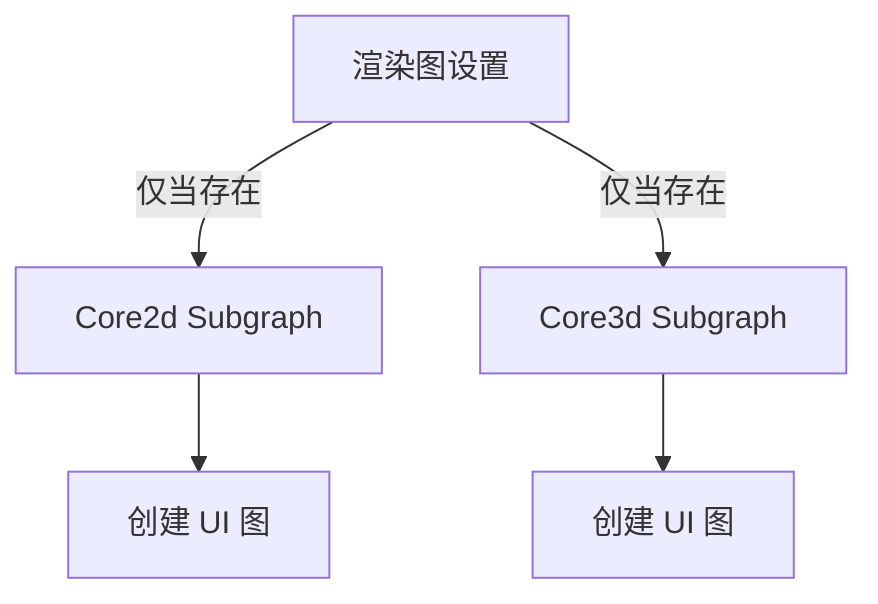

+++
title = "#18983 UI render graph setup refactor"
date = "2025-07-21T00:00:00"
draft = false
template = "pull_request_page.html"
in_search_index = false

[extra]
current_language = "zh-cn"
available_languages = {"en" = { name = "English", url = "/pull_request/bevy/2025-07/pr-18983-en-20250721" }, "zh-cn" = { name = "中文", url = "/pull_request/bevy/2025-07/pr-18983-zh-cn-20250721" }}
labels = ["D-Trivial", "A-Rendering", "A-UI", "C-Code-Quality"]
+++

# UI render graph setup refactor

## Basic Information
- **Title**: UI render graph setup refactor
- **PR Link**: https://github.com/bevyengine/bevy/pull/18983
- **Author**: ickshonpe
- **Status**: MERGED
- **Labels**: D-Trivial, A-Rendering, A-UI, C-Code-Quality, S-Ready-For-Final-Review
- **Created**: 2025-04-29T15:30:07Z
- **Merged**: 2025-07-21T22:38:59Z
- **Merged By**: alice-i-cecile

## Description Translation
# 目标

* bevy_ui 渲染模块中的 `get_ui_graph` 函数命名不当。它并不是获取图形，而是创建新图形。
* 在成功获取每个子图之前不应调用 `get_ui_graph`，否则新建的 UI 图会被浪费。

## 解决方案

* 将 `get_ui_graph` 重命名为 `new_ui_graph`
* 仅在成功从渲染图中检索到每个子图后才调用 `new_ui_graph`

## The Story of This Pull Request

在 Bevy 引擎的渲染系统中，UI 元素通过专门的渲染图（render graph）进行管理。原始实现存在两个技术问题：函数命名不准确和资源创建时机不当。

问题首先出现在 `get_ui_graph` 函数。虽然名为 "get"（获取），但它实际执行的是创建新渲染图的操作。这种命名会误导开发者，让他们误以为函数只是访问现有资源而非创建新资源。准确命名对代码可读性和维护性至关重要。

第二个问题涉及资源创建效率。原始实现在获取 2D 和 3D 子图之前就创建了 UI 渲染图：
```rust
let ui_graph_2d = get_ui_graph(render_app);
let ui_graph_3d = get_ui_graph(render_app);
let mut graph = render_app.world_mut().resource_mut::<RenderGraph>();
```
这种顺序导致即使子图不存在（`get_sub_graph_mut` 返回 `None`），UI 渲染图仍会被创建。在不需要 UI 渲染的场景中，这会造成不必要的资源分配和计算浪费。

解决方案采用两阶段优化。首先将函数重命名为 `new_ui_graph`，准确反映其创建新资源的本质：
```rust
fn new_ui_graph(world: &mut World) -> RenderGraph {
    let ui_pass_node = UiPassNode::new(world);
    let mut ui_graph = RenderGraph::default();
    ui_graph.add_node(NodeUi::UiPass, ui_pass_node);
    ui_graph
}
```
关键改进在于延迟创建操作。通过将 UI 图创建移至子图检索条件块内部：
```rust
if let Some(graph_2d) = graph.get_sub_graph_mut(Core2d) {
    let ui_graph_2d = new_ui_graph(world);
    // 添加子图到Core2d
}
```
现在 UI 图仅在确认子图存在后创建。这种惰性初始化（lazy initialization）模式避免了不必要的资源分配。

另一个结构性改进是引入资源作用域管理：
```rust
render_app.world_mut().resource_scope(|world, mut graph: Mut<RenderGraph>| {
    // 子图处理逻辑
});
```
这种模式更安全地管理 `RenderGraph` 资源访问，遵循 Bevy 的 ECS 最佳实践。

这些修改虽然表面简单，但体现了重要的工程原则：
1. 语义准确性：函数名应精确反映行为
2. 资源效率：避免提前创建可能不需要的资源
3. 作用域管理：使用资源作用域确保安全访问

最终实现保持了完全相同的功能行为，但通过更精确的命名和更高效的资源处理提升了代码质量。这种优化在频繁创建/销毁 UI 的场景中尤其有价值，可减少不必要的计算开销。

## Visual Representation



## Key Files Changed

### crates/bevy_ui_render/src/lib.rs
1. **变更描述**：重构 UI 渲染图初始化逻辑，修复函数命名问题并优化资源创建时机
2. **核心修改**：
```diff
- let ui_graph_2d = get_ui_graph(render_app);
- let ui_graph_3d = get_ui_graph(render_app);
- let mut graph = render_app.world_mut().resource_mut::<RenderGraph>();
-
- if let Some(graph_2d) = graph.get_sub_graph_mut(Core2d) {
-     graph_2d.add_sub_graph(SubGraphUi, ui_graph_2d);
-     // ...其他操作
- }
+ render_app.world_mut().resource_scope(|world, mut graph: Mut<RenderGraph>| {
+     if let Some(graph_2d) = graph.get_sub_graph_mut(Core2d) {
+         let ui_graph_2d = new_ui_graph(world);
+         graph_2d.add_sub_graph(SubGraphUi, ui_graph_2d);
+         // ...其他操作
+     }
```

```diff
- fn get_ui_graph(render_app: &mut SubApp) -> RenderGraph {
-     let ui_pass_node = UiPassNode::new(render_app.world_mut());
+ fn new_ui_graph(world: &mut World) -> RenderGraph {
+     let ui_pass_node = UiPassNode::new(world);
```

3. **关联性**：
   - 函数重命名解决语义准确性问题
   - 资源作用域和条件创建解决资源效率问题
   - 整体结构优化提升代码可维护性

## Further Reading
1. [Bevy Render Graph Documentation](https://bevyengine.org/learn/book/next/render/render-graph/)
2. [Resource Management in ECS](https://bevyengine.org/learn/book/next/programming/ecs/resource)
3. [Rust API Guidelines - Naming](https://rust-lang.github.io/api-guidelines/naming.html)