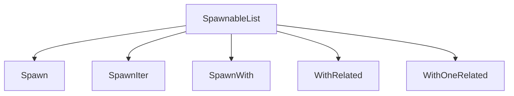

+++
title = "#19046 Allow entities to be added to a relationship using the new spawn api (remade)"
date = "2025-07-21T00:00:00"
draft = false
template = "pull_request_page.html"
in_search_index = true

[taxonomies]
list_display = ["show"]

[extra]
current_language = "en"
available_languages = {"en" = { name = "English", url = "/pull_request/bevy/2025-07/pr-19046-en-20250721" }, "zh-cn" = { name = "中文", url = "/pull_request/bevy/2025-07/pr-19046-zh-cn-20250721" }}
labels = ["A-ECS", "C-Usability", "X-Contentious"]
+++

### Allow entities to be added to a relationship using the new spawn api (remade)

## Basic Information
- **Title**: Allow entities to be added to a relationship using the new spawn api (remade)
- **PR Link**: https://github.com/bevyengine/bevy/pull/19046
- **Author**: Freyja-moth
- **Status**: MERGED
- **Labels**: A-ECS, C-Usability, S-Ready-For-Final-Review, X-Contentious
- **Created**: 2025-05-03T16:57:21Z
- **Merged**: 2025-07-21T22:40:20Z
- **Merged By**: alice-i-cecile

## Description Translation
# Objective

Reopens #18961

## Solution

Copy the code

## Testing

It worked in the previous pull request

## Showcase

See #18961

## The Story of This Pull Request

### The Problem and Context
The ECS spawn API previously lacked a straightforward way to add existing entities to relationships during entity spawning. This limitation forced developers to manually add relationships after spawning entities, resulting in boilerplate code and potential consistency issues. The problem was particularly noticeable in hierarchical entity setups where some child entities might be pre-existing.

### The Solution Approach
This PR introduces two new types implementing the `SpawnableList` trait: `WithRelated` for adding multiple existing entities and `WithOneRelated` for adding a single existing entity. These complement the existing `Spawn`, `SpawnIter`, and `SpawnWith` types, completing the API surface for relationship management during spawning. The implementation maintains API consistency by integrating seamlessly with the existing `SpawnRelated` system.

### The Implementation
The core changes add two new structs and their implementations:

1. **`WithRelated`** accepts an iterator of existing entities and adds them to a relationship:
```rust
pub struct WithRelated<I>(pub I);

impl<R: Relationship, I: Iterator<Item = Entity>> SpawnableList<R> for WithRelated<I> {
    fn spawn(self, world: &mut World, entity: Entity) {
        world
            .entity_mut(entity)
            .add_related::<R>(&self.0.collect::<Vec<_>>());
    }
}
```

2. **`WithOneRelated`** handles single-entity relationships more efficiently:
```rust
pub struct WithOneRelated(pub Entity);

impl<R: Relationship> SpawnableList<R> for WithOneRelated {
    fn spawn(self, world: &mut World, entity: Entity) {
        world.entity_mut(entity).add_one_related::<R>(self.0);
    }
}
```

### Technical Insights
The implementation leverages existing relationship methods (`add_related` and `add_one_related`) to ensure consistent behavior. Size hints are implemented to help with pre-allocation optimizations. The PR includes comprehensive doc examples showing practical usage patterns:

```rust
// Adding multiple existing entities as children
Children::spawn(WithRelated([child2, child3].into_iter()))

// Adding a single existing entity
Children::spawn(WithOneRelated(child1))
```

### The Impact
This change completes the relationship spawning API, allowing all common relationship patterns to be expressed during entity creation. Developers can now:
1. Spawn new entities with relationships
2. Add existing entities to relationships
3. Mix both approaches in a single operation

The addition resolves the original issue (#18961) while maintaining backward compatibility and API consistency.

## Visual Representation



## Key Files Changed

### `crates/bevy_ecs/src/spawn.rs`
Added new structs and implementations:
```rust
// New struct definition
pub struct WithRelated<I>(pub I);

impl<R: Relationship, I: Iterator<Item = Entity>> SpawnableList<R> for WithRelated<I> {
    fn spawn(self, world: &mut World, entity: Entity) {
        world
            .entity_mut(entity)
            .add_related::<R>(&self.0.collect::<Vec<_>>());
    }
}

pub struct WithOneRelated(pub Entity);

impl<R: Relationship> SpawnableList<R> for WithOneRelated {
    fn spawn(self, world: &mut World, entity: Entity) {
        world.entity_mut(entity).add_one_related::<R>(self.0);
    }
}
```
Updated documentation references:
```diff
- /// See [`Spawn`], [`SpawnIter`], and [`SpawnWith`] for usage examples.
+ /// See [`Spawn`], [`SpawnIter`], [`SpawnWith`], [`WithRelated`] and [`WithOneRelated`] for usage examples.
```

Added comprehensive unit tests:
```rust
#[test]
fn with_related() {
    // Tests adding multiple existing entities
}

#[test]
fn with_one_related() {
    // Tests adding single existing entity
}
```

### `crates/bevy_ecs/src/lib.rs`
Updated prelude exports:
```diff
- spawn::{Spawn, SpawnRelated},
+ spawn::{Spawn, SpawnIter, SpawnRelated, SpawnWith, WithOneRelated, WithRelated},
```

## Further Reading
1. [Bevy ECS Relationships Documentation](https://docs.rs/bevy_ecs/latest/bevy_ecs/relationship/index.html)
2. [Original Issue Discussion](https://github.com/bevyengine/bevy/issues/18959)
3. [SpawnableList Trait Reference](https://docs.rs/bevy_ecs/latest/bevy_ecs/spawn/trait.SpawnableList.html)