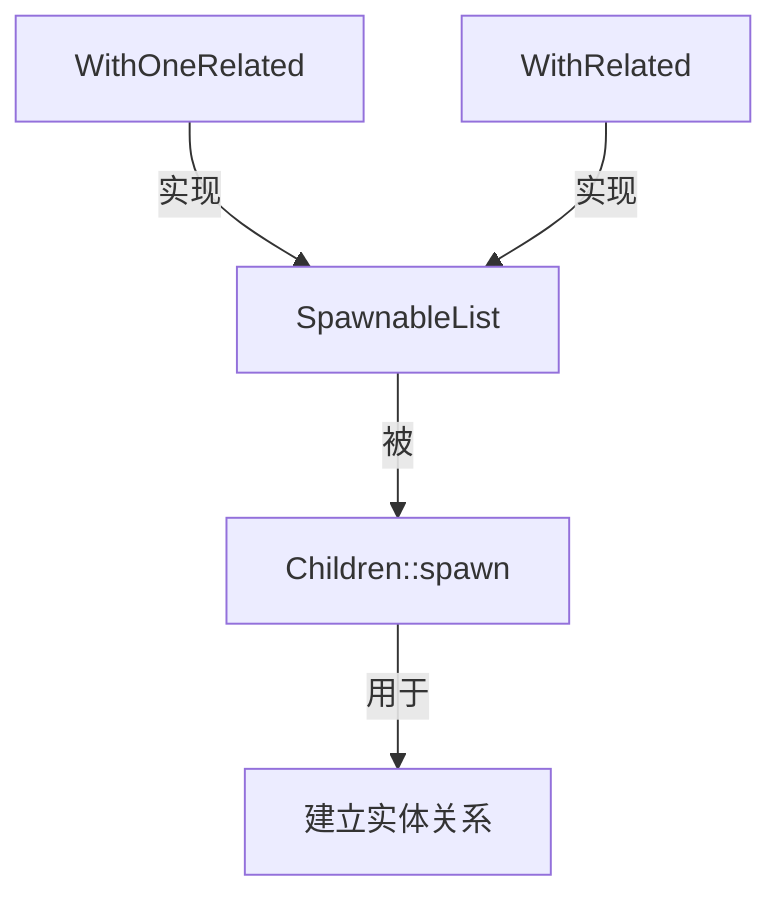

+++
title = "#19046 Allow entities to be added to a relationship using the new spawn api (remade)"
date = "2025-07-21T00:00:00"
draft = false
template = "pull_request_page.html"
in_search_index = false

[extra]
current_language = "zh-cn"
available_languages = {"en" = { name = "English", url = "/pull_request/bevy/2025-07/pr-19046-en-20250721" }, "zh-cn" = { name = "中文", url = "/pull_request/bevy/2025-07/pr-19046-zh-cn-20250721" }}
+++

# 技术分析报告：PR #19046 "Allow entities to be added to a relationship using the new spawn api (remade)"

## 基本信息
- **标题**: Allow entities to be added to a relationship using the new spawn api (remade)
- **PR链接**: https://github.com/bevyengine/bevy/pull/19046
- **作者**: Freyja-moth
- **状态**: MERGED
- **标签**: A-ECS, C-Usability, S-Ready-For-Final-Review, X-Contentious
- **创建时间**: 2025-05-03T16:57:21Z
- **合并时间**: 2025-07-21T22:40:20Z
- **合并者**: alice-i-cecile

## 描述翻译
### Objective
Reopens #18961

### Solution
Copy the code

### Testing
It worked in the previous pull request

### Showcase
See #18961

## PR分析叙述

### 问题背景与目标
在Bevy ECS系统中，实体关系管理是核心功能之一。PR #18961曾尝试改进关系API，允许开发者将已存在的实体添加到关系中，但该PR未被合并。本PR(#19046)的目标是重新引入这一功能，解决以下痛点：
1. 现有`Spawn` API只能创建新实体并建立关系，无法将已存在实体添加到关系链中
2. 开发者需要更灵活的方式管理实体关系，特别是处理预生成实体时
3. 缺少标准方法将多个已存在实体一次性添加到关系中

### 解决方案设计
本PR通过引入两个新类型扩展了关系API：
1. **`WithRelated<I>`**：包装一个实体迭代器，用于批量添加已存在实体
2. **`WithOneRelated`**：包装单个实体，用于添加单个已存在实体

这两个类型都实现了`SpawnableList` trait，使其能与现有的`Children::spawn()`等API无缝集成。设计时考虑了以下关键点：
- 保持与现有`Spawn` API的一致性
- 最小化性能开销（利用size_hint预分配）
- 提供编译时类型安全
- 支持批量操作和单个实体操作两种场景

### 实现细节
核心实现位于`spawn.rs`，新增类型直接集成到现有的关系系统中：
```rust
pub struct WithRelated<I>(pub I);

impl<R: Relationship, I: Iterator<Item = Entity>> SpawnableList<R> for WithRelated<I> {
    fn spawn(self, world: &mut World, entity: Entity) {
        world
            .entity_mut(entity)
            .add_related::<R>(&self.0.collect::<Vec<_>>());
    }
    ...
}

pub struct WithOneRelated(pub Entity);

impl<R: Relationship> SpawnableList<R> for WithOneRelated {
    fn spawn(self, world: &mut World, entity: Entity) {
        world.entity_mut(entity).add_one_related::<R>(self.0);
    }
    ...
}
```
这些实现直接调用`EntityWorldMut`的`add_related`和`add_one_related`方法，确保关系组件被正确更新。

### API使用示例
新API使用方式清晰直观：
```rust
// 添加单个已存在实体
world.spawn((Name::new("Parent"), Children::spawn(WithOneRelated(child1))));

// 批量添加已存在实体
world.spawn((Name::new("Parent"), Children::spawn(WithRelated([child2, child3].into_iter())));
```

### 测试验证
新增的单元测试全面覆盖了各种使用场景：
```rust
#[test]
fn with_related() {
    let mut world = World::new();
    let child1 = world.spawn(Name::new("Child1")).id();
    let child2 = world.spawn(Name::new("Child2")).id();
    
    let parent = world.spawn((...)).id();
    
    // 验证关系是否正确建立
    assert_eq!(world.entity(child1).get::<ChildOf>(), Some(&ChildOf(parent)));
}
```
测试包括：
1. 基本Spawn功能
2. 迭代器Spawn
3. 闭包Spawn
4. 批量添加已存在实体
5. 单个实体添加

### 集成变更
1. 在`lib.rs`中更新了prelude导出：
```diff
 pub mod prelude {
     ...
-    spawn::{Spawn, SpawnRelated},
+    spawn::{Spawn, SpawnIter, SpawnRelated, SpawnWith, WithOneRelated, WithRelated},
     ...
 }
```
2. 更新了文档说明，明确新的使用方式：
```rust
/// See [`Spawn`], [`SpawnIter`], [`SpawnWith`], [`WithRelated`] and [`WithOneRelated`] for usage examples.
```

### 技术影响
1. **API扩展**：填补了关系API的关键空白，支持已存在实体的关系管理
2. **向后兼容**：完全兼容现有代码，新增而非修改现有行为
3. **性能优化**：保持O(n)时间复杂度，利用size_hint预分配
4. **使用性提升**：简化了预生成实体集成到关系图的流程

## 组件关系图


## 关键文件变更

### crates/bevy_ecs/src/spawn.rs (+213/-1)
**变更目的**：实现新API的核心逻辑  
**关键代码片段**：
```rust
// 新增WithRelated结构体
pub struct WithRelated<I>(pub I);

impl<R: Relationship, I: Iterator<Item = Entity>> SpawnableList<R> for WithRelated<I> {
    fn spawn(self, world: &mut World, entity: Entity) {
        world
            .entity_mut(entity)
            .add_related::<R>(&self.0.collect::<Vec<_>>());
    }
    ...
}

// 新增WithOneRelated结构体
pub struct WithOneRelated(pub Entity);

impl<R: Relationship> SpawnableList<R> for WithOneRelated {
    fn spawn(self, world: &mut World, entity: Entity) {
        world.entity_mut(entity).add_one_related::<R>(self.0);
    }
    ...
}
```

### crates/bevy_ecs/src/lib.rs (+1/-1)
**变更目的**：导出新API到prelude  
**关键代码片段**：
```diff
 pub mod prelude {
     ...
-    spawn::{Spawn, SpawnRelated},
+    spawn::{Spawn, SpawnIter, SpawnRelated, SpawnWith, WithOneRelated, WithRelated},
     ...
 }
```

## 延伸阅读
1. [Bevy ECS Relationships文档](https://docs.rs/bevy_ecs/latest/bevy_ecs/relationship/index.html)
2. [原始PR #18961](https://github.com/bevyengine/bevy/pull/18961)
3. [Entity Relations RFC](https://github.com/bevyengine/rfcs/blob/main/rfcs/45-entity-relations.md)

## 完整代码变更
```diff
diff --git a/crates/bevy_ecs/src/lib.rs b/crates/bevy_ecs/src/lib.rs
index 99f95763d572a..db8801d03dc1a 100644
--- a/crates/bevy_ecs/src/lib.rs
+++ b/crates/bevy_ecs/src/lib.rs
@@ -89,7 +89,7 @@ pub mod prelude {
             apply_deferred, common_conditions::*, ApplyDeferred, Condition, IntoScheduleConfigs,
             IntoSystemSet, Schedule, Schedules, SystemSet,
         },
-        spawn::{Spawn, SpawnRelated},
+        spawn::{Spawn, SpawnIter, SpawnRelated, SpawnWith, WithOneRelated, WithRelated},
         system::{
             Command, Commands, Deferred, EntityCommand, EntityCommands, In, InMut, InRef,
             IntoSystem, Local, NonSend, NonSendMut, ParamSet, Populated, Query, ReadOnlySystem,
diff --git a/crates/bevy_ecs/src/spawn.rs b/crates/bevy_ecs/src/spawn.rs
index 5235889ffba20..a201205c3f6a2 100644
--- a/crates/bevy_ecs/src/spawn.rs
+++ b/crates/bevy_ecs/src/spawn.rs
@@ -133,6 +133,80 @@ impl<R: Relationship, F: FnOnce(&mut RelatedSpawner<R>) + Send + Sync + 'static>
     }
 }
 
+/// A [`SpawnableList`] that links already spawned entities to the root entity via relations of type `I`.
+///
+/// This is useful if the entity has already been spawned earlier or if you spawn multiple relationships link to the same entity at the same time.
+/// If you only need to do this for a single entity, consider using [`WithOneRelated`].
+///
+/// ```
+/// # use bevy_ecs::hierarchy::Children;
+/// # use bevy_ecs::spawn::{Spawn, WithRelated, SpawnRelated};
+/// # use bevy_ecs::name::Name;
+/// # use bevy_ecs::world::World;
+/// let mut world = World::new();
+///
+/// let child2 = world.spawn(Name::new("Child2")).id();
+/// let child3 = world.spawn(Name::new("Child3")).id();
+///
+/// world.spawn((
+///     Name::new("Root"),
+///     Children::spawn((
+///         Spawn(Name::new("Child1")),
+///         // This adds the already existing entities as children of Root.
+///         WithRelated([child2, child3].into_iter()),
+///     )),
+/// ));
+/// ```
+pub struct WithRelated<I>(pub I);
+
+impl<R: Relationship, I: Iterator<Item = Entity>> SpawnableList<R> for WithRelated<I> {
+    fn spawn(self, world: &mut World, entity: Entity) {
+        world
+            .entity_mut(entity)
+            .add_related::<R>(&self.0.collect::<Vec<_>>());
+    }
+
+    fn size_hint(&self) -> usize {
+        self.0.size_hint().0
+    }
+}
+
+/// A wrapper over an [`Entity`] indicating that an entity should be added.
+/// This is intended to be used for hierarchical spawning via traits like [`SpawnableList`] and [`SpawnRelated`].
+///
+/// Unlike [`WithRelated`] this only adds one entity.
+///
+/// Also see the [`children`](crate::children) and [`related`](crate::related) macros that abstract over the [`Spawn`] API.
+///
+/// ```
+/// # use bevy_ecs::hierarchy::Children;
+/// # use bevy_ecs::spawn::{Spawn, WithOneRelated, SpawnRelated};
+/// # use bevy_ecs::name::Name;
+/// # use bevy_ecs::world::World;
+/// let mut world = World::new();
+///
+/// let child1 = world.spawn(Name::new("Child1")).id();
+///
+/// world.spawn((
+///     Name::new("Root"),
+///     Children::spawn((
+///         // This adds the already existing entity as a child of Root.
+///         WithOneRelated(child1),
+///     )),
+/// ));
+/// ```
+pub struct WithOneRelated(pub Entity);
+
+impl<R: Relationship> SpawnableList<R> for WithOneRelated {
+    fn spawn(self, world: &mut World, entity: Entity) {
+        world.entity_mut(entity).add_one_related::<R>(self.0);
+    }
+
+    fn size_hint(&self) -> usize {
+        1
+    }
+}
+
 macro_rules! spawnable_list_impl {
     ($($list: ident),*) => {
         #[expect(
@@ -286,7 +360,7 @@ pub trait SpawnRelated: RelationshipTarget {
     /// Returns a [`Bundle`] containing this [`RelationshipTarget`] component. It also spawns a [`SpawnableList`] of entities, each related to the bundle's entity
     /// via [`RelationshipTarget::Relationship`]. The [`RelationshipTarget`] (when possible) will pre-allocate space for the related entities.
     ///
-    /// See [`Spawn`], [`SpawnIter`], and [`SpawnWith`] for usage examples.
+    /// See [`Spawn`], [`SpawnIter`], [`SpawnWith`], [`WithRelated`] and [`WithOneRelated`] for usage examples.
     fn spawn<L: SpawnableList<Self::Relationship>>(
         list: L,
     ) -> SpawnRelatedBundle<Self::Relationship, L>;
@@ -359,3 +433,141 @@ macro_rules! related {
        <$relationship_target>::spawn(($($crate::spawn::Spawn($child)),*))
     };
 }
+
+#[cfg(test)]
+mod tests {
+
+    use crate::{
+        name::Name,
+        prelude::{ChildOf, Children, RelationshipTarget},
+        relationship::RelatedSpawner,
+        world::World,
+    };
+
+    use super::{Spawn, SpawnIter, SpawnRelated, SpawnWith, WithOneRelated, WithRelated};
+
+    #[test]
+    fn spawn() {
+        let mut world = World::new();
+
+        let parent = world
+            .spawn((
+                Name::new("Parent"),
+                Children::spawn(Spawn(Name::new("Child1"))),
+            ))
+            .id();
+
+        let children = world
+            .query::<&Children>()
+            .get(&world, parent)
+            .expect("An entity with Children should exist");
+
+        assert_eq!(children.iter().count(), 1);
+
+        for ChildOf(child) in world.query::<&ChildOf>().iter(&world) {
+            assert_eq!(child, &parent);
+        }
+    }
+
+    #[test]
+    fn spawn_iter() {
+        let mut world = World::new();
+
+        let parent = world
+            .spawn((
+                Name::new("Parent"),
+                Children::spawn(SpawnIter(["Child1", "Child2"].into_iter().map(Name::new))),
+            ))
+            .id();
+
+        let children = world
+            .query::<&Children>()
+            .get(&world, parent)
+            .expect("An entity with Children should exist");
+
+        assert_eq!(children.iter().count(), 2);
+
+        for ChildOf(child) in world.query::<&ChildOf>().iter(&world) {
+            assert_eq!(child, &parent);
+        }
+    }
+
+    #[test]
+    fn spawn_with() {
+        let mut world = World::new();
+
+        let parent = world
+            .spawn((
+                Name::new("Parent"),
+                Children::spawn(SpawnWith(|parent: &mut RelatedSpawner<ChildOf>| {
+                    parent.spawn(Name::new("Child1"));
+                })),
+            ))
+            .id();
+
+        let children = world
+            .query::<&Children>()
+            .get(&world, parent)
+            .expect("An entity with Children should exist");
+
+        assert_eq!(children.iter().count(), 1);
+
+        for ChildOf(child) in world.query::<&ChildOf>().iter(&world) {
+            assert_eq!(child, &parent);
+        }
+    }
+
+    #[test]
+    fn with_related() {
+        let mut world = World::new();
+
+        let child1 = world.spawn(Name::new("Child1")).id();
+        let child2 = world.spawn(Name::new("Child2")).id();
+
+        let parent = world
+            .spawn((
+                Name::new("Parent"),
+                Children::spawn(WithRelated([child1, child2].into_iter())),
+            ))
+            .id();
+
+        let children = world
+            .query::<&Children>()
+            .get(&world, parent)
+            .expect("An entity with Children should exist");
+
+        assert_eq!(children.iter().count(), 2);
+
+        assert_eq!(
+            world.entity(child1).get::<ChildOf>(),
+            Some(&ChildOf(parent))
+        );
+        assert_eq!(
+            world.entity(child2).get::<ChildOf>(),
+            Some(&ChildOf(parent))
+        );
+    }
+
+    #[test]
+    fn with_one_related() {
+        let mut world = World::new();
+
+        let child1 = world.spawn(Name::new("Child1")).id();
+
+        let parent = world
+            .spawn((Name::new("Parent"), Children::spawn(WithOneRelated(child1))))
+            .id();
+
+        let children = world
+            .query::<&Children>()
+            .get(&world, parent)
+            .expect("An entity with Children should exist");
+
+        assert_eq!(children.iter().count(), 1);
+
+        assert_eq!(
+            world.entity(child1).get::<ChildOf>(),
+            Some(&ChildOf(parent))
+        );
+    }
+}
```