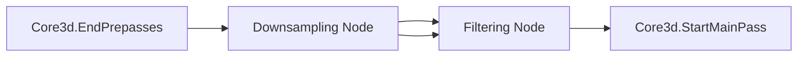

+++
title = "#19076 Environment Map Filtering GPU pipeline"
date = "2025-07-23T00:00:00"
draft = false
template = "pull_request_page.html"
in_search_index = true

[taxonomies]
list_display = ["show"]

[extra]
current_language = "en"
available_languages = {"en" = { name = "English", url = "/pull_request/bevy/2025-07/pr-19076-en-20250723" }, "zh-cn" = { name = "中文", url = "/pull_request/bevy/2025-07/pr-19076-zh-cn-20250723" }}
labels = ["C-Feature", "A-Rendering", "D-Complex", "M-Deliberate-Rendering-Change"]
+++

# Environment Map Filtering GPU pipeline

## Basic Information
- **Title**: Environment Map Filtering GPU pipeline
- **PR Link**: https://github.com/bevyengine/bevy/pull/19076
- **Author**: mate-h
- **Status**: MERGED
- **Labels**: C-Feature, A-Rendering, S-Ready-For-Final-Review, D-Complex, M-Needs-Release-Note, M-Deliberate-Rendering-Change
- **Created**: 2025-05-05T16:22:04Z
- **Merged**: 2025-07-23T19:51:10Z
- **Merged By**: alice-i-cecile

## Description Translation

# Objective

This PR implements a robust GPU-based pipeline for dynamically generating environment maps in Bevy. It builds upon PR #19037, allowing these changes to be evaluated independently from the atmosphere implementation.

While existing offline tools can process environment maps, generate mip levels, and calculate specular lighting with importance sampling, they're limited to static file-based workflows. This PR introduces a real-time GPU pipeline that dynamically generates complete environment maps from a single cubemap texture on each frame.

Closes #9380 

## Solution

Implemented a Single Pass Downsampling (SPD) pipeline that processes textures without pre-existing mip levels or pre-filtered lighting data.

Single Pass Downsampling (SPD) pipeline:
- accepts any square, power-of-two cubemap up to 8192 × 8192 per face and generates the complete mip chain in one frame;
- copies the base mip (level 0) in a dedicated compute dispatch (`copy_mip0`) before the down-sampling pass;
- performs the down-sampling itself in two compute dispatches to fit within subgroup limits;
- heavily inspired by Jasmine's prototype code.

Pre-filtering pipeline:
- generates the specular Radiance Map using bounded-VNDF GGX importance sampling for higher quality highlights and fewer fireflies;
- computes the diffuse Irradiance Map with cosine-weighted hemisphere sampling;
- mirrors the forward-/reverse-tonemap workflow used by TAA instead of exposing a separate *white-point* parameter;
- is based on the resources below together with the "Bounded VNDF Sampling for Smith-GGX Reflections" paper.

The pre-filtering pipeline is largely based on these articles:
- https://placeholderart.wordpress.com/2015/07/28/implementation-notes-runtime-environment-map-filtering-for-image-based-lighting/
- https://bruop.github.io/ibl/
- https://gpuopen.com/download/Bounded_VNDF_Sampling_for_Smith-GGX_Reflections.pdf

> The forward-/reverse-tonemap trick removes almost all fireflies without the need for a separate white-point parameter.

Previous work: #9414

## Testing

The `reflection_probes.rs` example has been updated:

- The camera starts closer to the spheres so the reflections are easier to see.
- The GLTF scene is spawned only when the reflection probe mode is active (press Space).
- The third display mode (toggled with Space) shows the generated cubemap chain.
- You can change the roughness of the center sphere with the Up/Down keys.

## Render Graph

Composed of two nodes and a graph edge:
```
Downsampling -> Filtering
```

Pass breakdown:
```
dowsampling_first_pass -> dowsampling_second_pass ->
radiance_map_pass -> irradiance_map_pass
```


---

## Showcase


User facing API:
```rust
commands.entity(camera)
    .insert(GeneratedEnvironmentMapLight {
        environment_map: world.load_asset("environment_maps/pisa_specular_rgb9e5_zstd.ktx2"),
        ..default()
    });
```

## Computed Environment Maps
To use fully dynamic environment maps, create a new placeholder image handle with `Image::new_fill`, extract it to the render world. Then dispatch a compute shader, bind the image as a 2d array storage texture. Anything can be rendered to the custom dynamic environment map.
This is already demonstrated in PR #19037 with the `atmosphere.rs` example.

We can extend this idea further and run the entire PBR pipeline from the perspective of the light probe, and it is possible to have some form of global illumination or baked lighting information this way, especially if we make use of irradiance volumes for the realtime aspect. This method could very well be extended to bake indirect lighting in the scene.
#13840 should make this possible!

## Notes for reviewers

This PR no longer bundles any large test textures.


## The Story of This Pull Request

### The Problem and Context
Environment maps are essential for realistic rendering, providing ambient lighting and reflections. Traditionally, Bevy required prefiltered environment maps generated offline. This limitation prevented real-time updates and dynamic environment sources. The existing solution couldn't handle cases like:
- Runtime-loaded environment maps
- Dynamic scenes where environment lighting changes
- Reflection probes needing real-time updates

The challenge was implementing a robust GPU pipeline that could:
1. Efficiently downsample cubemaps with full mip chains
2. Perform high-quality filtering in real-time
3. Integrate with Bevy's existing rendering architecture
4. Maintain performance across different hardware capabilities

### The Solution Approach
The implementation uses a two-stage GPU pipeline:
1. **Downsampling**: Single Pass Downsampling (SPD) generates mip chains efficiently
2. **Filtering**: Importance sampling creates specular (radiance) and diffuse (irradiance) maps

Key engineering decisions:
- Split downsampling into two passes to handle device limitations
- Use bounded VNDF sampling for GGX reflections to reduce noise
- Mirror TAA's tonemapping workflow to eliminate fireflies
- Add blue noise textures for improved sample distribution

The pipeline dynamically adapts to device capabilities:
```rust
let storage_texture_limit = render_device.limits().max_storage_textures_per_shader_stage;
let read_write_support = /* check texture format features */;
let combine_bind_group = storage_texture_limit >= 12 && read_write_support;
```

### The Implementation
The implementation adds several key components:

1. **New `GeneratedEnvironmentMapLight` component**:
   ```rust
   pub struct GeneratedEnvironmentMapLight {
       pub environment_map: Handle<Image>,
       pub intensity: f32,
       pub rotation: Quat,
       pub affects_lightmapped_mesh_diffuse: bool,
   }
   ```

2. **Downsampling shaders**:
   - SPD algorithm processes 6× faster than traditional methods
   - Handles cubemaps up to 8192×8192
   - Uses compute shaders with workgroup optimizations

3. **Filtering pipeline**:
   - Radiance map uses importance sampling with 32-1024 samples
   - Irradiance map uses cosine-weighted hemisphere sampling
   - Blue noise improves sample distribution

The render graph integrates these stages:


### Technical Insights
Key technical aspects:
1. **Mip chain generation**:
   ```rust
   fn compute_mip_count(size: u32) -> u32 {
       32 - size.leading_zeros()
   }
   ```
   Calculates mip levels from texture size

2. **Bounded VNDF sampling**:
   ```wgsl
   fn sample_visible_ggx(xi: vec2f, roughness: f32, normal: vec3f, view: vec3f) -> vec3f {
       // Implementation based on GPUOpen paper
   }
   ```
   Reduces noise in specular reflections

3. **Adaptive LOD selection**:
   ```wgsl
   fn calculate_environment_map_lod(pdf: f32, width: f32, samples: f32) -> f32 {
       let omega_s = 1.0 / (samples * pdf);
       let omega_p = 4.0 * PI / (6.0 * width * width);
       return 0.5 * log2(omega_s / omega_p);
   }
   ```
   Dynamically selects mip level based on sample density

### The Impact
These changes enable:
- Real-time environment map processing
- Dynamic reflection probes
- Runtime-generated skyboxes
- Higher quality reflections with reduced noise
- Support for cubemaps up to 8192×8192

The implementation maintains compatibility across devices by:
- Providing fallbacks for limited storage textures
- Supporting both read-write and write-only storage
- Automatically adapting to subgroup support

## Visual Representation



## Key Files Changed

1. `crates/bevy_pbr/src/light_probe/generate.rs` (+1097/-0)
   - Implements the core environment map generation logic
   - Manages GPU pipelines, bind groups, and resources
   - Handles extraction and preparation of render data

2. `crates/bevy_pbr/src/light_probe/downsample.wgsl` (+460/-0)
   - Single Pass Downsampling implementation
   - Efficiently generates mip chains in two compute passes
   - Key function:
   ```wgsl
   @compute @workgroup_size(256, 1, 1)
   fn downsample_first(...) {
       // SPD implementation
   }
   ```

3. `examples/3d/reflection_probes.rs` (+141/-53)
   - Updated example showcasing the new functionality
   - Added roughness control to center sphere:
   ```rust
   fn change_sphere_roughness(...) {
       app_status.sphere_roughness = ...;
       material.perceptual_roughness = ...;
   }
   ```

4. `crates/bevy_pbr/src/light_probe/environment_filter.wgsl` (+176/-0)
   - Implements environment filtering algorithms
   - Key radiance map function:
   ```wgsl
   @compute @workgroup_size(8, 8, 1)
   fn generate_radiance_map(...) {
       // Importance sampling implementation
   }
   ```

5. `crates/bevy_pbr/src/render/utils.wgsl` (+114/-0)
   - Added utility functions for cubemap processing:
   ```wgsl
   fn sample_cube_dir(uv: vec2f, face: u32) -> vec3f {
       // Convert UV/face to direction vector
   }
   
   fn dir_to_cube_uv(dir: vec3f) -> CubeUV {
       // Convert direction to UV/face
   }
   ```

## Further Reading

1. [Bounded VNDF Sampling for Smith-GGX Reflections](https://gpuopen.com/download/Bounded_VNDF_Sampling_for_Smith-GGX_Reflections.pdf) - Core sampling technique
2. [Runtime Environment Map Filtering](https://placeholderart.wordpress.com/2015/07/28/implementation-notes-runtime-environment-map-filtering-for-image-based-lighting/) - Implementation reference
3. [Image Based Lighting](https://bruop.github.io/ibl/) - IBL concepts
4. [FidelityFX SPD](https://gpuopen.com/fidelityfx-spd/) - Single Pass Downsampling reference
5. [Bevy Reflection Probes Example](https://github.com/bevyengine/bevy/blob/main/examples/3d/reflection_probes.rs) - Usage example