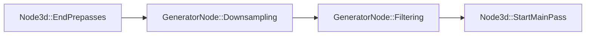
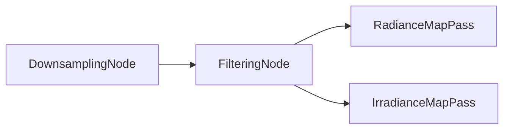

+++
title = "#19076 Environment Map Filtering GPU pipeline"
date = "2025-07-23T00:00:00"
draft = false
template = "pull_request_page.html"
in_search_index = false

[extra]
current_language = "zh-cn"
available_languages = {"en" = { name = "English", url = "/pull_request/bevy/2025-07/pr-19076-en-20250723" }, "zh-cn" = { name = "中文", url = "/pull_request/bevy/2025-07/pr-19076-zh-cn-20250723" }}
labels = ["C-Feature", "A-Rendering", "D-Complex", "M-Deliberate-Rendering-Change"]
+++

# Environment Map Filtering GPU pipeline

## Basic Information
- **Title**: Environment Map Filtering GPU pipeline
- **PR Link**: https://github.com/bevyengine/bevy/pull/19076
- **Author**: mate-h
- **Status**: MERGED
- **Labels**: C-Feature, A-Rendering, S-Ready-For-Final-Review, D-Complex, M-Needs-Release-Note, M-Deliberate-Rendering-Change
- **Created**: 2025-05-05T16:22:04Z
- **Merged**: 2025-07-23T19:51:10Z
- **Merged By**: alice-i-cecile

## Description Translation
这个PR在Bevy中实现了一个强大的基于GPU的管线，用于动态生成环境贴图。它建立在PR #19037的基础上，使得这些变更可以独立于大气层实现进行评估。

虽然现有的离线工具可以处理环境贴图、生成mip层级以及通过重要性采样计算镜面光照，但它们仅限于基于文件的静态工作流。本PR引入了一个实时的GPU管线，该管线在每一帧动态地从单个立方体贴图纹理生成完整的环境贴图。

关闭 #9380

## 解决方案

实现了一个单通道下采样（SPD）管线，该管线处理没有预先存在的mip层级或预过滤光照数据的纹理。

单通道下采样（SPD）管线：
- 接受任何正方形、边长为2的幂的立方体贴图（每个面最大8192×8192），并在单帧内生成完整的mip链；
- 在下采样通道之前，通过一个专用的计算调度（`copy_mip0`）复制基础mip（层级0）；
- 通过两个计算调度执行下采样，以适应子组限制；
- 灵感来源于Jasmine的原型代码。

预过滤管线：
- 使用有界VNDF GGX重要性采样生成镜面辐射度贴图（Radiance Map），以获得更高质量的高光和更少的萤火虫（fireflies）问题；
- 通过余弦加权的半球采样计算漫反射辐照度贴图（Irradiance Map）；
- 镜像TAA使用的前向/反向色调映射工作流，而不是暴露单独的*白点*参数；
- 基于以下资源以及“Bounded VNDF Sampling for Smith-GGX Reflections”论文。

预过滤管线主要基于以下文章：
- https://placeholderart.wordpress.com/2015/07/28/implementation-notes-runtime-environment-map-filtering-for-image-based-lighting/
- https://bruop.github.io/ibl/
- https://gpuopen.com/download/Bounded_VNDF_Sampling_for_Smith-GGX_Reflections.pdf

> 前向/反向色调映射技巧移除了几乎所有萤火虫（fireflies）问题，而不需要单独的白点参数。

先前的工作：#9414

## 测试

`reflection_probes.rs`示例已更新：

- 相机起始位置更靠近球体，以便更容易观察反射。
- 仅当反射探针模式激活时（按空格键）才生成GLTF场景。
- 第三种显示模式（通过空格键切换）显示生成的立方体贴图链。
- 你可以使用上/下键改变中心球体的粗糙度。

## 渲染图

由两个节点和一个图边组成：
```
下采样 -> 过滤
```

通道分解：
```
下采样第一通道 -> 下采样第二通道 ->
辐射度贴图通道 -> 辐照度贴图通道
```


---

## 展示


面向用户的API：
```rust
commands.entity(camera)
    .insert(GeneratedEnvironmentMapLight {
        environment_map: world.load_asset("environment_maps/pisa_specular_rgb9e5_zstd.ktx2"),
        ..default()
    });
```

## 计算环境贴图
要使用完全动态的环境贴图，用`Image::new_fill`创建一个新的占位图像句柄，将其提取到渲染世界。然后调度一个计算着色器，将该图像绑定为2D数组存储纹理。任何内容都可以渲染到自定义的动态环境贴图。
这已经在PR #19037的`atmosphere.rs`示例中展示。

我们可以进一步扩展这个想法，从光探针的视角运行整个PBR管线，特别是如果我们使用辐照体积（irradiance volumes）来实现实时方面，那么这种方式可以实现某种形式的全局光照或烘焙光照信息。这个方法甚至可以扩展到烘焙场景中的间接光照。
#13840 应该使这成为可能！

## 给审阅者的说明

本PR不再捆绑任何大型测试纹理。

## The Story of This Pull Request

### 问题和背景
在实时渲染中，环境贴图常用于模拟环境光照和反射效果。传统上，环境贴图需要预先处理（预过滤）才能用于镜面反射和漫反射光照计算。这包括生成mip链和预计算不同粗糙度级别的反射数据。然而，这种方法存在明显限制：
- 无法处理动态生成的环境贴图（如实时渲染的场景）
- 需要额外的离线处理步骤
- 不支持实时更新的环境内容

具体到Bevy引擎，用户只能使用预过滤的环境贴图（通过`EnvironmentMapLight`组件），无法在运行时动态生成。这限制了那些需要实时环境反射的场景，如动态天空盒或实时反射探针。

### 解决方案方法
该PR引入了`GeneratedEnvironmentMapLight`组件，支持在GPU上实时过滤环境贴图。核心方案包含两个主要处理阶段：

1. **单通道下采样（SPD）管线**：
   - 从源立方体贴图生成完整的mip链
   - 通过两个计算通道处理（适应设备限制）
   - 复制基础mip后执行下采样

2. **预过滤管线**：
   - 使用有界VNDF GGX重要性采样生成镜面辐射度贴图
   - 使用余弦加权半球采样计算漫反射辐照度贴图
   - 采用前向/反向色调映射工作流减少萤火虫伪影

技术决策考虑：
- 使用WGSL编写计算着色器以保持跨平台兼容性
- 根据设备能力动态选择绑定组布局（支持12个存储纹理时使用组合绑定组）
- 集成时空蓝噪声纹理（stbn.ktx2）进行随机采样
- 通过两个渲染图节点组织管线（下采样 -> 过滤）

### 实现细节
实现围绕四个核心组件构建：

**1. 新的`GeneratedEnvironmentMapLight`组件**  
替代`EnvironmentMapLight`支持实时过滤：
```rust
pub struct GeneratedEnvironmentMapLight {
    pub environment_map: Handle<Image>,  // 源立方体贴图
    pub intensity: f32,                 // 光照强度
    pub rotation: Quat,                 // 世界空间旋转
    pub affects_lightmapped_mesh_diffuse: bool,
}
```

**2. SPD下采样管线**  
在`downsample.wgsl`中实现，关键算法：
- 使用工作组共享内存减少纹理采样
- 通过remap_for_wave_reduction()映射线程ID
- 分两个通道处理mip链（0-5和6-12）

**3. 环境过滤着色器**  
在`environment_filter.wgsl`中实现：
- 镜面反射：基于粗糙度使用不同样本数
- 漫反射：固定1024个样本
- 使用蓝噪声进行随机采样偏移

**4. 渲染图集成**  
将处理管线集成到Bevy渲染图中：


### 技术洞察
关键技术和性能考虑：

1. **有界VNDF采样**  
   使用改进的GGX重要性采样减少噪声：
   ```wgsl
   fn sample_visible_ggx(xi: vec2f, roughness: f32, normal: vec3f, view: vec3f) -> vec3f {
       // 实现有界VNDF采样
   }
   ```

2. **动态mip层级计算**  
   根据粗糙度动态选择mip层级：
   ```wgsl
   let lod = calculate_environment_map_lod(pdf, width, f32(sample_count));
   ```

3. **设备兼容性处理**  
   动态检测设备能力：
   ```rust
   let combine_bind_group = storage_texture_limit >= 12 && read_write_support;
   ```

4. **资源管理**  
   为每个环境贴图创建中间纹理：
   ```rust
   texture_cache.get(&render_device, TextureDescriptor {
       size: Extent3d { width: base_size, height: base_size, depth_or_array_layers: 6 },
       mip_level_count,
       format: TextureFormat::Rgba16Float,
       // ...
   })
   ```

### 影响
这些变更带来的主要改进：

1. **新功能**：
   - 实时环境贴图过滤
   - 支持动态生成的环境贴图
   - 示例中可交互调整粗糙度

2. **性能**：
   - 单帧内完成完整mip链生成
   - 自适应采样减少不必要的计算

3. **扩展性**：
   - 为实时全局光照奠定基础
   - 可与大气渲染等系统结合

4. **用户体验**：
   - 简化动态环境反射的工作流
   - 提供可视化调试选项

## Visual Representation


## Key Files Changed

### `crates/bevy_pbr/src/light_probe/generate.rs` (+1097/-0)
实现了环境贴图生成的核心逻辑，包括：
- 绑定组和管线初始化
- 中间纹理管理
- 渲染图节点实现

关键代码片段：
```rust
// 环境贴图生成管线
pub fn prepare_generated_environment_map_bind_groups(
    light_probes: Query<...>,
    render_device: Res<RenderDevice>,
    // ...
) {
    // 创建辐射度贴图绑定组
    for mip in 0..num_mips {
        let bind_group = render_device.create_bind_group(...);
        radiance_bind_groups.push(bind_group);
    }
}
```

### `crates/bevy_pbr/src/light_probe/downsample.wgsl` (+460/-0)
实现单通道下采样算法：
```wgsl
@compute
@workgroup_size(256, 1, 1)
fn downsample_first(...) {
    // 处理mip 0-5
    spd_downsample_mips_0_1(...);
    spd_downsample_next_four(...);
}
```

### `examples/3d/reflection_probes.rs` (+141/-53)
更新示例展示新功能：
- 添加粗糙度控制
- 实现模式切换逻辑
- 优化相机位置

关键变更：
```rust
// 切换生成环境贴图模式
commands.entity(camera).insert(GeneratedEnvironmentMapLight {
    environment_map: cubemaps.specular_environment_map.clone(),
    intensity: 5000.0,
    ..default()
});
```

### `crates/bevy_pbr/src/light_probe/environment_filter.wgsl` (+176/-0)
实现环境过滤着色器：
```wgsl
fn generate_radiance_map(...) {
    // 使用有界VNDF采样
    let light_dir = lighting::sample_visible_ggx(xi, roughness, normal, view);
    // 计算辐射度
    radiance += sample_color * NdotL * G;
}
```

### `crates/bevy_pbr/src/render/utils.wgsl` (+114/-0)
添加工具函数：
```wgsl
// 立方体贴图方向转换
fn dir_to_cube_uv(dir: vec3f) -> CubeUV {
    // 计算UV和面索引
}
```

## Further Reading
1. [实时环境贴图过滤实现说明](https://placeholderart.wordpress.com/2015/07/28/implementation-notes-runtime-environment-map-filtering-for-image-based-lighting/)
2. [基于图像的照明](https://bruop.github.io/ibl/)
3. [有界VNDF采样论文](https://gpuopen.com/download/Bounded_VNDF_Sampling_for_Smith-GGX_Reflections.pdf)
4. [FidelityFX SPD](https://gpuopen.com/fidelityfx-spd/)