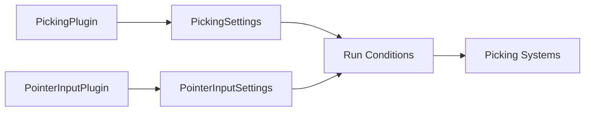

+++
title = "#19078 Extract members of `PickingPlugin` and `PointerInputPlugin` into new types"
date = "2025-07-07T00:00:00"
draft = false
template = "pull_request_page.html"
in_search_index = true

[taxonomies]
list_display = ["show"]

[extra]
current_language = "en"
available_languages = {"en" = { name = "English", url = "/pull_request/bevy/2025-07/pr-19078-en-20250707" }, "zh-cn" = { name = "中文", url = "/pull_request/bevy/2025-07/pr-19078-zh-cn-20250707" }}
labels = ["C-Code-Quality", "D-Straightforward", "A-Picking"]
+++

## Extract members of `PickingPlugin` and `PointerInputPlugin` into new types

### Basic Information
- **Title**: Extract members of `PickingPlugin` and `PointerInputPlugin` into new types
- **PR Link**: https://github.com/bevyengine/bevy/pull/19078
- **Author**: hukasu
- **Status**: MERGED
- **Labels**: C-Code-Quality, S-Ready-For-Final-Review, M-Needs-Migration-Guide, D-Straightforward, A-Picking
- **Created**: 2025-05-05T16:58:06Z
- **Merged**: 2025-07-07T19:59:59Z
- **Merged By**: alice-i-cecile

### Description Translation
# Objective

`PickingPlugin` and `PointerInputPlugin` were kinda weird being both a plugin and a resource.

## Solution

Extract the resource functionality of `PickingPlugin` and `PointerInputPlugin` into new resources

## Testing

`mesh_picking` and `sprite_picking`

### The Story of This Pull Request

The core issue addressed in this PR was an architectural inconsistency in Bevy's picking system. Both `PickingPlugin` and `PointerInputPlugin` were serving dual roles: they were plugins that configured systems, but also resources that stored runtime configuration. This violated the separation of concerns principle and made the API confusing. The developer recognized that plugins should primarily define behavior while resources should manage state.

To resolve this, the implementation separates the configuration concerns from the plugin initialization logic. The former resource-like members of both plugins were extracted into dedicated resource structs: `PickingSettings` and `PointerInputSettings`. These new resources now exclusively handle runtime configuration, while the plugins themselves become simpler unit structs focused solely on system registration.

The changes maintain backward compatibility through default initialization. If no custom resource is provided, the plugins initialize the settings resources with default values. This approach allows users to customize behavior either during app setup or at runtime by modifying the settings resources.

The refactor required updating all system run conditions to reference the new settings resources. For example, where systems previously checked `PickingPlugin::input_should_run`, they now check `PickingSettings::input_should_run`. This maintains the same conditional execution behavior but with clearer resource ownership.

### Visual Representation



### Key Files Changed

#### `crates/bevy_picking/src/input.rs` (+34/-18)
Refactored `PointerInputPlugin` into separate plugin and resource components. The configuration settings were moved to `PointerInputSettings`, while the plugin became a unit struct focused on system registration.

```rust
// Before:
#[derive(Copy, Clone, Resource, Debug, Reflect)]
pub struct PointerInputPlugin {
    pub is_touch_enabled: bool,
    pub is_mouse_enabled: bool,
}

impl Plugin for PointerInputPlugin {
    fn build(&self, app: &mut App) {
        app.insert_resource(*self)
            // ... other setup
    }
}

// After:
#[derive(Copy, Clone, Resource, Debug, Reflect)]
pub struct PointerInputSettings {
    pub is_touch_enabled: bool,
    pub is_mouse_enabled: bool,
}

pub struct PointerInputPlugin;

impl Plugin for PointerInputPlugin {
    fn build(&self, app: &mut App) {
        app.init_resource::<PointerInputSettings>()
            // ... other setup
    }
}
```

#### `crates/bevy_picking/src/lib.rs` (+35/-15)
Similarly refactored `PickingPlugin`, extracting its configuration fields into `PickingSettings` and simplifying the plugin to a unit struct.

```rust
// Before:
#[derive(Copy, Clone, Debug, Resource, Reflect)]
pub struct PickingPlugin {
    pub is_enabled: bool,
    pub is_input_enabled: bool,
    // ... other fields
}

// After:
#[derive(Copy, Clone, Debug, Resource, Reflect)]
pub struct PickingSettings {
    pub is_enabled: bool,
    pub is_input_enabled: bool,
    // ... other fields
}

pub struct PickingPlugin;

impl Plugin for PickingPlugin {
    fn build(&self, app: &mut App) {
        app.init_resource::<PickingSettings>()
            // ... other setup
    }
}
```

#### `release-content/migration-guides/extract-picking-plugin-members.md` (+10/-0)
Added migration guide explaining how to transition from using `PickingPlugin` to `PickingSettings`:

```markdown
Controlling the behavior of picking should be done through
the `PickingSettings` resource instead of `PickingPlugin`.

To initialize `PickingSettings` with non-default values, simply add
the resource to the app using `insert_resource` with the desired value.
```

#### `release-content/migration-guides/extract-pointer-input-plugin-members.md` (+10/-0)
Added similar migration guide for `PointerInputSettings`:

```markdown
Toggling mouse and touch input update for picking should be done through
the `PointerInputSettings` resource instead of `PointerInputPlugin`.

To initialize `PointerInputSettings` with non-default values, simply add
the resource to the app using `insert_resource` with the desired value.
```

### Further Reading
- [Bevy Plugins Documentation](https://bevyengine.org/learn/book/getting-started/plugins/)
- [ECS Resource Management](https://bevyengine.org/learn/book/getting-started/resources/)
- [System Run Conditions](https://bevyengine.org/learn/book/getting-started/ecs/#system-sets-and-run-criteria)