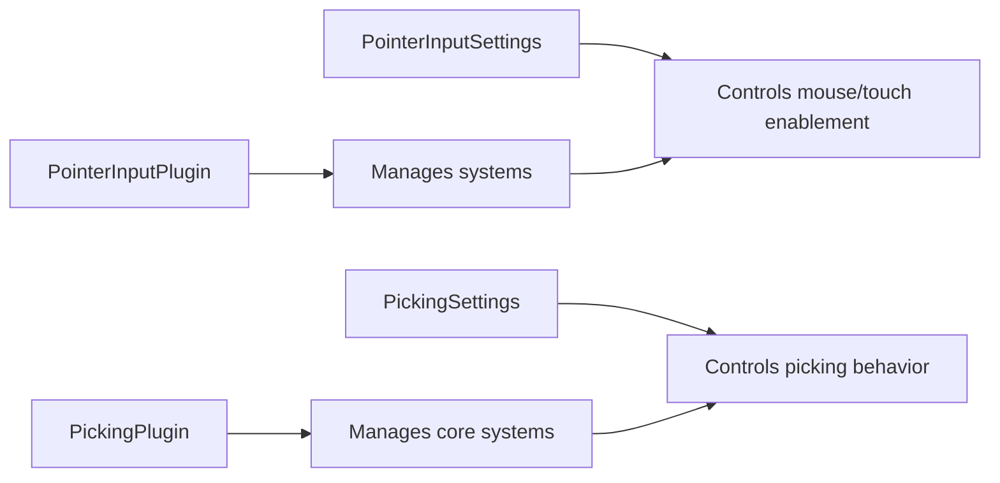

+++
title = "#19078 Extract members of `PickingPlugin` and `PointerInputPlugin` into new types"
date = "2025-07-07T00:00:00"
draft = false
template = "pull_request_page.html"
in_search_index = false

[extra]
current_language = "zh-cn"
available_languages = {"en" = { name = "English", url = "/pull_request/bevy/2025-07/pr-19078-en-20250707" }, "zh-cn" = { name = "中文", url = "/pull_request/bevy/2025-07/pr-19078-zh-cn-20250707" }}
labels = ["C-Code-Quality", "D-Straightforward", "A-Picking"]
+++

# Extract members of `PickingPlugin` and `PointerInputPlugin` into new types

## Basic Information
- **Title**: Extract members of `PickingPlugin` and `PointerInputPlugin` into new types
- **PR Link**: https://github.com/bevyengine/bevy/pull/19078
- **Author**: hukasu
- **Status**: MERGED
- **Labels**: C-Code-Quality, S-Ready-For-Final-Review, M-Needs-Migration-Guide, D-Straightforward, A-Picking
- **Created**: 2025-05-05T16:58:06Z
- **Merged**: 2025-07-07T19:59:59Z
- **Merged By**: alice-i-cecile

## Description Translation
`PickingPlugin` 和 `PointerInputPlugin` 同时作为插件和资源存在，这种设计显得有些奇怪。

### 解决方案
将 `PickingPlugin` 和 `PointerInputPlugin` 的资源功能提取到新的资源类型中

### 测试
`mesh_picking` 和 `sprite_picking`

## The Story of This Pull Request

在 Bevy 的 picking 系统中，`PickingPlugin` 和 `PointerInputPlugin` 承担了双重职责：它们既是设置系统的插件，又是包含运行时配置的资源。这种设计违反了单一职责原则，导致代码结构不够清晰。开发者在使用这些插件时，需要同时理解它们的插件初始化逻辑和资源配置功能，这增加了认知负担。

为了解决这个问题，PR #19078 进行了重构，将配置部分从插件中分离出来。具体做法是创建新的资源类型 `PickingSettings` 和 `PointerInputSettings` 来专门管理配置参数，而原始插件则简化为只负责系统初始化和资源设置。

在实现上，这个重构涉及几个关键步骤：
1. 将原插件结构体中的配置字段提取到新的 settings 资源类型
2. 将原插件类型改为空结构体，仅保留 Plugin 实现
3. 修改系统运行条件，从直接访问插件资源改为访问新的 settings 资源
4. 更新资源初始化逻辑，使用 `init_resource` 替代直接插入

这种分离带来了几个好处：配置和初始化逻辑解耦，用户可以通过标准资源 API 控制 picking 行为，代码结构更符合 Bevy 的惯用模式。例如，现在可以通过标准方式初始化自定义配置：

```rust
app.insert_resource(PickingSettings {
    is_enabled: true,
    is_input_enabled: false,
    is_hover_enabled: true,
    is_window_picking_enabled: false,
})
.add_plugins(PickingPlugin);
```

在系统运行条件方面，条件检查现在基于新的 settings 资源。以前的条件检查方法如 `PickingPlugin::input_should_run` 被更新为 `PickingSettings::input_should_run`，这更准确地反映了其作为运行时配置的角色。

重构还保持了完全的向后兼容性。因为新插件会自动初始化默认的 settings 资源，现有用户如果不修改配置，可以无缝升级。对于需要自定义配置的用户，迁移指南提供了明确的升级路径。

## Visual Representation



## Key Files Changed

### `crates/bevy_picking/src/input.rs` (+34/-18)
重构了鼠标/触摸输入处理，将配置移出插件

```rust
// Before:
#[derive(Copy, Clone, Resource, Debug, Reflect)]
pub struct PointerInputPlugin {
    pub is_touch_enabled: bool,
    pub is_mouse_enabled: bool,
}

// After:
#[derive(Copy, Clone, Resource, Debug, Reflect)]
pub struct PointerInputSettings {
    pub is_touch_enabled: bool,
    pub is_mouse_enabled: bool,
}

pub struct PointerInputPlugin;

impl Plugin for PointerInputPlugin {
    fn build(&self, app: &mut App) {
        app.init_resource::<PointerInputSettings>()
            .add_systems(
                First,
                mouse_pick_events.run_if(PointerInputSettings::is_mouse_enabled),
                // ...
            )
    }
}
```

### `crates/bevy_picking/src/lib.rs` (+35/-15)
重构了核心 picking 系统，分离配置和逻辑

```rust
// Before:
#[derive(Resource)]
pub struct PickingPlugin {
    pub is_enabled: bool,
    // ...其他配置字段
}

// After:
#[derive(Resource)]
pub struct PickingSettings {
    pub is_enabled: bool,
    // ...其他配置字段
}

pub struct PickingPlugin;

impl Plugin for PickingPlugin {
    fn build(&self, app: &mut App) {
        app.init_resource::<PickingSettings>()
            .add_systems(
                PreUpdate,
                window::update_window_hits
                    .run_if(PickingSettings::window_picking_should_run)
            )
    }
}
```

### `release-content/migration-guides/extract-picking-plugin-members.md` (+10/-0)
新增迁移指南，说明如何更新 picking 配置

```markdown
---
title: Extract `PickingPlugin` members into `PickingSettings`
---

Controlling the behavior of picking should be done through
the `PickingSettings` resource instead of `PickingPlugin`.

To initialize `PickingSettings` with non-default values, simply add
the resource to the app using `insert_resource` with the desired value.
```

### `release-content/migration-guides/extract-pointer-input-plugin-members.md` (+10/-0)
新增迁移指南，说明如何更新输入配置

```markdown
---
title: Extract `PointerInputPlugin` members into `PointerInputSettings`
---

Toggling mouse and touch input update for picking should be done through
the `PointerInputSettings` resource instead of `PointerInputPlugin`.

To initialize `PointerInputSettings` with non-default values, simply add
the resource to the app using `insert_resource` with the desired value.
```

## Further Reading
- [Bevy Plugins Documentation](https://docs.rs/bevy/latest/bevy/app/trait.Plugin.html)
- [Resource Pattern in ECS](https://github.com/bevyengine/bevy/blob/main/docs/plugins_guidelines.md#resources)
- [System Run Conditions](https://docs.rs/bevy/latest/bevy/ecs/schedule/trait.IntoSystemConfigs.html#method.run_if)