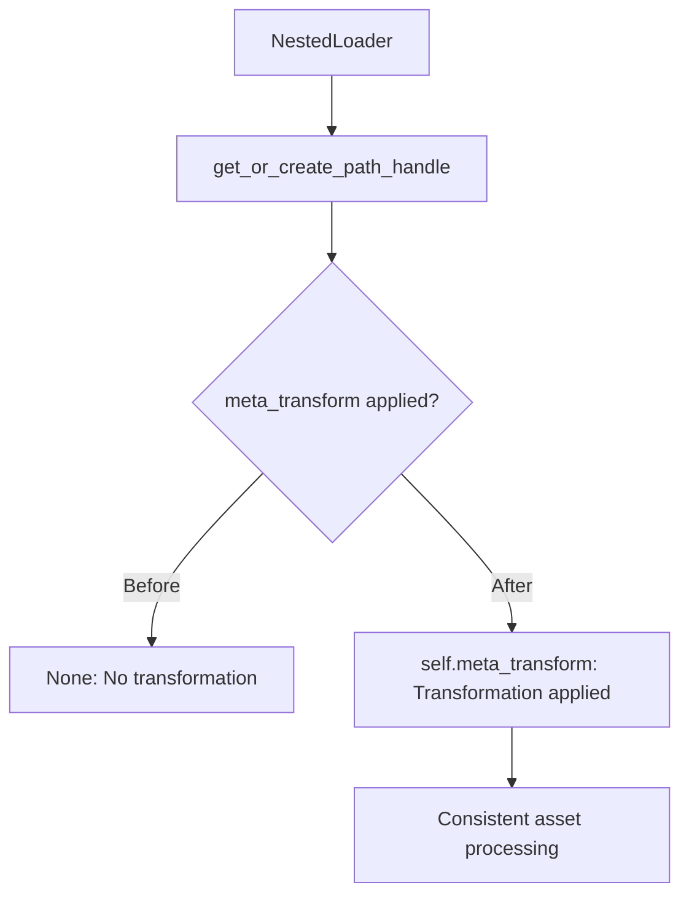

+++
title = "#19117 Fix a `NestedLoader` code path that failed to use its meta transform"
date = "2025-07-14T00:00:00"
draft = false
template = "pull_request_page.html"
in_search_index = true

[taxonomies]
list_display = ["show"]

[extra]
current_language = "en"
available_languages = {"en" = { name = "English", url = "/pull_request/bevy/2025-07/pr-19117-en-20250714" }, "zh-cn" = { name = "中文", url = "/pull_request/bevy/2025-07/pr-19117-zh-cn-20250714" }}
labels = ["C-Bug", "A-Assets", "D-Straightforward"]
+++

## Technical Analysis of PR #19117: Fix a `NestedLoader` code path that failed to use its meta transform

### Basic Information
- **Title**: Fix a `NestedLoader` code path that failed to use its meta transform
- **PR Link**: https://github.com/bevyengine/bevy/pull/19117
- **Author**: greeble-dev
- **Status**: MERGED
- **Labels**: C-Bug, A-Assets, S-Ready-For-Final-Review, D-Straightforward
- **Created**: 2025-05-07T16:48:02Z
- **Merged**: 2025-07-14T20:35:14Z
- **Merged By**: alice-i-cecile

### Description
While poking around `NestedLoader` I noticed that one code path fails to pass on the loader's meta transform.

```diff
- .get_or_create_path_handle(path, None)
+ .get_or_create_path_handle(path, self.meta_transform)
```

This seems like a simple oversight - all other code paths pass on the meta transform where possible - although I'm not familiar enough with the asset system to be 100% sure. It was introduced when asset loaders were changed to use the builder pattern (#13465).

Unfortunately I couldn't find an example that actually hits this code path. So I don't have a good test case, and I don't know if any users have experienced it as a bug.

#### Testing

```
cargo test -p bevy_asset
```

Also tested various examples - `testbed_2d`, `testbed_3d` and everything in `examples/asset`.

### The Story of This Pull Request

During routine analysis of Bevy's asset loading system, the developer identified an inconsistency in how `NestedLoader` handles asset metadata transformations. The `NestedLoader` class plays a critical role in asset processing, particularly for handling nested assets within complex asset structures. Its primary function involves resolving asset paths and creating handles while applying metadata transformations where necessary.

The core issue stemmed from a specific code path in the `NestedLoader` implementation where asset handles were being created without applying the required metadata transformations. This oversight occurred because the `get_or_create_path_handle` method was being called with a `None` value for the meta transform parameter, bypassing the transformation pipeline:

```rust
.get_or_create_path_handle(path, None)
```

This was inconsistent with other code paths in the same class that correctly passed `self.meta_transform` to the same method. The developer traced this issue back to PR #13465, which transitioned asset loaders to a builder pattern. During that refactor, this particular code path was not updated to handle metadata transformations correctly.

The fix was straightforward but important for maintaining consistent asset processing behavior. The developer modified the call to properly pass the loader's metadata transformation function:

```rust
.get_or_create_path_handle(path, self.meta_transform)
```

This change ensures that all asset handle creations through this code path now properly apply the required metadata transformations. The `meta_transform` function is essential for processing asset metadata (元数据) - it handles tasks like setting default values, applying overrides, and preparing assets for loading. Without this transformation, assets loaded through this path could exhibit unexpected behavior due to unprocessed metadata.

The developer noted that while the fix was logically sound, they couldn't identify a specific test case or example that exercised this particular code path. This made it difficult to verify the concrete impact of the bug or demonstrate the fix through automated tests. However, given that all other similar code paths in `NestedLoader` already used the meta transform, the change was justified as a consistency improvement and potential bug prevention measure.

Testing was performed through:
1. Standard test suite execution (`cargo test -p bevy_asset`)
2. Manual verification with multiple Bevy examples including `testbed_2d`, `testbed_3d`, and all examples in `examples/asset`

The minimal nature of the change (single line modification) and its straightforward correction of an obvious inconsistency made it a low-risk improvement. The PR was labeled accordingly (C-Bug, A-Assets, D-Straightforward) and merged after review.

### Visual Representation



### Key Files Changed

#### `crates/bevy_asset/src/loader_builders.rs`
**Change**: Fixed inconsistent metadata transformation handling in `NestedLoader` implementation  
**Purpose**: Ensure all asset handle creations apply required metadata transformations  
**Impact**: Maintains consistent asset processing behavior across all code paths  

```rust
// Before:
self.load_context
    .asset_server
    .get_or_create_path_handle(path, None)

// After:
self.load_context
    .asset_server
    .get_or_create_path_handle(path, self.meta_transform)
```

### Further Reading
1. [Bevy Asset System Documentation](https://bevyengine.org/learn/book/features/assets/)
2. [Original Builder Pattern Refactor (PR #13465)](https://github.com/bevyengine/bevy/pull/13465)
3. [Asset Metadata Processing in Bevy](https://bevyengine.org/learn/book/features/assets/#asset-metadata)