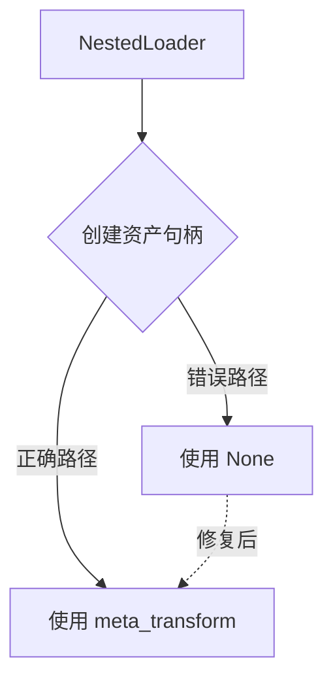

+++
title = "#19117 Fix a `NestedLoader` code path that failed to use its meta transform"
date = "2025-07-14T00:00:00"
draft = false
template = "pull_request_page.html"
in_search_index = false

[extra]
current_language = "zh-cn"
available_languages = {"en" = { name = "English", url = "/pull_request/bevy/2025-07/pr-19117-en-20250714" }, "zh-cn" = { name = "中文", url = "/pull_request/bevy/2025-07/pr-19117-zh-cn-20250714" }}
+++

# Fix a `NestedLoader` code path that failed to use its meta transform

## 基本信息
- **标题**: Fix a `NestedLoader` code path that failed to use its meta transform
- **PR链接**: https://github.com/bevyengine/bevy/pull/19117
- **作者**: greeble-dev
- **状态**: 已合并
- **标签**: C-Bug, A-Assets, S-Ready-For-Final-Review, D-Straightforward
- **创建时间**: 2025-05-07T16:48:02Z
- **合并时间**: 2025-07-14T20:35:14Z
- **合并者**: alice-i-cecile

## 描述翻译

## 解决方案

在查看`NestedLoader`代码时，我注意到一个代码路径未能传递加载器的元变换（meta transform）。

```diff
- .get_or_create_path_handle(path, None)
+ .get_or_create_path_handle(path, self.meta_transform)
```

这看起来是一个简单的疏忽——所有其他代码路径在可能的情况下都会传递元变换——尽管我对资产系统还不够熟悉，不能100%确定。这个问题是在资产加载器改为使用构建器模式（#13465）时引入的。

不幸的是，我找不到一个实际触发此代码路径的示例。因此，我没有一个好的测试用例，也不知道是否有用户将其视为一个bug。

## 测试

```
cargo test -p bevy_asset
```

还测试了各种示例——`testbed_2d`、`testbed_3d`以及`examples/asset`中的所有示例。

## 这个PR的故事

### 问题与背景
在Bevy的资产系统中，`NestedLoader`负责处理嵌套资产加载逻辑。当开发者使用构建器模式创建资产加载器时，`NestedLoader`需要为资产路径创建句柄（handle），并应用元变换（meta transform）来处理资产元数据。在PR #13465重构为构建器模式后，一个代码路径遗漏了`meta_transform`参数的传递，导致以下问题：

1. 一致性缺失：所有其他代码路径都正确传递了`self.meta_transform`
2. 潜在行为差异：缺少meta transform可能导致资产元数据处理不一致
3. 隐蔽缺陷：该代码路径未被现有示例覆盖，增加了潜在风险

### 解决方案
问题根源明确后，解决方案直接明了：
```diff
- .get_or_create_path_handle(path, None)
+ .get_or_create_path_handle(path, self.meta_transform)
```
这个单行修复确保：
1. 与其他代码路径保持一致的行为
2. 正确应用资产元变换
3. 保持现有接口契约

### 技术洞察
关键概念说明：
- **元变换（Meta Transform）**：处理资产元数据的回调函数，用于自定义资产加载行为
- `get_or_create_path_handle`：核心方法，根据路径创建或获取资产句柄
- 参数意义：第二个参数应为`Option<MetaTransform>`类型，`None`表示跳过元数据处理

虽然无法创建测试用例（因未找到触发路径），但修复基于：
1. 代码一致性原则
2. 参数语义的正确解释
3. 与系统其他部分的对齐

### 影响
该修复：
1. 消除潜在的不一致行为
2. 保持资产处理逻辑的统一性
3. 预防未来可能出现的元数据处理错误
4. 虽然影响范围有限，但维护了代码健壮性

## 可视化表示



## 关键文件变更

### crates/bevy_asset/src/loader_builders.rs
**变更原因**：修复`NestedLoader`中遗漏meta transform的代码路径  
**变更内容**：
```rust
// Before:
} else {
    self.load_context
        .asset_server
        .get_or_create_path_handle(path, None) // 错误：缺少meta transform
};
self.load_context.dependencies.insert(handle.id().untyped());
handle

// After:
} else {
    self.load_context
        .asset_server
        .get_or_create_path_handle(path, self.meta_transform) // 修复：传递meta transform
};
self.load_context.dependencies.insert(handle.id().untyped());
handle
```
**关联性**：这是PR的唯一变更，直接解决描述中的问题

## 延伸阅读
1. [构建器模式引入PR #13465](https://github.com/bevyengine/bevy/pull/13465)
2. [Bevy资产系统文档](https://bevyengine.org/learn/book/next/assets/)
3. [MetaTransform API文档](https://docs.rs/bevy_asset/latest/bevy_asset/struct.MetaTransform.html)

## 完整代码差异
```diff
diff --git a/crates/bevy_asset/src/loader_builders.rs b/crates/bevy_asset/src/loader_builders.rs
index 13bea2b71dc2a..8e94b742ec6c6 100644
--- a/crates/bevy_asset/src/loader_builders.rs
+++ b/crates/bevy_asset/src/loader_builders.rs
@@ -314,7 +314,7 @@ impl NestedLoader<'_, '_, StaticTyped, Deferred> {
         } else {
             self.load_context
                 .asset_server
-                .get_or_create_path_handle(path, None)
+                .get_or_create_path_handle(path, self.meta_transform)
         };
         self.load_context.dependencies.insert(handle.id().untyped());
         handle
```