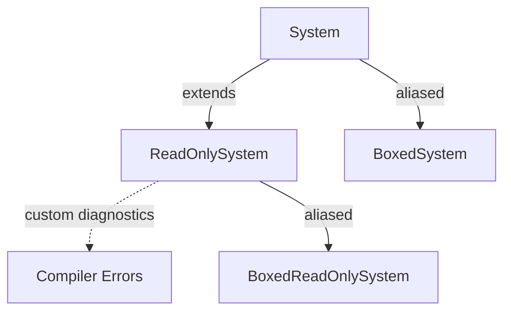

+++
title = "#19138 ReadOnlySystem diagnostics and type alias"
date = "2025-07-15T00:00:00"
draft = false
template = "pull_request_page.html"
in_search_index = true

[taxonomies]
list_display = ["show"]

[extra]
current_language = "en"
available_languages = {"en" = { name = "English", url = "/pull_request/bevy/2025-07/pr-19138-en-20250715" }, "zh-cn" = { name = "中文", url = "/pull_request/bevy/2025-07/pr-19138-zh-cn-20250715" }}
labels = ["A-ECS", "C-Usability", "D-Straightforward"]
+++

## ReadOnlySystem diagnostics and type alias

## Basic Information
- **Title**: ReadOnlySystem diagnostics and type alias
- **PR Link**: https://github.com/bevyengine/bevy/pull/19138
- **Author**: ItsDoot
- **Status**: MERGED
- **Labels**: A-ECS, C-Usability, S-Ready-For-Final-Review, D-Straightforward
- **Created**: 2025-05-09T07:53:30Z
- **Merged**: 2025-07-15T00:35:25Z
- **Merged By**: alice-i-cecile

## Description Translation
# Objective

- Improve usability of read-only systems.

## Solution

- Added `on_unimplemented` diagnostics for types/functions that aren't read-only systems.
- Added `BoxedReadOnlySystem` type alias, similar to `BoxedSystem`.

## Testing

Can/should we test these diagnostics?

## The Story of This Pull Request

In Bevy's ECS architecture, read-only systems play a critical role in enabling parallel execution. Systems implementing the `ReadOnlySystem` trait guarantee they won't mutate the `World` state, allowing the scheduler to safely execute them concurrently with other read-only systems. However, two usability issues existed in the previous implementation.

First, when developers accidentally used a mutable system where a read-only system was required, the compiler errors were generic and unhelpful. The error messages didn't clearly indicate that the issue was specifically about the read-only constraint, making debugging unnecessarily difficult. For example:

```rust
// Before PR: Generic error when passing mutable system to read-only context
fn mutable_system(mut query: Query<&mut Transform>) { /* ... */ }

// Scheduling code expecting read-only system
schedule.add_systems(mutable_system.into_readonly_system());
```

Second, while Bevy provided `BoxedSystem` for dynamically typed systems, there was no equivalent for read-only systems. This forced developers to use verbose type declarations when working with collections of boxed read-only systems:

```rust
// Before PR: No concise way to box read-only systems
let systems: Vec<Box<dyn ReadOnlySystem<In = (), Out = ()>>> = vec![
    Box::new(system_a),
    Box::new(system_b)
];
```

To address these issues, the PR implemented two targeted improvements. The first change adds custom diagnostics to the `ReadOnlySystem` trait using Rust's `on_unimplemented` attribute. This attribute generates clearer error messages when a type fails to implement the trait:

```rust
#[diagnostic::on_unimplemented(
    message = "`{Self}` is not a read-only system",
    label = "invalid read-only system"
)]
pub unsafe trait ReadOnlySystem: System {
    // ... existing trait methods ...
}
```

Now when a mutable system is used incorrectly, the compiler explicitly states: "`{SystemType}` is not a read-only system" with the label "invalid read-only system". This immediate feedback helps developers quickly identify and fix the root cause.

The second change introduces a `BoxedReadOnlySystem` type alias that mirrors the existing `BoxedSystem` pattern:

```rust
pub type BoxedReadOnlySystem<In = (), Out = ()> = Box<dyn ReadOnlySystem<In = In, Out = Out>>;
```

This allows more concise and readable code when working with boxed read-only systems:

```rust
// After PR: Cleaner boxed read-only system usage
let systems: Vec<BoxedReadOnlySystem> = vec![
    Box::new(system_a),
    Box::new(system_b)
];
```

Both changes are intentionally minimal and non-breaking. They follow existing patterns in Bevy's ECS implementation while significantly improving developer experience. The diagnostics improvement helps catch mistakes earlier in development, while the type alias reduces boilerplate and improves code readability when working with dynamic system collections.

## Visual Representation



## Key Files Changed

1. `crates/bevy_ecs/src/system/system.rs`
   - Added diagnostic attributes to `ReadOnlySystem`
   - Created new type alias `BoxedReadOnlySystem`

```rust
// Before: No diagnostics or type alias
pub unsafe trait ReadOnlySystem: System {
    // ...
}

pub type BoxedSystem<In = (), Out = ()> = Box<dyn System<In = In, Out = Out>>;
```

```rust
// After: Added diagnostics and type alias
#[diagnostic::on_unimplemented(
    message = "`{Self}` is not a read-only system",
    label = "invalid read-only system"
)]
pub unsafe trait ReadOnlySystem: System {
    // ...
}

pub type BoxedSystem<In = (), Out = ()> = Box<dyn System<In = In, Out = Out>>;

/// A convenience type alias for a boxed [`ReadOnlySystem`] trait object.
pub type BoxedReadOnlySystem<In = (), Out = ()> = Box<dyn ReadOnlySystem<In = In, Out = Out>>;
```

## Further Reading
- [Rust's `on_unimplemented` attribute](https://doc.rust-lang.org/rustc/diagnostics/diagnostics.html#the-on_unimplemented-attribute) (unstable feature)
- [Bevy ECS System Documentation](https://docs.rs/bevy_ecs/latest/bevy_ecs/system/trait.System.html)
- [Bevy Parallel Query Execution](https://bevyengine.org/learn/book/migration-guides/0.12-to-0.13/#parallel-query-iteration)