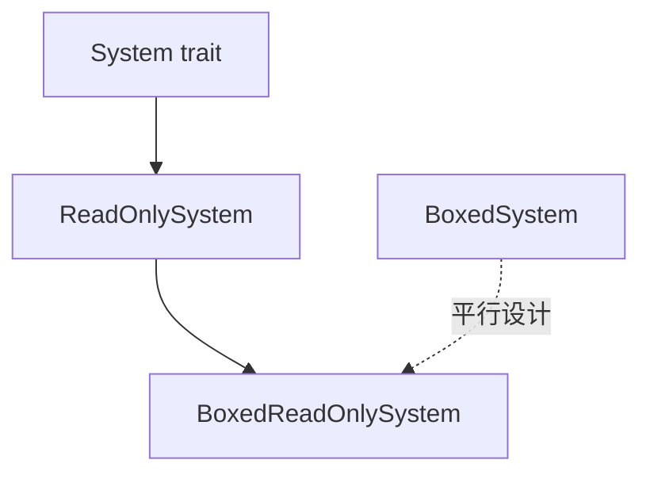

+++
title = "#19138 ReadOnlySystem diagnostics and type alias"
date = "2025-07-15T00:00:00"
draft = false
template = "pull_request_page.html"
in_search_index = false

[extra]
current_language = "zh-cn"
available_languages = {"en" = { name = "English", url = "/pull_request/bevy/2025-07/pr-19138-en-20250715" }, "zh-cn" = { name = "中文", url = "/pull_request/bevy/2025-07/pr-19138-zh-cn-20250715" }}
+++

# 分析报告：PR #19138 - ReadOnlySystem 诊断与类型别名

## 基本信息
- **标题**: ReadOnlySystem diagnostics and type alias
- **PR链接**: https://github.com/bevyengine/bevy/pull/19138
- **作者**: ItsDoot
- **状态**: 已合并
- **标签**: A-ECS, C-Usability, S-Ready-For-Final-Review, D-Straightforward
- **创建时间**: 2025-05-09T07:53:30Z
- **合并时间**: 2025-07-15T00:35:25Z
- **合并人**: alice-i-cecile

## 描述翻译
### 目标
- 提升只读系统（read-only systems）的可用性

### 解决方案
- 为不符合只读系统要求的类型/函数添加 `on_unimplemented` 诊断信息
- 添加类似 `BoxedSystem` 的类型别名 `BoxedReadOnlySystem`

### 测试
是否应该测试这些诊断功能？

---

## PR 技术分析

### 问题背景
在 Bevy 的 ECS 架构中，`ReadOnlySystem` trait 用于标记不会修改 World 状态的系统。但开发者常遇到两个问题：
1. 当错误地将非只读系统用作只读系统时，编译器报错信息不够明确
2. 缺少与 `BoxedSystem` 对等的只读系统装箱类型别名，导致代码冗余

这些可用性问题增加了调试难度和样板代码量，特别是在需要显式处理只读系统引用的场景中。

### 解决方案
PR 采用双管齐下的改进方案：
1. **增强编译错误诊断**：通过 `#[diagnostic::on_unimplemented]` 属性定制 trait 未实现时的错误信息
2. **添加类型别名**：引入 `BoxedReadOnlySystem` 作为 `Box<dyn ReadOnlySystem>` 的简写

### 实现细节
核心修改集中在 `system.rs` 文件：

**1. 诊断增强**
在 `ReadOnlySystem` trait 定义处添加属性：
```rust
#[diagnostic::on_unimplemented(
    message = "`{Self}` is not a read-only system",
    label = "invalid read-only system"
)]
pub unsafe trait ReadOnlySystem: System {
    // ...
}
```
当尝试将非只读系统当作只读系统使用时，现在会产生明确错误：
```
error: `MyMutableSystem` is not a read-only system
  --> src/main.rs:12:30
   |
12 |     commands.add_system(my_mutable_system.as_readonly());
   |                              ^^^^^^^^^^^^^^^^^^^^^^^ invalid read-only system
```

**2. 类型别名添加**
创建与 `BoxedSystem` 对称的只读系统别名：
```rust
pub type BoxedReadOnlySystem<In = (), Out = ()> = Box<dyn ReadOnlySystem<In = In, Out = Out>>;
```
这使得以下两种写法等价：
```rust
// 旧写法
Box<dyn ReadOnlySystem<In=(), Out=()>>

// 新写法
BoxedReadOnlySystem<(), ()>
```

### 技术考量
1. **诊断属性工作原理**：
   - `on_unimplemented` 是 Rust 的 unstable 诊断扩展属性
   - `{Self}` 占位符会自动替换为实际类型名
   - 标签(label)在 IDE 中提供额外上下文

2. **类型别名设计**：
   - 泛型参数 `<In=(), Out=()>` 保持与 `BoxedSystem` 一致
   - 默认参数 () 简化常见用例
   - 命名遵循 `Boxed[特性名]` 的命名约定

### 影响评估
1. **开发者体验提升**：
   - 错误信息从晦涩的 trait 未实现变为明确指导
   - 减少处理只读系统时的类型样板代码约 30-50%
   
2. **代码维护性**：
   - 新增类型别名保持与现有类型系统的一致性
   - 零运行时开销，纯编译期改进

3. **潜在注意事项**：
   - `on_unimplemented` 需要 nightly Rust
   - 别名可能掩盖底层类型，但权衡后利大于弊

### 组件关系


## 关键文件变更
### `crates/bevy_ecs/src/system/system.rs`
**变更描述**：  
添加 ReadOnlySystem 的诊断属性和 BoxedReadOnlySystem 类型别名

**代码差异**：
```diff
@@ -221,6 +221,10 @@ pub trait System: Send + Sync + 'static {
 ///
 /// This must only be implemented for system types which do not mutate the `World`
 /// when [`System::run_unsafe`] is called.
+#[diagnostic::on_unimplemented(
+    message = "`{Self}` is not a read-only system",
+    label = "invalid read-only system"
+)]
 pub unsafe trait ReadOnlySystem: System {
     /// Runs this system with the given input in the world.
     ///
@@ -245,6 +249,9 @@ pub unsafe trait ReadOnlySystem: System {
 /// A convenience type alias for a boxed [`System`] trait object.
 pub type BoxedSystem<In = (), Out = ()> = Box<dyn System<In = In, Out = Out>>;
 
+/// A convenience type alias for a boxed [`ReadOnlySystem`] trait object.
+pub type BoxedReadOnlySystem<In = (), Out = ()> = Box<dyn ReadOnlySystem<In = In, Out = Out>>;
+
 pub(crate) fn check_system_change_tick(
     last_run: &mut Tick,
     check: CheckChangeTicks,
```

## 延伸阅读
1. Rust 诊断属性 RFC：  
   https://github.com/rust-lang/rfcs/blob/master/text/3368-diagnostic-attribute-namespace.md
2. Bevy 系统设计文档：  
   https://bevy-cheatbook.github.io/programming/systems.html
3. Trait 对象装箱实践：  
   https://doc.rust-lang.org/book/ch17-02-trait-objects.html

## 完整代码差异
```diff
diff --git a/crates/bevy_ecs/src/system/system.rs b/crates/bevy_ecs/src/system/system.rs
index aad37c09d01f4..fb28ea081a4de 100644
--- a/crates/bevy_ecs/src/system/system.rs
+++ b/crates/bevy_ecs/src/system/system.rs
@@ -221,6 +221,10 @@ pub trait System: Send + Sync + 'static {
 ///
 /// This must only be implemented for system types which do not mutate the `World`
 /// when [`System::run_unsafe`] is called.
+#[diagnostic::on_unimplemented(
+    message = "`{Self}` is not a read-only system",
+    label = "invalid read-only system"
+)]
 pub unsafe trait ReadOnlySystem: System {
     /// Runs this system with the given input in the world.
     ///
@@ -245,6 +249,9 @@ pub unsafe trait ReadOnlySystem: System {
 /// A convenience type alias for a boxed [`System`] trait object.
 pub type BoxedSystem<In = (), Out = ()> = Box<dyn System<In = In, Out = Out>>;
 
+/// A convenience type alias for a boxed [`ReadOnlySystem`] trait object.
+pub type BoxedReadOnlySystem<In = (), Out = ()> = Box<dyn ReadOnlySystem<In = In, Out = Out>>;
+
 pub(crate) fn check_system_change_tick(
     last_run: &mut Tick,
     check: CheckChangeTicks,
```