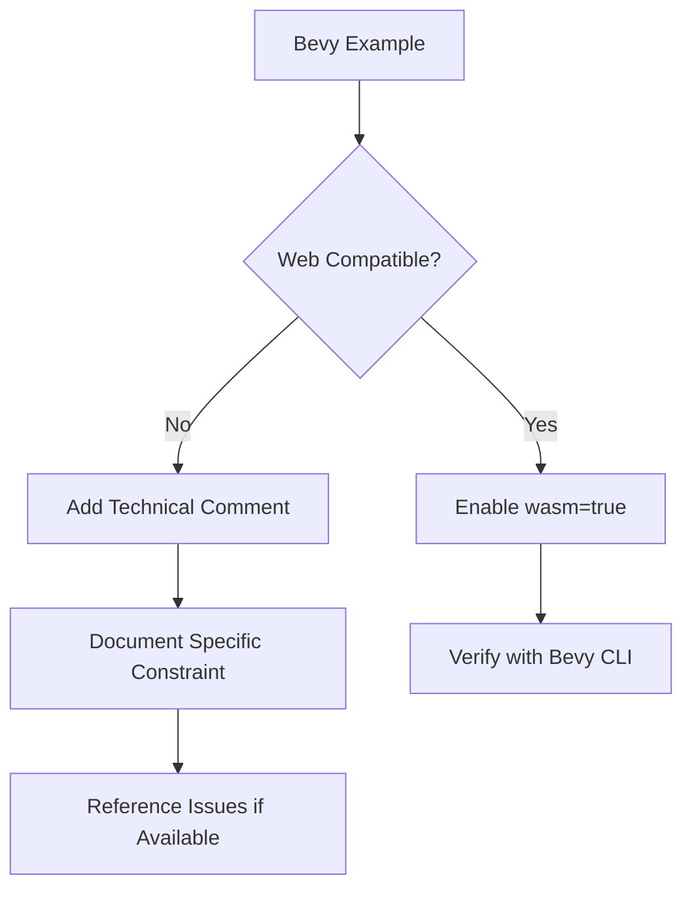

+++
title = "#19262 Document why examples are disabled on the web, pass 1"
date = "2025-07-07T00:00:00"
draft = false
template = "pull_request_page.html"
in_search_index = true

[taxonomies]
list_display = ["show"]

[extra]
current_language = "en"
available_languages = {"en" = { name = "English", url = "/pull_request/bevy/2025-07/pr-19262-en-20250707" }, "zh-cn" = { name = "中文", url = "/pull_request/bevy/2025-07/pr-19262-zh-cn-20250707" }}
labels = ["C-Docs", "C-Examples", "O-Web", "A-Meta", "O-WebGL2"]
+++

# Documenting Web Constraints for Bevy Examples: PR #19262 Analysis

## Basic Information
- **Title**: Document why examples are disabled on the web, pass 1
- **PR Link**: https://github.com/bevyengine/bevy/pull/19262
- **Author**: TimJentzsch
- **Status**: MERGED
- **Labels**: C-Docs, C-Examples, O-Web, A-Meta, S-Ready-For-Final-Review, O-WebGL2
- **Created**: 2025-05-17T15:12:35Z
- **Merged**: 2025-07-07T20:32:19Z
- **Merged By**: alice-i-cecile

## Description Translation
# Objective

With the Bevy CLI, we now have an easy way to locally test if examples work on the web.
We should start to explicitly document why examples don't work on the web to keep track and to ensure that as many examples are enabled as possible.

## Solution

- Go through the examples with `wasm = false` and check if they really don't work
- If they don't work, try to figure out why by looking through the code and announcement posts (we need better docs for this please) and add a comment explaining it
- The `lightmap` example seemed to work without problems, so I enabled it

## Testing

Install the [Bevy CLI](https://github.com/TheBevyFlock/bevy_cli) and run:

```
bevy run --example={example_name} web --open
```

# Future Work

- There are about 100 more examples with `wasm = false` that also need to be documeneted
- Also improve the documentation on the related features/plugins/types to make it easier for users to determine what they can use

## The Story of This Pull Request

The core problem addressed in this PR was the lack of documentation explaining why certain Bevy examples were disabled for web targets. With the introduction of the Bevy CLI, developers gained an efficient way to test examples in web environments using commands like `bevy run --example={name} web --open`. However, approximately 100 examples had `wasm = false` flags without clear explanations, making it difficult to track compatibility issues or re-enable examples when web capabilities improved.

The solution approach involved systematically reviewing each disabled example to verify its web incompatibility and document the specific technical constraints. The author used the Bevy CLI to test examples locally and investigated codebases and announcement posts to identify root causes. For each confirmed incompatible example, they added inline comments above the `wasm = false` flag explaining the technical limitation. When examples were found to work correctly (like `lightmap`), the web flag was explicitly enabled.

Key technical constraints identified during this audit included:
1. **Compute shader requirements**: Examples like `auto_exposure` and `ssao` require compute shaders, which aren't supported in WebGL
2. **Rendering technique limitations**: `wireframe` and `oit` rely on rendering techniques unsupported in WebGL
3. **Asset loading constraints**: `texture_atlas` requires folder-based asset loading, unavailable in Wasm
4. **Browser API gaps**: `drag_and_drop` depends on browser APIs not exposed to Wasm
5. **Texture binding limits**: `irradiance_volumes` exceeds WebGL/WebGPU texture binding limits
6. **Headless operation**: Examples like `empty` and `headless` don't render content or create canvases

The implementation consisted of adding precise technical comments to 16 examples in `Cargo.toml`. Each comment explains the specific web compatibility issue using concrete technical terms. For example:

```toml
# On WebGL and WebGPU, the number of texture bindings is too low
# See <https://github.com/bevyengine/bevy/issues/11885>
wasm = false
```

Two examples (`skybox` and `lightmap`) were enabled for web after verification. The `lightmap` example in particular showed that previous assumptions about its incompatibility were incorrect, demonstrating the value of systematic verification.

These changes improve maintainability by:
1. Creating a searchable record of web limitations
2. Enabling targeted fixes when web capabilities evolve
3. Reducing duplicate investigation efforts
4. Providing clear guidance for contributors adding new examples

The PR establishes a pattern for future documentation passes by showing how to:
- Reference related GitHub issues
- Specify exact technical constraints
- Distinguish between WebGL and WebGPU limitations
- Enable examples when constraints are resolved

## Visual Representation



## Key Files Changed

### `Cargo.toml` (+19/-2)
This file contains metadata and configuration for all Bevy examples. The changes add documentation comments explaining web incompatibilities and enable two previously disabled examples.

**Significant Changes:**

1. Added documentation for Texture Atlas example:
```toml
# Before:
wasm = false

# After:
# Loading asset folders is not supported in Wasm, but required to create the atlas.
wasm = false
```

2. Enabled lightmap example:
```toml
# Before:
wasm = false

# After:
wasm = true
```

3. Detailed documentation for Irradiance Volumes:
```toml
# Before:
wasm = false

# After:
# On WebGL and WebGPU, the number of texture bindings is too low
# See <https://github.com/bevyengine/bevy/issues/11885>
wasm = false
```

4. Enabled skybox example:
```toml
# Before:
wasm = false

# After:
wasm = true
```

5. Compute shader limitation documentation:
```toml
# Before:
wasm = false

# After:
# Requires compute shaders, which are not supported by WebGL.
wasm = false
```

## Further Reading
1. [Bevy WebGL2 Support Tracking Issue](https://github.com/bevyengine/bevy/issues/11970)
2. [WebGPU vs WebGL Capabilities Comparison](https://developer.mozilla.org/en-US/docs/Web/API/WebGPU_API)
3. [Bevy CLI Documentation](https://github.com/TheBevyFlock/bevy_cli)
4. [Wasm Asset Loading Constraints](https://bevyengine.org/learn/book/getting-started/resources/#loading-assets)