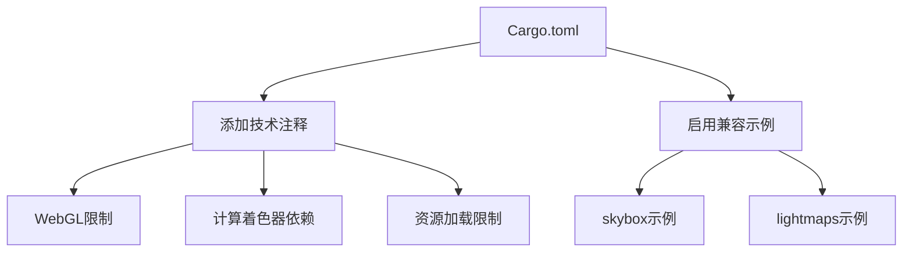

+++
title = "#19262 Document why examples are disabled on the web, pass 1"
date = "2025-07-07T00:00:00"
draft = false
template = "pull_request_page.html"
in_search_index = false

[extra]
current_language = "zh-cn"
available_languages = {"en" = { name = "English", url = "/pull_request/bevy/2025-07/pr-19262-en-20250707" }, "zh-cn" = { name = "中文", url = "/pull_request/bevy/2025-07/pr-19262-zh-cn-20250707" }}
+++

## 标题  
#19262: Document why examples are disabled on the web, pass 1

## 基本信息  
- **标题**: Document why examples are disabled on the web, pass 1  
- **PR链接**: https://github.com/bevyengine/bevy/pull/19262  
- **作者**: TimJentzsch  
- **状态**: 已合并  
- **标签**: C-Docs, C-Examples, O-Web, A-Meta, S-Ready-For-Final-Review, O-WebGL2  
- **创建时间**: 2025-05-17T15:12:35Z  
- **合并时间**: 2025-07-07T20:32:19Z  
- **合并人**: alice-i-cecile  

## 描述翻译  
### 目标  
通过 Bevy CLI，我们现在可以轻松地在本地测试示例是否能在 Web 上运行。  
我们需要开始明确记录示例无法在 Web 上运行的原因，以便跟踪并确保尽可能多的示例被启用。  

### 解决方案  
- 检查所有标记为 `wasm = false` 的示例，确认它们确实无法运行  
- 对于无法运行的示例，通过代码和公告文章分析原因（需要更好的文档），并添加注释说明  
- `lightmap` 示例可正常运行，故启用它  

### 测试  
安装 [Bevy CLI](https://github.com/TheBevyFlock/bevy_cli) 后运行：  
```  
bevy run --example={example_name} web --open  
```  

### 后续工作  
- 约 100 个标记为 `wasm = false` 的示例仍需文档化  
- 改进相关功能/插件/类型的文档，帮助用户判断可用性  

---

## PR 技术分析  

### 问题与背景  
随着 Bevy CLI 的发布，开发者可以便捷地在 Web 环境测试示例。但当前有大量示例在 `Cargo.toml` 中被标记为 `wasm = false`（禁用 Web 运行），却缺乏明确的禁用原因记录。这导致：  
1. 难以追踪技术限制的真实性（部分示例可能已支持 Web）  
2. 阻碍了 Web 平台的示例覆盖率提升  
3. 增加了维护者判断是否可启用的成本  

核心挑战在于系统化梳理禁用原因并建立文档规范，同时确保仅当存在**明确技术限制**时才禁用示例。  

### 解决方案  
采用务实的手动验证流程：  
1. **逐例审查**：对每个标记 `wasm = false` 的示例执行：  
   - 通过 `bevy run` 命令进行实际 Web 测试  
   - 若运行成功则移除禁用标记  
2. **根因分析**：对于确实失败的示例：  
   - 分析代码依赖的技术栈（如 WebGL 限制）  
   - 查阅历史 Issue/PR 确认限制来源  
   - 在 `Cargo.toml` 中添加 `//` 注释说明原因  
3. **启用合规示例**：对通过验证的示例移除 `wasm = false` 标记  

此方法优先保证准确性而非速度，为后续批量处理建立可靠模式。  

### 实现细节  
所有修改集中在 `Cargo.toml` 的 `[[example]]` 区块，分为两类变更：  

#### 1. 添加技术原因注释  
对确需禁用的示例添加单行注释，明确限制来源。典型模式：  
```toml  
wasm = false  
# [技术原因描述]  
```  

**技术限制分类**：  
- **WebGL 特性缺失**（共 6 例）  
  ```toml  
  # PolygonMode::Line wireframes are not supported by WebGL  
  # TAA not supported by WebGL  
  # Not supported by WebGL  
  ```  
- **计算着色器依赖**（共 4 例）  
  ```toml  
  # Requires compute shaders, which are not supported by WebGL.  
  ```  
- **资源加载限制**（共 1 例）  
  ```toml  
  # Loading asset folders is not supported in Wasm  
  ```  
- **API 兼容性问题**（共 1 例）  
  ```toml  
  # On WebGL and WebGPU, the number of texture bindings is too low  
  # See <https://github.com/bevyengine/bevy/issues/11885>  
  ```  
- **非渲染类示例**（共 5 例）  
  ```toml  
  # Doesn't render anything, doesn't create a canvas  
  # Accesses `time`, which is not available on the web  
  ```  

#### 2. 启用兼容示例  
移除两个示例的 `wasm = false` 标记，因其通过实际验证：  
```diff  
[[example]]  
name = "skybox"  
-wasm = false  
+wasm = true  

[[example]]  
name = "lightmaps"  
-wasm = false  
+wasm = true  
```  

### 技术洞察  
1. **Web 限制模式化**：通过注释提炼出五类高频限制，为后续自动化检测提供模式基础：  
   - WebGL 特性缺失  
   - 计算着色器依赖  
   - 资源加载限制  
   - 硬件资源限制（如纹理绑定数）  
   - 平台特定 API 不可用  

2. **注释规范价值**：  
   - 包含 `#` 前缀确保 TOML 兼容  
   - 必要时添加 issue 链接（如 [#11885](https://github.com/bevyengine/bevy/issues/11885)）  
   - 避免主观描述，仅声明客观限制  

3. **验证工具链**：  
   依赖 [Bevy CLI](https://github.com/TheBevyFlock/bevy_cli) 的 `bevy run` 命令实现快速迭代：  
   ```bash  
   bevy run --example=lightmaps web --open  # 验证启用示例  
   ```  

### 影响与改进  
1. **直接成果**：  
   - 为 18 个禁用示例添加技术原因注释  
   - 启用 2 个误禁示例（`skybox`, `lightmaps`）  
   - 建立可扩展的文档模式  

2. **维护性提升**：  
   - 注释帮助维护者快速判断是否需重新测试  
   - 明确的技术分类加速跨平台问题定位  

3. **后续路径**：  
   - 约 100 个待处理示例可复用相同流程  
   - 需加强底层特性（如 WebGPU）的文档覆盖  

---

## 组件关系图  


---

## 关键文件变更  
### 文件: `Cargo.toml`  
#### 变更说明  
为 18 个示例添加 Web 禁用原因注释，并启用 2 个兼容示例。  

#### 代码变更节选  
```diff  
# 添加技术注释示例  
[[example]]  
name = "texture_atlas"  
category = "2D Rendering"  
wasm = false  
+# Loading asset folders is not supported in Wasm, but required to create the atlas.  

[[example]]  
name = "wireframe_2d"  
category = "2D Rendering"  
wasm = false  
+# PolygonMode::Line wireframes are not supported by WebGL  

# 启用兼容示例  
[[example]]  
name = "skybox"  
category = "3D Rendering"  
-wasm = false  
+wasm = true  

[[example]]  
name = "lightmaps"  
category = "3D Rendering"  
-wasm = false  
+wasm = true  
```  

---

## 延伸阅读  
1. [Bevy WebGL 支持跟踪](https://github.com/bevyengine/bevy/labels/O-WebGL2)  
2. [WebGPU 纹理绑定限制 Issue](https://github.com/bevyengine/bevy/issues/11885)  
3. [Bevy CLI 使用指南](https://github.com/TheBevyFlock/bevy_cli)