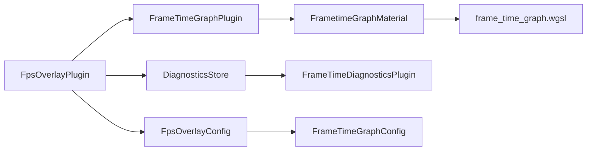

+++
title = "#19277 Add frame_time graph to fps_overlay v2"
date = "2025-07-09T00:00:00"
draft = false
template = "pull_request_page.html"
in_search_index = true

[taxonomies]
list_display = ["show"]

[extra]
current_language = "en"
available_languages = {"en" = { name = "English", url = "/pull_request/bevy/2025-07/pr-19277-en-20250709" }, "zh-cn" = { name = "中文", url = "/pull_request/bevy/2025-07/pr-19277-zh-cn-20250709" }}
labels = ["C-Feature", "A-Rendering", "A-Diagnostics", "A-Dev-Tools", "D-Modest"]
+++

## Technical Analysis of PR #19277: Add frame_time graph to fps_overlay v2

### Basic Information
- **Title**: Add frame_time graph to fps_overlay v2
- **PR Link**: https://github.com/bevyengine/bevy/pull/19277
- **Author**: Zeophlite
- **Status**: MERGED
- **Labels**: C-Feature, A-Rendering, S-Ready-For-Final-Review, A-Diagnostics, M-Needs-Release-Note, A-Dev-Tools, D-Modest
- **Created**: 2025-05-18T14:24:09Z
- **Merged**: 2025-07-09T17:20:34Z
- **Merged By**: alice-i-cecile

### Description Translation
# Objective
- Rebase of https://github.com/bevyengine/bevy/pull/12561, note that this is blocked on "up-streaming [iyes_perf_ui](https://crates.io/crates/iyes_perf_ui)", but that work seems to also be stalled

> Frame time is often more important to know than FPS but because of the temporal nature of it, just seeing a number is not enough. Seeing a graph that shows the history makes it easier to reason about performance.

## Solution
> This PR adds a bar graph of the frame time history.
> 
> Each bar is scaled based on the frame time where a bigger frame time will give a taller and wider bar.
> 
> The color also scales with that frame time where red is at or bellow the minimum target fps and green is at or above the target maximum frame rate. Anything between those 2 values will be interpolated between green and red based on the frame time.
> 
> The algorithm is highly inspired by this article: https://asawicki.info/news_1758_an_idea_for_visualization_of_frame_times

## Testing
- Ran `cargo run --example fps_overlay --features="bevy_dev_tools"`

### The Story of This Pull Request

#### The Problem and Context
The existing FPS overlay in Bevy provided only numerical FPS and frame time metrics. While useful, raw numbers lack temporal context, making it difficult to identify frame time spikes or performance trends over time. Developers needed a visualization tool to understand frame time patterns, especially when optimizing for consistent frame pacing. The technical challenge was to implement a performant, real-time visualization that integrates seamlessly with Bevy's existing diagnostics and UI systems.

#### The Solution Approach
The implementation adds a frame time history graph below the FPS text. Key design decisions:
1. **Bar Graph Representation**: Each frame is represented as a bar whose height and width scale with frame time
2. **Color Gradient**: Interpolates between green (good performance) and red (poor performance) based on configurable FPS targets
3. **Shader-Based Rendering**: Uses a custom WGSL shader for efficient graph rendering
4. **Dynamic Configuration**: Allows runtime toggling of graph visibility and performance thresholds
5. **Diagnostics Integration**: Leverages Bevy's existing `FrameTimeDiagnosticsPlugin` for data collection

The solution was inspired by Adam Sawicki's frame time visualization techniques, adapting them to Bevy's ECS architecture and rendering pipeline.

#### The Implementation
The implementation consists of three main parts:
1. **Configuration Extensions**:
   - Added `FrameTimeGraphConfig` to `FpsOverlayConfig`
   - Defined scaling factors for graph dimensions relative to text size

```rust
// crates/bevy_dev_tools/src/fps_overlay.rs
pub struct FrameTimeGraphConfig {
    pub enabled: bool,
    pub min_fps: f32,
    pub target_fps: f32,
}

const FRAME_TIME_GRAPH_WIDTH_SCALE: f32 = 6.0;
const FRAME_TIME_GRAPH_HEIGHT_SCALE: f32 = 2.0;
```

2. **Graph Rendering**:
   - Created dedicated UI node with custom material
   - Implemented sizing relative to text dimensions

```rust
// In setup() function
p.spawn((
    Node {
        width: Val::Px(font_size * FRAME_TIME_GRAPH_WIDTH_SCALE),
        height: Val::Px(font_size * FRAME_TIME_GRAPH_HEIGHT_SCALE),
        // ...
    },
    MaterialNode::from(frame_time_graph_materials.add(FrametimeGraphMaterial { /* ... */ })),
    FrameTimeGraph,
));
```

3. **Shader Implementation**:
   - Created WGSL shader for bar graph rendering
   - Implemented frame time to color mapping
   - Used signed distance fields for efficient bar rendering

```wgsl
// crates/bevy_dev_tools/src/frame_time_graph/frame_time_graph.wgsl
fn color_from_dt(dt: f32) -> vec4<f32> {
    return mix(GREEN, RED, dt / config.dt_max);
}

@fragment
fn fragment(in: UiVertexOutput) -> @location(0) vec4<f32> {
    // ... bar rendering logic ...
}
```

#### Technical Insights
1. **Data Pipeline**:
   - Frame time data is collected via `DiagnosticsStore`
   - Converted to milliseconds and stored in shader storage buffers
   - Updated every frame through `update_frame_time_values` system

```rust
// crates/bevy_dev_tools/src/frame_time_graph/mod.rs
fn update_frame_time_values(/* ... */) {
    let frame_times = frame_time.values().map(|x| *x as f32 / 1000.0).collect::<Vec<_>>();
    buffer.set_data(frame_times.clone().as_slice());
}
```

2. **Performance Considerations**:
   - Used logarithmic scaling for better visualization of frame time variations
   - Implemented early-out in update system when graph is disabled
   - Maintained single draw call through instanced bar rendering in shader

3. **Configuration Management**:
   - Added toggle controls for both text and graph visibility
   - Made graph dimensions responsive to text size changes
   - Exposed min/target FPS parameters for customization

```rust
// crates/bevy_dev_tools/src/fps_overlay.rs
fn toggle_display(/* ... */) {
    if overlay_config.frame_time_graph_config.enabled {
        graph_style.width = Val::Px(font_size * FRAME_TIME_GRAPH_WIDTH_SCALE);
        graph_style.height = Val::Px(font_size * FRAME_TIME_GRAPH_HEIGHT_SCALE);
    }
}
```

#### The Impact
This PR enhances Bevy's developer tools by:
1. Providing visual frame time history for performance analysis
2. Adding configurable performance thresholds with color feedback
3. Maintaining backward compatibility with existing FPS overlay
4. Introducing reusable shader-based visualization components
5. Demonstrating best practices for custom UI materials in Bevy

The implementation shows how to efficiently bridge Bevy's diagnostics system with its rendering pipeline while maintaining clean separation of concerns between configuration, data processing, and visualization.

### Visual Representation



### Key Files Changed

1. `crates/bevy_dev_tools/src/fps_overlay.rs` (+107/-7)
   - Added frame time graph UI components
   - Integrated graph configuration into FPS overlay
   - Implemented responsive sizing relative to text
   
```rust
// After: Graph setup in FPS overlay
p.spawn((
    Node {
        width: Val::Px(font_size * FRAME_TIME_GRAPH_WIDTH_SCALE),
        height: Val::Px(font_size * FRAME_TIME_GRAPH_HEIGHT_SCALE),
        // ...
    },
    MaterialNode::from(frame_time_graph_materials.add(FrametimeGraphMaterial { ... })),
    FrameTimeGraph,
));
```

2. `crates/bevy_dev_tools/src/frame_time_graph/mod.rs` (+114/-0)
   - New module for frame time graph systems
   - Implemented shader material and uniform buffers
   - Created data update system

```rust
// New material definition
#[derive(AsBindGroup, Asset, TypePath, Debug, Clone)]
pub struct FrametimeGraphMaterial {
    #[storage(0, read_only)]
    pub values: Handle<ShaderStorageBuffer>,
    #[uniform(1)]
    pub config: FrameTimeGraphConfigUniform,
}
```

3. `crates/bevy_dev_tools/src/frame_time_graph/frame_time_graph.wgsl` (+68/-0)
   - Implemented bar graph rendering algorithm
   - Added color interpolation based on frame time
   - Created SDF-based bar rendering

```wgsl
// Shader color mapping
fn color_from_dt(dt: f32) -> vec4<f32> {
    return mix(GREEN, RED, dt / config.dt_max);
}
```

4. `release-content/release-notes/frame_time_graph.md` (+18/-0)
   - Added documentation for new feature
   - Explained visualization approach and configuration

```markdown
Enable the `bevy_dev_tools` feature, and add in `FpsOverlayPlugin` to add a bar graph...
```

5. `examples/dev_tools/fps_overlay.rs` (+13/-2)
   - Updated example with graph configuration
   - Added toggle controls for graph visibility

```rust
// Updated example configuration
frame_time_graph_config: FrameTimeGraphConfig {
    enabled: true,
    min_fps: 30.0,
    target_fps: 144.0,
},
```

### Further Reading
1. [Frame Time Visualization Techniques](https://asawicki.info/news_1758_an_idea_for_visualization_of_frame_times)
2. [Bevy UI Rendering Documentation](https://docs.rs/bevy_ui_render/latest/bevy_ui_render/)
3. [WGSL Shader Language Specification](https://gpuweb.github.io/gpuweb/wgsl/)
4. [Bevy Diagnostics System Overview](https://bevyengine.org/learn/book/development-practices/diagnostics/)