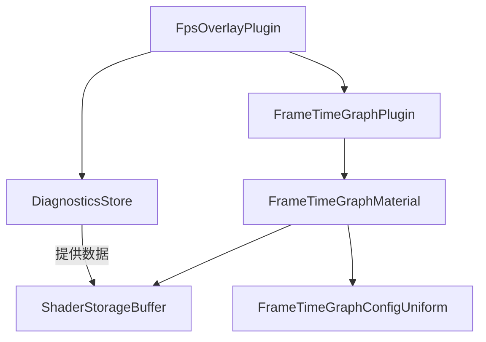

+++
title = "#19277 Add frame_time graph to fps_overlay v2"
date = "2025-07-09T00:00:00"
draft = false
template = "pull_request_page.html"
in_search_index = false

[extra]
current_language = "zh-cn"
available_languages = {"en" = { name = "English", url = "/pull_request/bevy/2025-07/pr-19277-en-20250709" }, "zh-cn" = { name = "中文", url = "/pull_request/bevy/2025-07/pr-19277-zh-cn-20250709" }}
+++

# 技术报告：PR #19277 - 在FPS叠加层中添加帧时间图表

## 基本信息
- **标题**: Add frame_time graph to fps_overlay v2
- **PR链接**: https://github.com/bevyengine/bevy/pull/19277
- **作者**: Zeophlite
- **状态**: 已合并
- **标签**: C-Feature, A-Rendering, S-Ready-For-Final-Review, A-Diagnostics, M-Needs-Release-Note, A-Dev-Tools, D-Modest
- **创建时间**: 2025-05-18T14:24:09Z
- **合并时间**: 2025-07-09T17:20:34Z
- **合并者**: alice-i-cecile

## 描述翻译
### 目标
- 对 https://github.com/bevyengine/bevy/pull/12561 的重构，此PR依赖于"上游化[iyes_perf_ui](https://crates.io/crates/iyes_perf_ui)"的工作，但该工作似乎也停滞了

> 帧时间通常比FPS更重要，但由于其时间特性，仅看数字是不够的。显示历史记录的图表能更有效地分析性能。

### 解决方案
> 此PR添加了帧时间历史的条形图。
> 
> 每个条形根据帧时间进行缩放，较大的帧时间会产生更高更宽的条形。
> 
> 颜色也随帧时间变化：红色表示低于或等于最低目标FPS，绿色表示达到或高于目标最大帧率。两者之间的值将根据帧时间在绿色和红色之间插值。
> 
> 算法灵感来源于此文：https://asawicki.info/news_1758_an_idea_for_visualization_of_frame_times

### 测试
- 运行 `cargo run --example fps_overlay --features="bevy_dev_tools"`

## PR技术分析

### 问题背景
在性能分析中，FPS（每秒帧数）是常用指标，但帧时间（每帧耗时）更能直接反映性能问题。现有FPS叠加层仅显示瞬时值，缺乏历史趋势可视化能力。当出现偶发性性能下降时，开发者难以通过单个数字诊断问题根源。因此需要扩展工具，提供帧时间历史数据的可视化支持。

### 解决方案
核心方案是在现有FPS叠加层中增加帧时间图表组件：
1. 实现基于WGSL的自定义着色器渲染帧时间条形图
2. 扩展FPS配置结构支持图表参数控制
3. 集成帧时间数据采集与缓冲区更新机制
4. 保持与现有UI系统的兼容性

关键设计决策：
- 使用对数尺度处理帧时间数据，解决小数值变化可视化问题
- 采用比例宽度渲染模式（帧时间越长条形越宽）
- 颜色插值机制直观区分性能状态
- 复用Bevy现有诊断数据采集系统

### 实现细节
新增`frame_time_graph`模块处理核心逻辑：
1. **帧时间数据采集**：从`DiagnosticsStore`获取历史帧时间数据
2. **缓冲区管理**：通过`ShaderStorageBuffer`向GPU传递数据
3. **材质系统**：实现`FrametimeGraphMaterial`自定义UI材质
4. **着色器处理**：在WGSL中实现条形图渲染算法

帧时间计算采用对数变换解决线性尺度下小值变化不明显的问题：
```rust
let dt_min_log2 = log2(dt_min);
let dt_max_log2 = log2(dt_max);
```

着色器中实现自适应条形渲染：
```wgsl
let frame_height_factor = (log2(dt) - dt_min_log2) / (dt_max_log2 - dt_min_log2);
let frame_height = mix(0.0, 1.0, frame_height_factor_norm);
```

### FPS叠加层集成
修改`fps_overlay`模块以支持图表组件：
1. 在UI结构中新增图表节点
2. 添加响应式布局逻辑
3. 实现配置联动更新

图表尺寸动态适配文本大小：
```rust
const FRAME_TIME_GRAPH_WIDTH_SCALE: f32 = 6.0;
const FRAME_TIME_GRAPH_HEIGHT_SCALE: f32 = 2.0;

// 在布局计算中
Val::Px(font_size * FRAME_TIME_GRAPH_WIDTH_SCALE)
Val::Px(font_size * FRAME_TIME_GRAPH_HEIGHT_SCALE)
```

### 性能考量
1. 每帧更新`ShaderStorageBuffer`但数据量有限（默认保留约120个帧时间点）
2. 着色器使用SDF渲染避免过度片段计算
3. 提供配置开关允许禁用图表减少开销

### 使用示例
更新`fps_overlay`示例展示配置选项：
```rust
FpsOverlayConfig {
    frame_time_graph_config: FrameTimeGraphConfig {
        enabled: true,
        min_fps: 30.0,   // 最低可接受FPS
        target_fps: 144.0 // 目标FPS
    },
    // 其他配置...
}
```

## 组件关系图


## 关键文件变更

### 1. `crates/bevy_dev_tools/src/fps_overlay.rs`
**变更描述**：扩展FPS叠加层支持帧时间图表集成

主要变更：
```rust
// 新增图表组件
p.spawn((
    Node {
        width: Val::Px(font_size * FRAME_TIME_GRAPH_WIDTH_SCALE),
        height: Val::Px(font_size * FRAME_TIME_GRAPH_HEIGHT_SCALE),
        // ...
    },
    MaterialNode::from(frame_time_graph_materials.add(FrametimeGraphMaterial {
        values: buffers.add(ShaderStorageBuffer::default()),
        config: FrameTimeGraphConfigUniform::new(/*...*/),
    })),
    FrameTimeGraph,
));

// 响应式布局更新
fn toggle_display(
    overlay_config: Res<FpsOverlayConfig>,
    mut query: Query<&mut Visibility, With<FpsText>>,
    mut graph_style: Query<&mut Node, With<FrameTimeGraph>>,
) {
    // ...
    if let Ok(mut graph_style) = graph_style.single_mut() {
        if overlay_config.frame_time_graph_config.enabled {
            let font_size = overlay_config.text_config.font_size;
            graph_style.width = Val::Px(font_size * FRAME_TIME_GRAPH_WIDTH_SCALE);
            graph_style.height = Val::Px(font_size * FRAME_TIME_GRAPH_HEIGHT_SCALE);
            // ...
        }
    }
}
```

### 2. `crates/bevy_dev_tools/src/frame_time_graph/mod.rs`
**变更描述**：实现帧时间图表核心逻辑

关键代码：
```rust
// 帧时间配置结构
#[derive(Debug, Clone, Copy, ShaderType)]
pub struct FrameTimeGraphConfigUniform {
    dt_min: f32,
    dt_max: f32,
    dt_min_log2: f32,
    dt_max_log2: f32,
    proportional_width: u32,
}

// 数据更新系统
fn update_frame_time_values(
    mut frame_time_graph_materials: ResMut<Assets<FrametimeGraphMaterial>>,
    mut buffers: ResMut<Assets<ShaderStorageBuffer>>,
    diagnostics_store: Res<DiagnosticsStore>,
) {
    let frame_time = diagnostics_store.get(&FrameTimeDiagnosticsPlugin::FRAME_TIME);
    let frame_times = frame_time.values().map(|x| *x as f32 / 1000.0).collect::<Vec<_>>();
    
    for material in frame_time_graph_materials.iter_mut() {
        let buffer = buffers.get_mut(&material.values).unwrap();
        buffer.set_data(frame_times.clone().as_slice());
    }
}
```

### 3. `crates/bevy_dev_tools/src/frame_time_graph/frame_time_graph.wgsl`
**变更描述**：实现帧时间图表渲染着色器

核心渲染逻辑：
```wgsl
fn sdf_square(pos: vec2<f32>, half_size: vec2<f32>, offset: vec2<f32>) -> f32 {
    let p = pos - offset;
    let dist = abs(p) - half_size;
    let outside_dist = length(max(dist, vec2<f32>(0.0, 0.0)));
    let inside_dist = min(max(dist.x, dist.y), 0.0);
    return outside_dist + inside_dist;
}

@fragment
fn fragment(in: UiVertexOutput) -> @location(0) vec4<f32> {
    for (var i = 0u; i <= len; i += 1u) {
        let dt = values[len - i];
        var frame_width: f32 = (dt / dt_min) / f32(len);
        let frame_height_factor = (log2(dt) - dt_min_log2) / (dt_max_log2 - dt_min_log2);
        let frame_height = mix(0.0, 1.0, frame_height_factor_norm);
        
        if (sdf_square(in.uv, size, offset) < 0.0) {
            return color_from_dt(dt);
        }
    }
    return vec4(0.0, 0.0, 0.0, 0.5);
}
```

### 4. `examples/dev_tools/fps_overlay.rs`
**变更描述**：更新示例展示帧时间图表配置

配置示例：
```rust
FpsOverlayConfig {
    frame_time_graph_config: FrameTimeGraphConfig {
        enabled: true,
        min_fps: 30.0,
        target_fps: 144.0,
    },
}
```

### 5. `release-content/release-notes/frame_time_graph.md`
**变更描述**：添加新功能发布说明

内容摘要：
```markdown
Frame time is often more important to know than FPS... 
Enable the `bevy_dev_tools` feature, and add in `FpsOverlayPlugin`...
The algorithm is highly inspired by [Adam Sawicki's article](https://asawicki.info/news_1758_an_idea_for_visualization_of_frame_times).
```

## 技术影响
1. **性能分析增强**：提供帧时间历史可视化，帮助开发者识别性能波动模式
2. **诊断能力提升**：通过颜色编码直观显示性能问题严重程度
3. **配置灵活性**：支持自定义目标FPS阈值和图表开关
4. **架构扩展性**：为未来性能可视化工具奠定基础

## 进一步阅读
1. [帧时间可视化技术详解](https://asawicki.info/news_1758_an_idea_for_visualization_of_frame_times)
2. [Bevy UI渲染系统文档](https://bevyengine.org/learn/book/features/ui/)
3. [WGSL着色语言规范](https://gpuweb.github.io/gpuweb/wgsl/)
4. [实时图形SDF渲染技术](https://iquilezles.org/articles/distfunctions/)