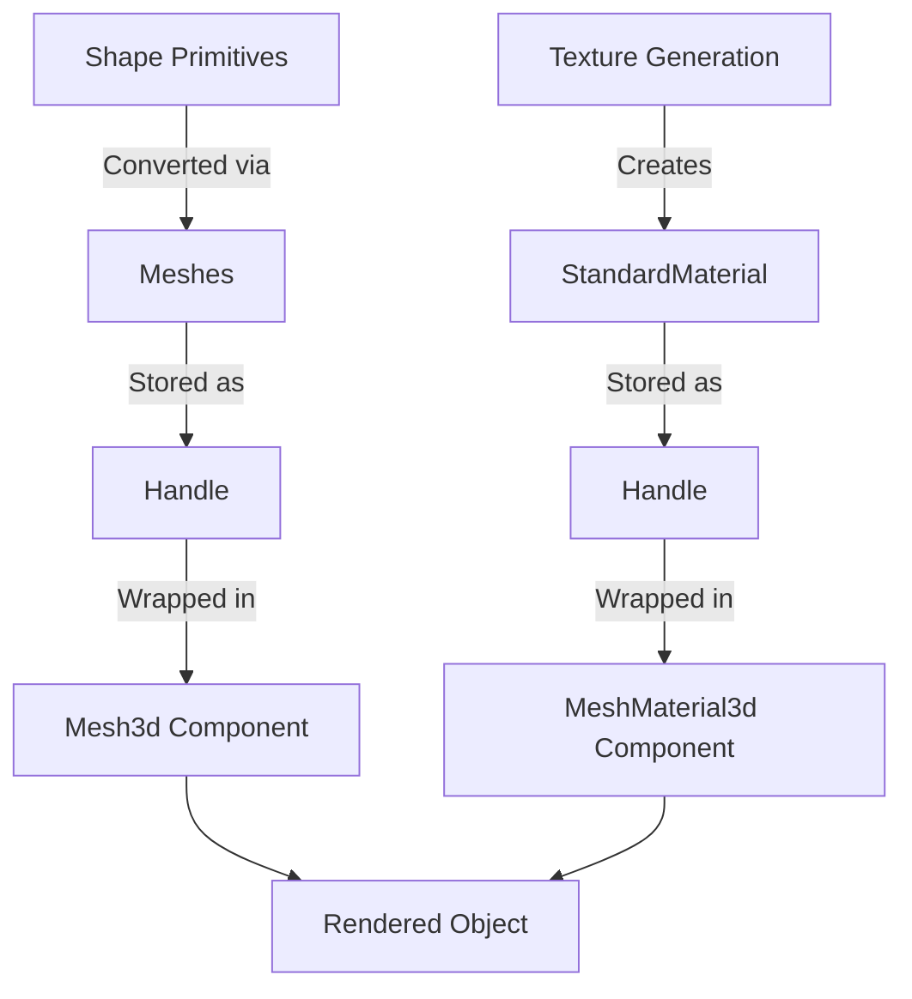

+++
title = "#19295 Explanation for the '3d shapes' example"
date = "2025-07-07T00:00:00"
draft = false
template = "pull_request_page.html"
in_search_index = true

[taxonomies]
list_display = ["show"]

[extra]
current_language = "en"
available_languages = {"en" = { name = "English", url = "/pull_request/bevy/2025-07/pr-19295-en-20250707" }, "zh-cn" = { name = "中文", url = "/pull_request/bevy/2025-07/pr-19295-zh-cn-20250707" }}
labels = ["C-Docs", "A-Rendering", "C-Examples", "D-Straightforward"]
+++

# Pull Request Analysis: Explanation for the '3d shapes' example

## Basic Information
- **Title**: Explanation for the '3d shapes' example
- **PR Link**: https://github.com/bevyengine/bevy/pull/19295
- **Author**: fallible-algebra
- **Status**: MERGED
- **Labels**: C-Docs, A-Rendering, C-Examples, S-Ready-For-Final-Review, D-Straightforward
- **Created**: 2025-05-19T16:12:21Z
- **Merged**: 2025-07-07T20:07:06Z
- **Merged By**: alice-i-cecile

## Description Translation
[Explanation](https://bevyengine.org/learn/contribute/helping-out/explaining-examples/) for the 3d shapes example. 

This shares a lot of detail with the [2d shapes](https://github.com/bevyengine/bevy/pull/19211) example, so it's similar in structure. The explanation for why asset handles are not components has been copied over for now with minor adjustment, I'll do another editing pass on this to make it match the surrounding context and focus before taking it out of drafts.

## The Story of This Pull Request

The 3D shapes example in Bevy demonstrates how to create various primitive 3D objects, but its documentation was minimal. This presented a problem for newcomers trying to understand how Bevy's rendering pipeline works with shape primitives, meshes, and materials. Without proper explanation, users might struggle to grasp key concepts like how mathematical shape definitions become renderable objects or why asset handles require special handling.

The solution approach focused on adding comprehensive documentation directly in the example file. The author expanded the module-level documentation to explain the complete workflow from shape primitives to rendered objects. This included clarifying several important concepts: how shape primitives differ from meshes, the role of the Assets system in mesh creation, how extrusion converts 2D shapes to 3D objects, and why asset handles need to be wrapped in component types.

The implementation consisted of replacing the original two-line comment with a detailed technical explanation. The new documentation explains the transformation pipeline where shape primitives like `Sphere` are converted to meshes via `meshes.add()`, which internally uses the `From<Shape>` implementation for `Mesh`. It also clarifies how extrusion works to give 2D shapes volume and depth.

```rust
// Before:
//! This example demonstrates the built-in 3d shapes in Bevy.
//! The scene includes a patterned texture and a rotation for visualizing the normals and UVs.

// After:
//! Here we use shape primitives to generate meshes for 3d objects as well as attaching a runtime-generated patterned texture to each 3d object.
//!
//! "Shape primitives" here are just the mathematical definition of certain shapes...
```

The explanation addresses a common point of confusion - why asset handles aren't used directly as components. The documentation clarifies that handles are wrapped in newtype components (`Mesh3d`, `MeshMaterial3d`) to prevent ambiguity since entities might hold handles for various purposes beyond rendering.

The texture generation process is also explained - how the example creates a patterned texture at runtime by writing RGBA values to a buffer array, registers it as an asset, and applies the resulting `Handle<StandardMaterial>` to all shapes. This demonstrates Bevy's dynamic asset creation capabilities.

These changes significantly improve the educational value of the example by explaining not just what the code does, but why each step is necessary and how it fits into Bevy's architecture. The documentation serves as a practical guide to core Bevy concepts like the asset system, mesh generation, and component composition.

## Visual Representation



## Key Files Changed

### `examples/3d/3d_shapes.rs`
This file received comprehensive documentation improvements explaining the 3D rendering workflow.

**Changes:**
```rust
// Before:
//! This example demonstrates the built-in 3d shapes in Bevy.
//! The scene includes a patterned texture and a rotation for visualizing the normals and UVs.

// After:
//! Here we use shape primitives to generate meshes for 3d objects as well as attaching a runtime-generated patterned texture to each 3d object.
//!
//! "Shape primitives" here are just the mathematical definition of certain shapes, they're not meshes on their own! A sphere with radius `1.0` can be defined with [`Sphere::new(1.0)`][Sphere::new] but all this does is store the radius. So we need to turn these descriptions of shapes into meshes.
//!
//! While a shape is not a mesh, turning it into one in Bevy is easy. In this example we call [`meshes.add(/* Shape here! */)`][Assets<A>::add] on the shape, which works because the [`Assets<A>::add`] method takes anything that can be turned into the asset type it stores. There's an implementation for [`From`] on shape primitives into [`Mesh`], so that will get called internally by [`Assets<A>::add`].
//!
//! [`Extrusion`] lets us turn 2D shape primitives into versions of those shapes that have volume by extruding them. A 1x1 square that gets wrapped in this with an extrusion depth of 2 will give us a rectangular prism of size 1x1x2, but here we're just extruding these 2d shapes by depth 1.
//!
//! The material applied to these shapes is a texture that we generate at run time by looping through a "palette" of RGBA values (stored adjacent to each other in the array) and writing values to positions in another array that represents the buffer for an 8x8 texture. This texture is then registered with the assets system just one time, with that [`Handle<StandardMaterial>`] then applied to all the shapes in this example.
//!
//! The mesh and material are [`Handle<Mesh>`] and [`Handle<StandardMaterial>`] at the moment, neither of which implement `Component` on their own. Handles are put behind "newtypes" to prevent ambiguity, as some entities might want to have handles to meshes (or images, or materials etc.) for different purposes! All we need to do to make them rendering-relevant components is wrap the mesh handle and the material handle in [`Mesh3d`] and [`MeshMaterial3d`] respectively.
```

**Impact:**
These changes transform the example from a simple demonstration to an educational resource that explains:
1. The relationship between shape primitives and renderable meshes
2. How the asset system converts shapes to meshes
3. The extrusion process for 3D shapes
4. Runtime texture generation
5. Why handles require component wrappers

## Further Reading
1. [Bevy's Contributing Guide: Explaining Examples](https://bevyengine.org/learn/contribute/helping-out/explaining-examples/)
2. [Related PR: Explanation for 2D Shapes Example](https://github.com/bevyengine/bevy/pull/19211)
3. [Bevy Assets System Documentation](https://docs.rs/bevy/latest/bevy/asset/trait.Asset.html)
4. [Mesh Generation in Bevy](https://docs.rs/bevy/latest/bevy/render/mesh/struct.Mesh.html)
5. [Component Wrapping Patterns in ECS](https://bevy-cheatbook.github.io/programming/component.html)