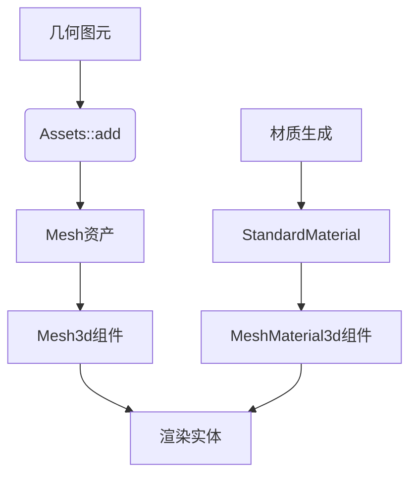

+++
title = "#19295 Explanation for the '3d shapes' example"
date = "2025-07-07T00:00:00"
draft = false
template = "pull_request_page.html"
in_search_index = false

[extra]
current_language = "zh-cn"
available_languages = {"en" = { name = "English", url = "/pull_request/bevy/2025-07/pr-19295-en-20250707" }, "zh-cn" = { name = "中文", url = "/pull_request/bevy/2025-07/pr-19295-zh-cn-20250707" }}
+++

# 技术分析报告：为3D形状示例添加说明

## 基本信息
- **标题**: Explanation for the '3d shapes' example
- **PR链接**: https://github.com/bevyengine/bevy/pull/19295
- **作者**: fallible-algebra
- **状态**: 已合并
- **标签**: C-Docs, A-Rendering, C-Examples, S-Ready-For-Final-Review, D-Straightforward
- **创建时间**: 2025-05-19T16:12:21Z
- **合并时间**: 2025-07-07T20:07:06Z
- **合并者**: alice-i-cecile

## 描述翻译
为3d shapes示例添加[说明](https://bevyengine.org/learn/contribute/helping-out/explaining-examples/)。

这与[2d shapes](https://github.com/beveengine/bevy/pull/19211)示例有许多共同之处，因此结构相似。关于为什么asset handles不是组件的解释已被复制过来并做了微调，在将其从草稿中移出之前，我将进行编辑使其与上下文匹配并聚焦。

## PR技术分析

### 问题背景
Bevy引擎的3D形状示例(`examples/3d/3d_shapes.rs`)原本只有两行基础描述，缺少对关键概念的详细解释：
```rust
//! This example demonstrates the built-in 3d shapes in Bevy.
//! The scene includes a patterned texture and a rotation for visualizing the normals and UVs.
```
这对新贡献者理解示例的实现原理造成了障碍，特别是：
1. 几何图元(shape primitives)与网格(Mesh)的转换关系不明确
2. 运行时生成材质的机制未说明
3. 资源句柄(Handle)在ECS中的使用方式需要澄清

### 解决方案
PR通过重写模块级文档注释(doc comments)来解决这些问题：
1. 明确区分几何图元与网格的概念
2. 详细说明`Assets::add`方法如何将图元转换为网格
3. 解释`Extrusion`如何将2D形状转换为3D对象
4. 阐明运行时材质生成逻辑
5. 说明资源句柄为何需要`Mesh3d`和`MeshMaterial3d`包装

### 实现细节
核心变更集中在澄清三个关键技术点：

**1. 图元到网格的转换机制**  
通过`meshes.add()`方法实现转换，这利用了Rust的`From` trait：
```rust
//! While a shape is not a mesh, turning it into one in Bevy is easy. In this example we call 
//! [`meshes.add(/* Shape here! */)`][Assets<A>::add] on the shape, which works because the 
//! [`Assets<A>::add`] method takes anything that can be turned into the asset type it stores. 
```

**2. 2D到3D的挤出(Extrusion)处理**  
使用`Extrusion`结构体为2D形状添加深度：
```rust
//! [`Extrusion`] lets us turn 2D shape primitives into versions of those shapes that have volume 
//! by extruding them. A 1x1 square that gets wrapped in this with an extrusion depth of 2 will 
//! give us a rectangular prism of size 1x1x2...
```

**3. 资源句柄的ECS集成**  
解释为何原始`Handle`需要包装才能作为组件使用：
```rust
//! The mesh and material are [`Handle<Mesh>`] and [`Handle<StandardMaterial>`] at the moment, 
//! neither of which implement `Component` on their own... All we need to do to make them 
//! rendering-relevant components is wrap the mesh handle and the material handle in 
//! [`Mesh3d`] and [`MeshMaterial3d`] respectively.
```

### 技术洞察
1. **资源生命周期**：材质纹理仅生成一次并复用，符合ECS的资源管理最佳实践
2. **类型安全**：通过新类型包装(newtype wrapping)避免句柄类型歧义
3. **API设计**：`Assets::add`的泛型实现允许隐式转换，简化了资产创建流程

### 影响与价值
1. 降低新贡献者的理解门槛
2. 澄清Bevy核心概念：图元 vs 网格、资源句柄 vs 组件
3. 为其他示例文档提供参考模板
4. 保持与2D形状示例的文档一致性

## 可视化表示



## 关键文件变更

### `examples/3d/3d_shapes.rs`
**变更说明**：重写模块级文档注释，添加技术实现细节  
**代码对比**：
```rust
# 修改前:
//! This example demonstrates the built-in 3d shapes in Bevy.
//! The scene includes a patterned texture and a rotation for visualizing the normals and UVs.

# 修改后:
//! Here we use shape primitives to generate meshes for 3d objects as well as attaching a runtime-generated patterned texture to each 3d object.
//!
//! "Shape primitives" here are just the mathematical definition of certain shapes, they're not meshes on their own! A sphere with radius `1.0` can be defined with [`Sphere::new(1.0)`][Sphere::new] but all this does is store the radius. So we need to turn these descriptions of shapes into meshes.
//!
//! While a shape is not a mesh, turning it into one in Bevy is easy. In this example we call [`meshes.add(/* Shape here! */)`][Assets<A>::add] on the shape, which works because the [`Assets<A>::add`] method takes anything that can be turned into the asset type it stores. There's an implementation for [`From`] on shape primitives into [`Mesh`], so that will get called internally by [`Assets<A>::add`].
//!
//! [`Extrusion`] lets us turn 2D shape primitives into versions of those shapes that have volume by extruding them. A 1x1 square that gets wrapped in this with an extrusion depth of 2 will give us a rectangular prism of size 1x1x2, but here we're just extruding these 2d shapes by depth 1.
//!
//! The material applied to these shapes is a texture that we generate at run time by looping through a "palette" of RGBA values (stored adjacent to each other in the array) and writing values to positions in another array that represents the buffer for an 8x8 texture. This texture is then registered with the assets system just one time, with that [`Handle<StandardMaterial>`] then applied to all the shapes in this example.
//!
//! The mesh and material are [`Handle<Mesh>`] and [`Handle<StandardMaterial>`] at the moment, neither of which implement `Component` on their own. Handles are put behind "newtypes" to prevent ambiguity, as some entities might want to have handles to meshes (or images, or materials etc.) for different purposes! All we need to do to make them rendering-relevant components is wrap the mesh handle and the material handle in [`Mesh3d`] and [`MeshMaterial3d`] respectively.
```

## 扩展阅读
1. [Bevy贡献指南 - 解释示例](https://bevyengine.org/learn/contribute/helping-out/explaining-examples/)
2. [相关PR：2D形状示例说明](https://github.com/bevyengine/bevy/pull/19211)
3. [Bevy ECS中的资源管理](https://bevyengine.org/learn/book/introduction/resources/)
4. [Rust的From trait文档](https://doc.rust-lang.org/std/convert/trait.From.html)