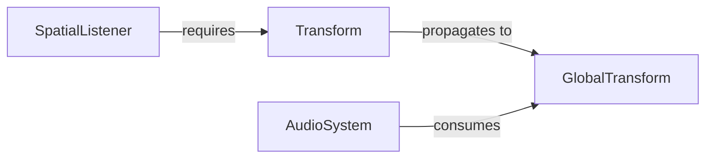

+++
title = "#19357 SpatialListener now requires a Transform"
date = "2025-07-07T00:00:00"
draft = false
template = "pull_request_page.html"
in_search_index = true

[taxonomies]
list_display = ["show"]

[extra]
current_language = "en"
available_languages = {"en" = { name = "English", url = "/pull_request/bevy/2025-07/pr-19357-en-20250707" }, "zh-cn" = { name = "中文", url = "/pull_request/bevy/2025-07/pr-19357-zh-cn-20250707" }}
labels = ["A-ECS", "A-Audio", "C-Usability", "D-Straightforward"]
+++

## SpatialListener now requires a Transform

### Basic Information
- **Title**: SpatialListener now requires a Transform
- **PR Link**: https://github.com/bevyengine/bevy/pull/19357
- **Author**: Wuketuke
- **Status**: MERGED
- **Labels**: A-ECS, A-Audio, C-Usability, S-Ready-For-Final-Review, D-Straightforward
- **Created**: 2025-05-24T14:40:42Z
- **Merged**: 2025-07-07T20:08:16Z
- **Merged By**: alice-i-cecile

### Description Translation
I noticed that the `SpatialListener` asks to have a `Transform` attached. It seemed weird that we didnt just use a require macro, so i went ahead and did that.  
I also tweaked the system that plays audio to use a `&GlobalTransform` instead of an `Option<&GlobalTransform>`

### The Story of This Pull Request

The PR addresses inconsistencies in Bevy's audio system regarding component requirements and data handling. The core issue was that `SpatialListener` documentation stated it needed a `Transform` component, but this requirement wasn't enforced in code. This created a potential runtime error scenario where audio systems could fail if the transform was missing.

First, the PR enforces the transform requirement using Bevy's `#[require]` attribute macro. This automatically adds a `Transform` component if missing and ensures queries including `SpatialListener` will always have a transform available. The documentation was updated to clarify this requirement:

```rust
// Before:
#[derive(Component, Clone, Debug, Reflect)]
#[reflect(Clone, Default, Component, Debug)]
pub struct SpatialListener { ... }

// After:
#[derive(Component, Clone, Debug, Reflect)]
#[require(Transform)]
#[reflect(Clone, Default, Component, Debug)]
pub struct SpatialListener { ... }
```

Second, the audio playback system was modified to leverage this new guarantee. Previously, it handled transforms as optional and fell back to zero coordinates with a warning when missing. This created unnecessary branching and potential unexpected behavior. The PR simplifies the system by requiring a `GlobalTransform` reference instead of an `Option`:

```rust
// Before:
Option<&GlobalTransform>

// After:
&GlobalTransform
```

The fallback code was completely removed since the transform requirement is now guaranteed at the component level. This also eliminated a warning that would log when transforms were missing:

```rust
// Removed code:
let emitter_translation = if let Some(emitter_transform) = maybe_emitter_transform {
    (emitter_transform.translation() * scale).into()
} else {
    warn!("Spatial AudioPlayer with no GlobalTransform component. Using zero.");
    Vec3::ZERO.into()
};
```

These changes improve data consistency by ensuring spatial audio calculations always have valid position data. The component requirement is now explicit in the type system rather than just documentation. This eliminates an entire class of potential runtime errors related to missing transforms.

The PR also included minor documentation improvements for better clarity, such as converting comments to use Markdown links for API references and clarifying playback behavior constraints.

### Visual Representation



### Key Files Changed

1. **crates/bevy_audio/src/audio.rs** (+18/-16)  
   Enforced transform requirement and improved documentation

```rust
// Before:
#[derive(Component, Clone, Debug, Reflect)]
#[reflect(Clone, Default, Component, Debug)]
pub struct SpatialListener { ... }

// After:
#[derive(Component, Clone, Debug, Reflect)]
#[require(Transform)]
#[reflect(Clone, Default, Component, Debug)]
pub struct SpatialListener { ... }

// Documentation improvements:
// Before:
/// This must be accompanied by `Transform` and `GlobalTransform`.

// After:
/// This is accompanied by [`Transform`] and [`GlobalTransform`].
```

2. **crates/bevy_audio/src/audio_output.rs** (+3/-10)  
   Simplified audio system by removing optional transform handling

```rust
// Query change:
// Before:
Option<&GlobalTransform>

// After:
&GlobalTransform

// Removed fallback logic:
- let emitter_translation = if let Some(emitter_transform) = maybe_emitter_transform {
-     (emitter_transform.translation() * scale).into()
- } else {
-     warn!("Spatial AudioPlayer with no GlobalTransform component. Using zero.");
-     Vec3::ZERO.into()
- };
```

### Further Reading
1. [Bevy ECS Require Components](https://docs.rs/bevy_ecs/latest/bevy_ecs/query/trait.QueryFilter.html#method.require)  
2. [Bevy Transform System](https://bevyengine.org/learn/book/getting-started/transform/)  
3. [Spatial Audio Concepts](https://developer.mozilla.org/en-US/docs/Web/API/Web_Audio_API/Web_audio_spatialization_basics)