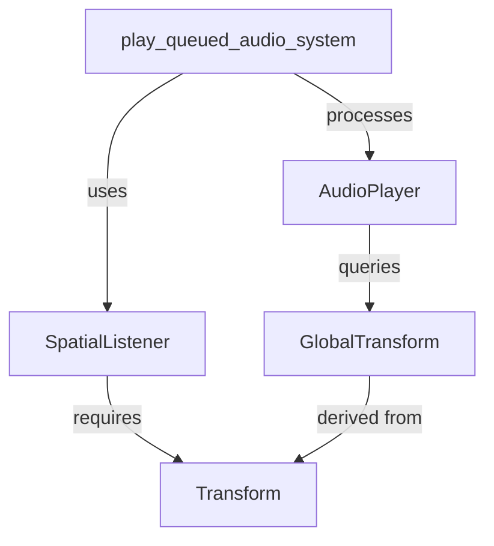

+++
title = "#19357 SpatialListener now requires a Transform"
date = "2025-07-07T00:00:00"
draft = false
template = "pull_request_page.html"
in_search_index = false

[extra]
current_language = "zh-cn"
available_languages = {"en" = { name = "English", url = "/pull_request/bevy/2025-07/pr-19357-en-20250707" }, "zh-cn" = { name = "中文", url = "/pull_request/bevy/2025-07/pr-19357-zh-cn-20250707" }}
labels = ["A-ECS", "A-Audio", "C-Usability", "D-Straightforward"]
+++

# SpatialListener now requires a Transform

## Basic Information
- **Title**: SpatialListener now requires a Transform
- **PR Link**: https://github.com/bevyengine/bevy/pull/19357
- **Author**: Wuketuke
- **Status**: MERGED
- **Labels**: A-ECS, A-Audio, C-Usability, S-Ready-For-Final-Review, D-Straightforward
- **Created**: 2025-05-24T14:40:42Z
- **Merged**: 2025-07-07T20:08:16Z
- **Merged By**: alice-i-cecile

## Description Translation
我注意到 `SpatialListener` 要求附加一个 `Transform`。之前没有使用 require 宏似乎有点奇怪，所以我添加了它。
我还调整了播放音频的系统，使用 `&GlobalTransform` 而不是 `Option<&GlobalTransform>`。

## The Story of This Pull Request

### 问题背景
在 Bevy 的音频系统中，`SpatialListener` 组件需要配合 `Transform` 和 `GlobalTransform` 组件才能正常工作。然而，现有的实现存在两个问题：
1. `SpatialListener` 只是文档中说明需要 `Transform`，但没有在代码层面强制要求
2. 音频播放系统 `play_queued_audio_system` 使用 `Option<&GlobalTransform>` 来处理空间音频，但实际场景中这个组件应该是必需的

这导致潜在的运行时错误风险：
- 开发者可能忘记添加 `Transform` 组件
- 系统需要处理 `None` 情况，增加了不必要的运行时检查
- 当 `GlobalTransform` 缺失时，系统会回退到 `Vec3::ZERO` 并打印警告，这不是理想的行为

### 解决方案
PR 通过两个主要修改解决上述问题：
1. 为 `SpatialListener` 添加 `#[require(Transform)]` 宏
   - 在编译时强制要求实体必须同时拥有 `Transform` 组件
   - 符合 Bevy ECS 的最佳实践
2. 修改音频播放系统，直接使用 `&GlobalTransform` 而非 `Option<&GlobalTransform>`
   - 简化系统逻辑，移除不必要的 `Option` 处理
   - 依赖 ECS 查询自动过滤缺失组件的实体

### 实现细节
在 `SpatialListener` 组件定义处添加 require 宏是直接有效的解决方案：
```rust
#[derive(Component, Clone, Debug, Reflect)]
#[require(Transform)]  // 新增的宏
#[reflect(Clone, Default, Component, Debug)]
pub struct SpatialListener {
    // ...
}
```
这个修改确保任何拥有 `SpatialListener` 的实体必须同时拥有 `Transform` 组件，否则会在编译时或运行时被 ECS 系统过滤掉。

在音频播放系统中，查询条件从：
```rust
Option<&GlobalTransform>,
```
修改为：
```rust
&GlobalTransform,
```
这个改动移除了对 `GlobalTransform` 的 `Option` 包装，意味着：
- 系统现在只处理同时拥有所有必需组件的实体
- 移除了 `maybe_emitter_transform` 变量和相关条件检查
- 直接使用 `emitter_transform` 获取位置信息

```rust
// 修改后
let emitter_translation = (emitter_transform.translation() * scale).into();
```
相比原来的实现：
```rust
// 修改前
let emitter_translation = if let Some(emitter_transform) = maybe_emitter_transform {
    (emitter_transform.translation() * scale).into()
} else {
    warn!("Spatial AudioPlayer with no GlobalTransform component. Using zero.");
    Vec3::ZERO.into()
};
```
新实现更简洁且避免了运行时警告和错误处理。

### 技术影响
1. **API 一致性**：与其他 Bevy 组件（如 `AudioSource` 要求 `PlaybackSettings`）保持一致
2. **错误预防**：编译时和系统查询级别的约束减少了运行时错误
3. **性能优化**：减少了一个分支判断，虽然微小但符合零开销原则
4. **开发者体验**：
   - 更清晰的组件依赖关系
   - 移除了潜在的错误日志干扰
   - 文档注释也相应更新，更准确地反映组件关系

### 潜在考量
- 这是一个破坏性变更（breaking change），但影响范围小
- 依赖 `GlobalTransform` 的系统现在需要确保实体完整包含所需组件
- 符合 Bevy 的 "实体组件作为数据契约" 设计理念

## Visual Representation



## Key Files Changed

### crates/bevy_audio/src/audio.rs
1. 为 `SpatialListener` 添加 `#[require(Transform)]` 属性宏
2. 更新文档注释，明确组件依赖关系
3. 改进文档链接格式

```rust
// Before:
#[derive(Component, Clone, Debug, Reflect)]
#[reflect(Clone, Default, Component, Debug)]
pub struct SpatialListener {
    // ...
}

// After:
#[derive(Component, Clone, Debug, Reflect)]
#[require(Transform)]  // 新增宏
#[reflect(Clone, Default, Component, Debug)]
pub struct SpatialListener {
    // ...
}
```

```rust
// 文档更新示例
// Before:
/// This must be accompanied by `Transform` and `GlobalTransform`.

// After:
/// This is accompanied by [`Transform`] and [`GlobalTransform`](bevy_transform::prelude::GlobalTransform).
```

### crates/bevy_audio/src/audio_output.rs
1. 修改音频系统查询条件，直接要求 `GlobalTransform`
2. 移除不必要的 `Option` 处理逻辑
3. 简化空间位置计算代码

```rust
// Before:
Option<&GlobalTransform>,
// ...
let emitter_translation = if let Some(emitter_transform) = maybe_emitter_transform {
    (emitter_transform.translation() * scale).into()
} else {
    warn!("Spatial AudioPlayer with no GlobalTransform component. Using zero.");
    Vec3::ZERO.into()
};

// After:
&GlobalTransform,
// ...
let emitter_translation = (emitter_transform.translation() * scale).into();
```

## Further Reading
1. [Bevy ECS 组件文档](https://bevyengine.org/learn/book/ecs/components/)
2. [Bevy 属性宏使用指南](https://github.com/bevyengine/bevy/tree/main/crates/bevy_ecs_macros)
3. [空间音频实现原理](https://docs.rs/bevy_audio/latest/bevy_audio/struct.SpatialAudioSink.html)
4. [ECS 查询系统详解](https://bevyengine.org/learn/book/ecs/queries/)