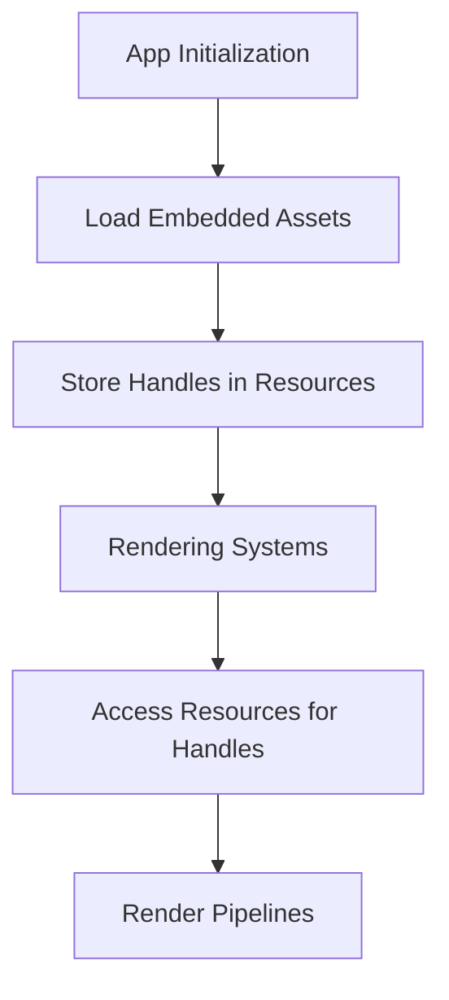

+++
title = "#19408 Clean up several miscellaneous uses of `weak_handle`."
date = "2025-07-08T00:00:00"
draft = false
template = "pull_request_page.html"
in_search_index = true

[taxonomies]
list_display = ["show"]

[extra]
current_language = "en"
available_languages = {"en" = { name = "English", url = "/pull_request/bevy/2025-07/pr-19408-en-20250708" }, "zh-cn" = { name = "中文", url = "/pull_request/bevy/2025-07/pr-19408-zh-cn-20250708" }}
labels = ["A-Rendering", "A-Assets", "D-Modest"]
+++

### Clean Up Weak Handle Usage in Rendering Pipelines

#### Basic Information
- **Title**: Clean up several miscellaneous uses of `weak_handle`.
- **PR Link**: https://github.com/bevyengine/bevy/pull/19408
- **Author**: andriyDev
- **Status**: MERGED
- **Labels**: A-Rendering, A-Assets, S-Ready-For-Final-Review, D-Modest
- **Created**: 2025-05-28T07:36:06Z
- **Merged**: 2025-07-08T07:05:24Z
- **Merged By**: superdump

#### Description Translation
The original description is in English, so it's included as-is:
```
# Objective

- Related to #19024.

## Solution

- This is a mix of several ways to get rid of weak handles. The primary strategy is putting strong asset handles in resources that the rendering code clones into its pipelines (or whatever).
- This does not handle every remaining case, but we are slowly clearing them out.

## Testing

- `anti_aliasing` example still works.
- `fog_volumes` example still works.
```

---

### The Story of This Pull Request

#### The Problem and Context
Bevy's rendering pipelines previously used `uuid_handle` to create weak handles for assets like shaders, lookup textures, and meshes. These weak handles only contained UUIDs without guaranteeing asset availability, which could cause runtime failures if assets weren't properly loaded. This approach conflicted with Bevy's asset management system, where strong handles ensure assets are loaded and managed correctly. The goal was to replace these weak handles with strong handles stored in resources for reliability and consistency.

#### The Solution Approach
The primary strategy involved:
1. Replacing `uuid_handle` constants with resources storing strong handles
2. Loading assets via `load_embedded_asset` during app initialization
3. Accessing handles through resources in rendering systems
This ensures assets are properly tracked by Bevy's asset system. Alternatives like global handles were considered but rejected in favor of resource-based storage for better encapsulation and compatibility with Bevy's ECS architecture.

#### The Implementation
Changes were made across multiple rendering modules:

**SMAA Anti-Aliasing**  
Replaced hardcoded LUT handles with a resource:
```rust
// Before: Weak handles
const SMAA_AREA_LUT_TEXTURE_HANDLE: Handle<Image> = 
    uuid_handle!("569c4d67-c7fa-4958-b1af-0836023603c0");

// After: Resource with strong handles
#[derive(Resource)]
struct SmaaLuts {
    area_lut: Handle<Image>,
    search_lut: Handle<Image>,
}

// Initialization
#[cfg(feature = "smaa_luts")]
let smaa_luts = SmaaLuts {
    area_lut: load_embedded_asset!(app, "SMAAAreaLUT.ktx2"),
    search_lut: load_embedded_asset!(app, "SMAASearchLUT.ktx2"),
};
```

**Mip Generation**  
Converted shader handle to a resource:
```rust
// Before: Global weak handle
pub const DOWNSAMPLE_DEPTH_SHADER_HANDLE: Handle<Shader> = 
    uuid_handle!("a09a149e-5922-4fa4-9170-3c1a13065364");

// After: Resource-based handle
#[derive(Resource, Deref)]
pub struct DownsampleDepthShader(Handle<Shader>);

// Pipeline now stores shader handle
struct DownsampleDepthPipeline {
    shader: Handle<Shader>,
    // ...
}
```

**Chromatic Aberration**  
Made LUT optional with fallback to default:
```rust
// Before: Required handle
pub color_lut: Handle<Image>,

// After: Optional with resource fallback
pub color_lut: Option<Handle<Image>>,

// Usage in rendering
let default_lut = world.resource::<DefaultChromaticAberrationLut>();
let handle = chromatic_aberration.color_lut.as_ref().unwrap_or(&default_lut.0);
```

**Volumetric Fog**  
Replaced global mesh handles with a resource:
```rust
// Before: Global weak handles
pub const PLANE_MESH: Handle<Mesh> = 
    uuid_handle!("92523617-c708-4fd0-b42f-ceb4300c930b");

// After: Resource storage
#[derive(Resource)]
pub struct FogAssets {
    plane_mesh: Handle<Mesh>,
    cube_mesh: Handle<Mesh>,
}
```

**Mesh2D Example**  
Updated custom pipeline to use resource-stored shader:
```rust
// Before: Global shader handle
pub const COLORED_MESH2D_SHADER_HANDLE: Handle<Shader> = 
    uuid_handle!("f48b148f-7373-4638-9900-392b3b3ccc66");

// After: Resource-managed handle
#[derive(Resource)]
struct ColoredMesh2dShader(Handle<Shader>);

struct ColoredMesh2dPipeline {
    shader: Handle<Shader>, 
    // ...
}
```

#### Technical Insights
Key technical aspects:
1. **Resource-Based Handles**: Assets are now loaded during app setup and stored in resources, ensuring they exist when rendering systems execute
2. **Fallback Patterns**: Optional handles (e.g., chromatic aberration LUT) with default resources simplify API usage
3. **Asset Loading**: `load_embedded_asset` replaces manual buffer loading, leveraging Bevy's asset system
4. **Pipeline Specialization**: Pipelines now reference shader handles directly from resources instead of global constants

Performance impact is neutral - handle resolution is similar, but with stronger guarantees of asset availability. This pattern also enables future optimizations like asset hot-reloading.

#### The Impact
- **Reliability**: Eliminates runtime failures from missing assets
- **Consistency**: Unifies asset handling across rendering pipelines
- **Maintainability**: Resources clearly define asset dependencies
- **Flexibility**: Optional handles allow customization without boilerplate
- **Testing**: Verified working with `anti_aliasing` and `fog_volumes` examples

The changes demonstrate Bevy's best practices for asset handling, showing how to safely manage GPU resources within the ECS paradigm. Future work can extend this pattern to remaining weak handle uses.

---

### Visual Representation


---

### Key Files Changed

#### crates/bevy_anti_aliasing/src/smaa/mod.rs (+31/-53)
Replaced weak LUT handles with resource-managed handles:
```rust
// Before: Weak handles
const SMAA_AREA_LUT_TEXTURE_HANDLE: Handle<Image> = ...;
const SMAA_SEARCH_LUT_TEXTURE_HANDLE: Handle<Image> = ...;

// After: Resource storage
#[derive(Resource)]
struct SmaaLuts {
    area_lut: Handle<Image>,
    search_lut: Handle<Image>,
}

// Usage in system
fn prepare_smaa_bind_groups(
    smaa_luts: Res<SmaaLuts>,
    // ...
) {
    images.get(&smaa_luts.search_lut),
    images.get(&smaa_luts.area_lut),
}
```

#### crates/bevy_core_pipeline/src/experimental/mip_generation/mod.rs (+31/-16)
Converted shader handle to resource:
```rust
// Before: Global weak handle
pub const DOWNSAMPLE_DEPTH_SHADER_HANDLE: Handle<Shader> = ...;

// After: Resource-based handle
#[derive(Resource, Deref)]
pub struct DownsampleDepthShader(Handle<Shader>);

// Pipeline initialization
fn create_downsample_depth_pipelines(
    downsample_depth_shader: Res<DownsampleDepthShader>,
) {
    DownsampleDepthPipeline::new(
        layout, 
        downsample_depth_shader.0.clone()
    )
}
```

#### crates/bevy_core_pipeline/src/post_process/mod.rs (+29/-30)
Made chromatic aberration LUT optional:
```rust
// Before: Required handle
pub color_lut: Handle<Image>,

// After: Optional with default
pub color_lut: Option<Handle<Image>>,

// Resource for default LUT
#[derive(Resource)]
struct DefaultChromaticAberrationLut(Handle<Image>);

// Fallback logic
let default_lut = world.resource::<DefaultChromaticAberrationLut>();
let lut = chromatic_aberration.color_lut.as_ref().unwrap_or(&default_lut.0);
```

#### crates/bevy_pbr/src/volumetric_fog/render.rs (+8/-18)
Replaced global mesh handles with resource:
```rust
// Before: Global weak handles
pub const PLANE_MESH: Handle<Mesh> = ...;
pub const CUBE_MESH: Handle<Mesh> = ...;

// After: Resource storage
#[derive(Resource)]
pub struct FogAssets {
    plane_mesh: Handle<Mesh>,
    cube_mesh: Handle<Mesh>,
}

// Usage
let fog_assets = world.resource::<FogAssets>();
let mesh_handle = if exterior {
    fog_assets.cube_mesh.clone()
} else {
    fog_assets.plane_mesh.clone()
};
```

#### examples/2d/mesh2d_manual.rs (+15/-10)
Updated custom pipeline to use resource-stored shader:
```rust
// Before: Global weak handle
pub const COLORED_MESH2D_SHADER_HANDLE: Handle<Shader> = ...;

// After: Resource-managed handle
#[derive(Resource)]
struct ColoredMesh2dShader(Handle<Shader>);

struct ColoredMesh2dPipeline {
    shader: Handle<Shader>,
}

// Pipeline setup
impl SpecializedRenderPipeline for ColoredMesh2dPipeline {
    fn specialize(...) -> RenderPipelineDescriptor {
        vertex: VertexState {
            shader: self.shader.clone(),
            // ...
        }
    }
}
```

---

### Further Reading
1. [Bevy Asset System Documentation](https://docs.rs/bevy_asset/latest/bevy_asset/)
2. [Handling Assets in ECS](https://bevy-cheatbook.github.io/features/assets.html)
3. [Render Pipeline Specialization](https://github.com/bevyengine/bevy/blob/main/docs/plugins_guidelines.md#render-pipelines)
4. [PR #19024: Remove Weak Handles](https://github.com/bevyengine/bevy/pull/19024)