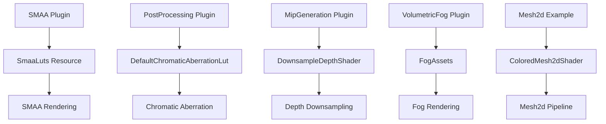

+++
title = "#19408 Clean up several miscellaneous uses of `weak_handle`."
date = "2025-07-08T00:00:00"
draft = false
template = "pull_request_page.html"
in_search_index = false

[extra]
current_language = "zh-cn"
available_languages = {"en" = { name = "English", url = "/pull_request/bevy/2025-07/pr-19408-en-20250708" }, "zh-cn" = { name = "中文", url = "/pull_request/bevy/2025-07/pr-19408-zh-cn-20250708" }}
+++

# 清理多个杂散的 `weak_handle` 使用

## 基本信息
- **标题**: Clean up several miscellaneous uses of `weak_handle`.
- **PR 链接**: https://github.com/bevyengine/bevy/pull/19408
- **作者**: andriyDev
- **状态**: MERGED
- **标签**: A-Rendering, A-Assets, S-Ready-For-Final-Review, D-Modest
- **创建时间**: 2025-05-28T07:36:06Z
- **合并时间**: 2025-07-08T07:05:24Z
- **合并人**: superdump

## 描述翻译
### Objective
- 关联 #19024

### Solution
- 这是多种移除 weak handles 方法的组合。主要策略是在资源中放置强资产句柄（strong asset handles），渲染代码将其克隆到其管线（或任何地方）
- 这并未处理所有剩余情况，但我们正在逐步清除它们

### Testing
- `anti_aliasing` 示例仍正常工作
- `fog_volumes` 示例仍正常工作

## PR 的技术分析

### 问题背景
Bevy 引擎中存在多个模块使用全局弱句柄（global weak handles）引用资产（assets），这些弱句柄通过 `uuid_handle!` 宏定义。这种做法有几个问题：
1. 弱句柄不保证资产在使用期间保持加载状态
2. 全局常量句柄难以追踪依赖关系
3. 当资产未被正确加载时，缺乏回退机制
4. 在禁用某些功能时（如 `smaa_luts`），使用占位符资产的方式不够灵活

此 PR 是 #19024 的后续工作，旨在清理多个模块中剩余的弱句柄使用案例。

### 解决方案
核心策略是将弱句柄替换为：
1. 存储在资源中的强句柄
2. 使用 `Option<Handle<T>>` 并提供默认值
3. 通过资源系统管理资产生命周期

具体实现包括：
1. 为每个需要共享的资产创建专用资源类型
2. 在插件初始化时加载资产并存储强句柄到资源中
3. 在渲染系统中从资源获取句柄
4. 对于可选资产，使用 `Option<Handle<T>>` 并提供默认回退

### 详细实现分析

#### SMAA 抗锯齿模块 (crates/bevy_anti_aliasing/src/smaa/mod.rs)
**问题**：原代码使用全局弱句柄 `SMAA_AREA_LUT_TEXTURE_HANDLE` 和 `SMAA_SEARCH_LUT_TEXTURE_HANDLE` 加载查找表（LUTs）

**解决方案**：
1. 创建 `SmaaLuts` 资源存储强句柄
2. 根据特性标志统一处理资产加载
3. 在渲染时从资源获取句柄

```rust
// 创建资源存储 LUTs
#[derive(Resource)]
struct SmaaLuts {
    area_lut: Handle<Image>,
    search_lut: Handle<Image>,
}

// 初始化时加载资产
#[cfg(feature = "smaa_luts")]
let smaa_luts = {
    embedded_asset!(app, "SMAAAreaLUT.ktx2");
    embedded_asset!(app, "SMAASearchLUT.ktx2");
    SmaaLuts {
        area_lut: load_embedded_asset!(app, "SMAAAreaLUT.ktx2"),
        search_lut: load_embedded_asset!(app, "SMAASearchLUT.ktx2"),
    }
};

// 渲染时使用资源
fn prepare_smaa_bind_groups(
    smaa_luts: Res<SmaaLuts>, // 从资源获取
    images: Res<RenderAssets<GpuImage>>,
) {
    let (Some(search_texture), Some(area_texture)) = (
        images.get(&smaa_luts.search_lut), // 使用资源中的句柄
        images.get(&smaa_luts.area_lut),
    ) else {
        return;
    };
}
```

**优势**：
- 消除全局弱句柄
- 统一处理带特性标志和不带特性标志的情况
- 确保资产在使用期间保持加载状态

#### 色差效果模块 (crates/bevy_core_pipeline/src/post_process/mod.rs)
**问题**：色差效果使用全局弱句柄 `DEFAULT_CHROMATIC_ABERRATION_LUT_HANDLE` 作为默认查找表

**解决方案**：
1. 将 `color_lut` 字段改为 `Option<Handle<Image>>`
2. 创建 `DefaultChromaticAberrationLut` 资源存储默认 LUT
3. 在渲染时提供回退机制

```rust
// 修改组件定义
pub struct ChromaticAberration {
    pub color_lut: Option<Handle<Image>>, // 改为 Option
    // ...
}

// 创建默认 LUT 资源
#[derive(Resource)]
struct DefaultChromaticAberrationLut(Handle<Image>);

// 渲染时处理回退
let default_lut = world.resource::<DefaultChromaticAberrationLut>();
let Some(chromatic_aberration_lut) = gpu_image_assets.get(
    chromatic_aberration
        .color_lut
        .as_ref()
        .unwrap_or(&default_lut.0) // 回退到默认
) else {
    return;
};
```

**优势**：
- 提供明确的回退机制
- 允许用户自定义 LUT 或使用默认值
- 消除全局弱句柄依赖

#### 深度下采样模块 (crates/bevy_core_pipeline/src/experimental/mip_generation/mod.rs)
**问题**：使用全局弱句柄 `DOWNSAMPLE_DEPTH_SHADER_HANDLE` 引用着色器

**解决方案**：
1. 创建 `DownsampleDepthShader` 资源存储着色器句柄
2. 在管线中存储着色器句柄副本

```rust
// 创建着色器资源
#[derive(Resource, Deref)]
pub struct DownsampleDepthShader(Handle<Shader>);

// 初始化时加载着色器
embedded_asset!(app, "downsample_depth.wgsl");
let downsample_depth_shader = load_embedded_asset!(app, "downsample_depth.wgsl");
render_app.insert_resource(DownsampleDepthShader(downsample_depth_shader));

// 在管线中存储句柄
pub struct DownsampleDepthPipeline {
    shader: Handle<Shader>, // 存储本地副本
    // ...
}

impl DownsampleDepthPipeline {
    fn new(..., shader: Handle<Shader>) -> Self {
        DownsampleDepthPipeline { shader, ... }
    }
}
```

**优势**：
- 消除全局弱句柄
- 确保着色器在使用期间保持加载状态
- 简化管线创建逻辑

#### 体积雾模块 (crates/bevy_pbr/src/volumetric_fog)
**问题**：使用全局弱句柄 `PLANE_MESH` 和 `CUBE_MESH`

**解决方案**：
1. 创建 `FogAssets` 资源存储网格句柄
2. 在插件初始化时创建网格并存储强句柄

```rust
// 创建雾资源
#[derive(Resource)]
pub struct FogAssets {
    plane_mesh: Handle<Mesh>,
    cube_mesh: Handle<Mesh>,
}

// 初始化时创建网格
let mut meshes = app.world_mut().resource_mut::<Assets<Mesh>>();
let plane_mesh = meshes.add(Plane3d::new(Vec3::Z, Vec2::ONE).mesh());
let cube_mesh = meshes.add(Cuboid::new(1.0, 1.0, 1.0).mesh());
render_app.insert_resource(FogAssets { plane_mesh, cube_mesh });

// 渲染时使用资源
let fog_assets = world.resource::<FogAssets>();
let mesh_handle = if view_fog_volume.exterior {
    fog_assets.cube_mesh.clone()
} else {
    fog_assets.plane_mesh.clone()
};
```

**优势**：
- 消除全局弱句柄
- 确保网格资产正确加载
- 统一资产管理

#### 2D 网格示例 (examples/2d/mesh2d_manual.rs)
**问题**：示例使用全局弱句柄引用自定义着色器

**解决方案**：
1. 创建 `ColoredMesh2dShader` 资源存储着色器句柄
2. 在管线中从资源获取句柄

```rust
// 创建着色器资源
#[derive(Resource)]
struct ColoredMesh2dShader(Handle<Shader>);

// 初始化时加载着色器
let shader = shaders.add(Shader::from_wgsl(COLORED_MESH2D_SHADER, file!()));
render_app.insert_resource(ColoredMesh2dShader(shader));

// 管线中获取句柄
impl FromWorld for ColoredMesh2dPipeline {
    fn from_world(world: &mut World) -> Self {
        Self {
            shader: world.resource::<ColoredMesh2dShader>().0.clone(),
            // ...
        }
    }
}
```

**优势**：
- 为示例提供正确的资产管理模式
- 展示最佳实践
- 消除全局弱句柄

### 技术洞察
1. **资源生命周期管理**：通过将句柄存储在资源中，确保资产在使用期间保持加载状态
2. **可选资产模式**：使用 `Option<Handle<T>>` 配合资源回退机制，提供灵活的自定义选项
3. **特性标志处理**：统一处理带特性标志和不带特性标志的代码路径
4. **模块化设计**：每个模块管理自己的资产依赖，减少全局状态

### 影响
1. **API 变更**：
   - `ChromaticAberration.color_lut` 改为 `Option<Handle<Image>>`
   - 需要更新自定义 LUT 的代码：`color_lut: some_handle` → `color_lut: Some(some_handle)`
2. **性能**：强句柄增加引用计数，但确保资产正确加载
3. **稳定性**：消除因资产提前卸载导致的运行时错误
4. **维护性**：减少全局状态，代码更易于理解和扩展

### 组件关系


## 关键文件变更

### crates/bevy_anti_aliasing/src/smaa/mod.rs
**变更**：重构 SMAA LUTs 加载方式，使用资源管理  
**代码示例**：
```rust
// 之前
const SMAA_AREA_LUT_TEXTURE_HANDLE: Handle<Image> = uuid_handle!("...");
load_internal_binary_asset!(app, SMAA_AREA_LUT_TEXTURE_HANDLE, ...);

// 之后
#[derive(Resource)]
struct SmaaLuts {
    area_lut: Handle<Image>,
    search_lut: Handle<Image>,
}

let smaa_luts = {
    embedded_asset!(app, "SMAAAreaLUT.ktx2");
    SmaaLuts {
        area_lut: load_embedded_asset!(app, "SMAAAreaLUT.ktx2"),
        // ...
    }
};
render_app.insert_resource(smaa_luts);
```

### crates/bevy_core_pipeline/src/post_process/mod.rs
**变更**：将色差 LUT 改为 Option 并添加默认资源  
**代码示例**：
```rust
// 之前
pub color_lut: Handle<Image>,
const DEFAULT_CHROMATIC_ABERRATION_LUT_HANDLE: Handle<Image> = ...;

// 之后
pub color_lut: Option<Handle<Image>>, // 改为 Option

#[derive(Resource)]
struct DefaultChromaticAberrationLut(Handle<Image>);

// 渲染时回退
chromatic_aberration.color_lut.as_ref().unwrap_or(&default_lut.0)
```

### crates/bevy_core_pipeline/src/experimental/mip_generation/mod.rs
**变更**：使用资源管理深度下采样着色器  
**代码示例**：
```rust
// 之前
pub const DOWNSAMPLE_DEPTH_SHADER_HANDLE: Handle<Shader> = ...;
load_internal_asset!(app, DOWNSAMPLE_DEPTH_SHADER_HANDLE, ...);

// 之后
#[derive(Resource, Deref)]
pub struct DownsampleDepthShader(Handle<Shader>);

let downsample_depth_shader = load_embedded_asset!(app, "downsample_depth.wgsl");
render_app.insert_resource(DownsampleDepthShader(downsample_depth_shader));

pub struct DownsampleDepthPipeline {
    shader: Handle<Shader>, // 存储本地副本
}
```

### crates/bevy_pbr/src/volumetric_fog/render.rs
**变更**：使用资源管理体积雾网格  
**代码示例**：
```rust
// 之前
pub const PLANE_MESH: Handle<Mesh> = ...;
pub const CUBE_MESH: Handle<Mesh> = ...;

// 之后
let fog_assets = world.resource::<FogAssets>();
let mesh_handle = if view_fog_volume.exterior {
    fog_assets.cube_mesh.clone()
} else {
    fog_assets.plane_mesh.clone()
};
```

### examples/2d/mesh2d_manual.rs
**变更**：示例中使用资源管理自定义着色器  
**代码示例**：
```rust
// 之前
pub const COLORED_MESH2D_SHADER_HANDLE: Handle<Shader> = ...;
shaders.insert(&COLORED_MESH2D_SHADER_HANDLE, ...);

// 之后
#[derive(Resource)]
struct ColoredMesh2dShader(Handle<Shader>);

let shader = shaders.add(Shader::from_wgsl(...));
render_app.insert_resource(ColoredMesh2dShader(shader));

impl FromWorld for ColoredMesh2dPipeline {
    fn from_world(world: &mut World) -> Self {
        Self {
            shader: world.resource::<ColoredMesh2dShader>().0.clone(),
            // ...
        }
    }
}
```

### release-content/migration-guides/chromatic_aberration_option.md
**新增迁移指南**：
```markdown
---
title: ChromaticAberration LUT is now Option
pull_requests: [19408]
---

The `ChromaticAberration` component `color_lut` field use to be a regular `Handle<Image>`. Now, it
is an `Option<Handle<Image>>` which falls back to the default image when `None`. For users assigning
a custom LUT, just wrap the value in `Some`.
```

## 进一步阅读
1. [Bevy 资产系统文档](https://docs.rs/bevy_asset/latest/bevy_asset/)
2. [Rust 中的智能指针](https://doc.rust-lang.org/book/ch15-00-smart-pointers.html)
3. [ECS 资源管理最佳实践](https://github.com/bevyengine/bevy/blob/main/docs/plugins_guidelines.md#resource-management)
4. [PR #19024 - 初始 weak_handle 清理](https://github.com/bevyengine/bevy/pull/19024)