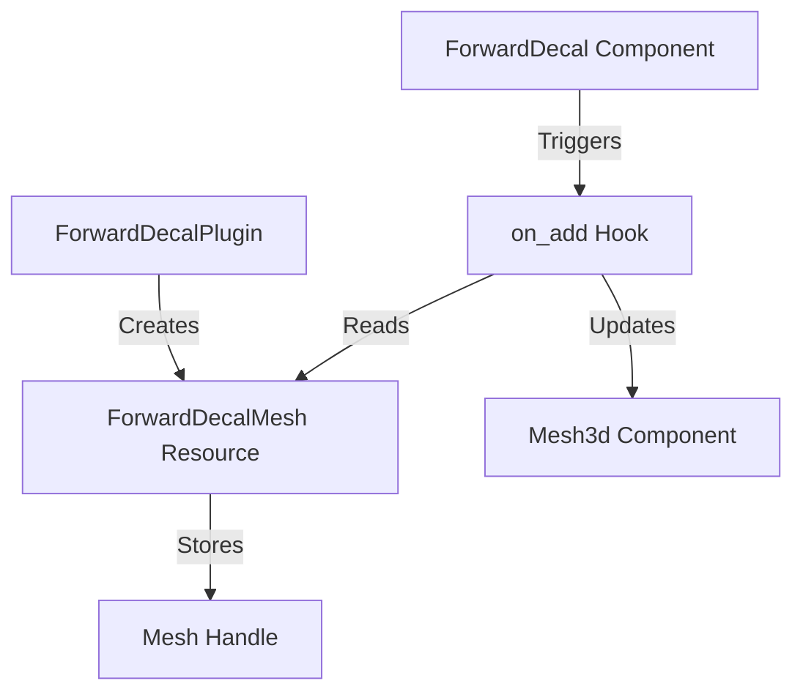

+++
title = "#19428 Replace the `FORWARD_DECAL_MESH_HANDLE` with a resource that gets cloned out in a hook."
date = "2025-07-23T00:00:00"
draft = false
template = "pull_request_page.html"
in_search_index = true

[taxonomies]
list_display = ["show"]

[extra]
current_language = "en"
available_languages = {"en" = { name = "English", url = "/pull_request/bevy/2025-07/pr-19428-en-20250723" }, "zh-cn" = { name = "中文", url = "/pull_request/bevy/2025-07/pr-19428-zh-cn-20250723" }}
labels = ["A-Rendering", "A-Assets", "X-Contentious", "D-Straightforward"]
+++

## Analysis of PR #19428: Replace the `FORWARD_DECAL_MESH_HANDLE` with a resource that gets cloned out in a hook

### Basic Information
- **Title**: Replace the `FORWARD_DECAL_MESH_HANDLE` with a resource that gets cloned out in a hook.
- **PR Link**: https://github.com/bevyengine/bevy/pull/19428
- **Author**: andriyDev
- **Status**: MERGED
- **Labels**: A-Rendering, A-Assets, S-Ready-For-Final-Review, X-Contentious, D-Straightforward
- **Created**: 2025-05-29T07:01:46Z
- **Merged**: 2025-07-23T18:20:31Z
- **Merged By**: alice-i-cecile

### Description Translation
# Objective
- Related to #19024.

## Solution
- Rather than adding a required component `Mesh3d` with a default set to `FORWARD_DECAL_MESH_HANDLE`, we use a hook to change the `Mesh3d`s asset handle.

## Testing
- `decal` example still works.

### The Story of This Pull Request

#### The Problem and Context
The original implementation for forward decals used a hardcoded UUID handle (`FORWARD_DECAL_MESH_HANDLE`) for the decal mesh. This required explicitly inserting the mesh asset into the asset store during plugin initialization and enforcing its usage through a required component constraint. This approach created two key limitations:

1. **Resource Access Limitation**: Required components cannot access resources like asset handles since they're function pointers without context
2. **Inflexible Handle Management**: The UUID handle approach bypassed Bevy's standard asset management system

These limitations became apparent when trying to extend or modify decal functionality, particularly when needing to access resources during component setup.

#### The Solution Approach
The solution replaces the static UUID handle with a resource-managed asset handle and uses an on-add hook for dynamic assignment. This approach offers several advantages:
- Avoids hardcoded UUID handles
- Works within Bevy's resource system
- Maintains compatibility with existing asset management
- Allows conditional mesh assignment (only when unset)

The hook approach was chosen over alternatives like custom component initializers because it provides the necessary context (resource access) while maintaining the simplicity of the component definition.

#### The Implementation
The implementation follows a clear sequence:

1. **Resource Creation**: A new resource `ForwardDecalMesh` stores the mesh handle
2. **Plugin Initialization**: The plugin creates the mesh and stores its handle in the resource
3. **Component Modification**: The `ForwardDecal` component now triggers an on-add hook
4. **Hook Logic**: The hook conditionally assigns the mesh handle when needed

The key implementation detail is the conditional assignment in the hook:
```rust
// Only replace the mesh handle if the mesh handle is defaulted
if **entity_mesh == Handle::default() {
    entity_mesh.0 = decal_mesh;
}
```
This ensures existing mesh assignments are preserved while providing a default for unconfigured entities.

#### Technical Insights
The hook mechanism (`on_add=forward_decal_set_mesh`) is particularly noteworthy. Hooks in Bevy provide a way to run custom logic when components are added, with access to the full ECS context. This implementation demonstrates a valid use case for hooks: resource-dependent component initialization.

The resource-based handle management also demonstrates proper asset lifecycle handling. By storing the handle in a resource rather than a static, we ensure:
- The mesh is only loaded once
- The handle remains valid across asset reloads
- The system works with Bevy's asset hot-reloading

#### The Impact
This change improves the decal system's maintainability and flexibility:
1. Removes a hardcoded UUID that could cause collisions
2. Aligns with Bevy's standard resource/asset patterns
3. Enables future extensions to decal mesh handling
4. Maintains backward compatibility (the decal example still works)

The solution demonstrates how hooks can bridge the gap between simple component definitions and complex initialization requirements.

### Visual Representation


### Key Files Changed
#### `crates/bevy_pbr/src/decal/forward.rs`
This file contains all the logic changes for the decal system. The modifications transition from a static UUID handle to a resource-managed approach with hook-based initialization.

**Key Changes:**
1. Replaced UUID handle with resource storage
```rust
// Before:
const FORWARD_DECAL_MESH_HANDLE: Handle<Mesh> =
    uuid_handle!("afa817f9-1869-4e0c-ac0d-d8cd1552d38a");

// After:
#[derive(Resource)]
struct ForwardDecalMesh(Handle<Mesh>);
```

2. Updated plugin initialization
```rust
// Before:
app.world_mut().resource_mut::<Assets<Mesh>>().insert(
    FORWARD_DECAL_MESH_HANDLE.id(),
    // ... mesh creation ...
);

// After:
let mesh = app.world_mut().resource_mut::<Assets<Mesh>>().add(
    // ... mesh creation ...
);
app.insert_resource(ForwardDecalMesh(mesh));
```

3. Modified component definition
```rust
// Before:
#[require(Mesh3d(FORWARD_DECAL_MESH_HANDLE))]

// After:
#[require(Mesh3d)]
#[component(on_add=forward_decal_set_mesh)]
```

4. Added hook implementation
```rust
fn forward_decal_set_mesh(mut world: DeferredWorld, HookContext { entity, .. }: HookContext) {
    let decal_mesh = world.resource::<ForwardDecalMesh>().0.clone();
    let mut entity = world.entity_mut(entity);
    let mut entity_mesh = entity.get_mut::<Mesh3d>().unwrap();
    if **entity_mesh == Handle::default() {
        entity_mesh.0 = decal_mesh;
    }
}
```

### Further Reading
1. [Bevy Hooks Documentation](https://docs.rs/bevy_ecs/latest/bevy_ecs/lifecycle/index.html) - Official docs for component lifecycle hooks
2. [Bevy Assets System](https://bevyengine.org/learn/book/features/assets/) - How asset management works in Bevy
3. [PR #19024](https://github.com/bevyengine/bevy/pull/19024) - Related PR that likely inspired this change
4. [Component Initialization Patterns](https://bevy-cheatbook.github.io/programming/init.html) - Common Bevy component initialization techniques

The implementation demonstrates a clean solution to resource-dependent component initialization using Bevy's hook system while maintaining compatibility with existing asset management patterns.