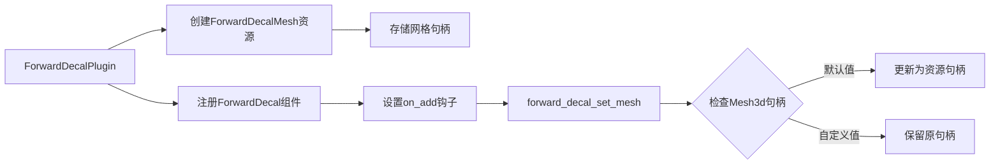

+++
title = "#19428 Replace the `FORWARD_DECAL_MESH_HANDLE` with a resource that gets cloned out in a hook."
date = "2025-07-23T00:00:00"
draft = false
template = "pull_request_page.html"
in_search_index = false

[extra]
current_language = "zh-cn"
available_languages = {"en" = { name = "English", url = "/pull_request/bevy/2025-07/pr-19428-en-20250723" }, "zh-cn" = { name = "中文", url = "/pull_request/bevy/2025-07/pr-19428-zh-cn-20250723" }}
+++

## 标题
将 `FORWARD_DECAL_MESH_HANDLE` 替换为通过钩子克隆的资源

## 基本信息
- **标题**: Replace the `FORWARD_DECAL_MESH_HANDLE` with a resource that gets cloned out in a hook.
- **PR 链接**: https://github.com/bevyengine/bevy/pull/19428
- **作者**: andriyDev
- **状态**: 已合并
- **标签**: A-Rendering, A-Assets, S-Ready-For-Final-Review, X-Contentious, D-Straightforward
- **创建时间**: 2025-05-29T07:01:46Z
- **合并时间**: 2025-07-23T18:20:31Z
- **合并者**: alice-i-cecile

## 描述翻译
### 目标
- 关联 issue #19024

### 解决方案
- 不再使用带有默认值 `FORWARD_DECAL_MESH_HANDLE` 的必需组件 `Mesh3d`，而是通过钩子 (hook) 来修改 `Mesh3d` 的资产句柄。

### 测试
- `decal` 示例仍可正常工作。

## 本 PR 的技术实现过程

### 问题与上下文
在 Bevy 的渲染系统中，前向贴花 (forward decal) 需要特定的网格 (mesh) 作为基础几何体。原实现使用硬编码的 UUID 句柄 `FORWARD_DECAL_MESH_HANDLE` 作为默认网格，通过 `require` 宏强制组件依赖：

```rust
#[require(Mesh3d(FORWARD_DECAL_MESH_HANDLE))]
```

这种方法存在两个主要问题：
1. **资源访问限制**：组件构造函数必须是函数指针，无法访问资源系统获取动态句柄
2. **硬编码依赖**：使用 `uuid_handle!` 宏创建静态句柄，不利于灵活性和热重载

### 解决方案设计
核心思路是将硬编码的网格句柄替换为动态资源：
1. 创建 `ForwardDecalMesh` 资源存储网格句柄
2. 使用生命周期钩子 (lifecycle hook) 在添加组件时动态设置网格
3. 保留默认行为同时允许自定义覆盖

关键决策点：
- 选择钩子而非必需组件：解决资源访问问题
- 条件替换逻辑：仅当句柄为默认值时替换，保留用户自定义
- 资源封装：使用专用资源类型保证类型安全

### 实现细节
#### 1. 移除硬编码句柄
删除原有的 UUID 句柄常量：
```diff
- const FORWARD_DECAL_MESH_HANDLE: Handle<Mesh> =
-     uuid_handle!("afa817f9-1869-4e0c-ac0d-d8cd1552d38a");
```

#### 2. 资源初始化
在插件初始化时创建网格并存储为资源：
```rust
let mesh = app.world_mut().resource_mut::<Assets<Mesh>>().add(
    Rectangle::from_size(Vec2::ONE)
        .mesh()
        .build()
        .with_inserted_attribute(Mesh::ATTRIBUTE_UV_0, vec![[1.0, 0.0], [0.0, 0.0], [0.0, 1.0], [1.0, 1.0]])
        .unwrap(),
);
app.insert_resource(ForwardDecalMesh(mesh));
```

#### 3. 组件定义修改
更新组件属性，使用钩子替代硬编码依赖：
```diff
#[derive(Component, Reflect)]
-#[require(Mesh3d(FORWARD_DECAL_MESH_HANDLE))]
+#[require(Mesh3d)]
+#[component(on_add=forward_decal_set_mesh)]
pub struct ForwardDecal;
```

#### 4. 钩子实现
添加资源类型和钩子函数：
```rust
#[derive(Resource)]
struct ForwardDecalMesh(Handle<Mesh>);

fn forward_decal_set_mesh(mut world: DeferredWorld, HookContext { entity, .. }: HookContext) {
    let decal_mesh = world.resource::<ForwardDecalMesh>().0.clone();
    let mut entity = world.entity_mut(entity);
    let mut entity_mesh = entity.get_mut::<Mesh3d>().unwrap();
    // Only replace the mesh handle if the mesh handle is defaulted.
    if **entity_mesh == Handle::default() {
        entity_mesh.0 = decal_mesh;
    }
}
```

### 技术洞察
1. **生命周期钩子优势**：
   - 在组件添加时执行自定义逻辑
   - 可访问 ECS 世界和资源
   - 避免静态函数限制

2. **条件替换模式**：
   ```rust
   if **entity_mesh == Handle::default() {
       entity_mesh.0 = decal_mesh;
   }
   ```
   保留用户显式设置的网格，仅在未设置时使用默认

3. **资源解耦**：
   - 网格创建与使用分离
   - 资源系统管理生命周期
   - 便于未来扩展（如热重载不同网格）

### 影响分析
1. **正向影响**：
   - 解决 issue #19024 的硬编码问题
   - 保持向后兼容（decal 示例仍工作）
   - 减少特殊宏的使用

2. **潜在考量**：
   - 轻微运行时开销（钩子执行）
   - 资源初始化顺序依赖（插件需先于实体创建）

## 组件关系图


## 关键文件变更
### `crates/bevy_pbr/src/decal/forward.rs` (+28/-9)

#### 变更说明
重构前向贴花网格初始化逻辑，用资源+钩子模式替代硬编码句柄

#### 主要代码变更
**1. 资源初始化（新增）**
```rust
let mesh = app.world_mut().resource_mut::<Assets<Mesh>>().add(
    Rectangle::from_size(Vec2::ONE)
        .mesh()
        .build()
        .with_inserted_attribute(Mesh::ATTRIBUTE_UV_0, vec![[1.0, 0.0], [0.0, 0.0], [0.0, 1.0], [1.0, 1.0]])
        .unwrap(),
);
app.insert_resource(ForwardDecalMesh(mesh));
```

**2. 组件定义变更**
```diff
// 修改前
#[require(Mesh3d(FORWARD_DECAL_MESH_HANDLE))]

// 修改后
#[require(Mesh3d)]
#[component(on_add=forward_decal_set_mesh)]
```

**3. 钩子实现（新增）**
```rust
#[derive(Resource)]
struct ForwardDecalMesh(Handle<Mesh>);

fn forward_decal_set_mesh(mut world: DeferredWorld, HookContext { entity, .. }: HookContext) {
    let decal_mesh = world.resource::<ForwardDecalMesh>().0.clone();
    let mut entity = world.entity_mut(entity);
    let mut entity_mesh = entity.get_mut::<Mesh3d>().unwrap();
    if **entity_mesh == Handle::default() {
        entity_mesh.0 = decal_mesh;
    }
}
```

## 扩展阅读
1. [Bevy 生命周期钩子文档](https://docs.rs/bevy_ecs/latest/bevy_ecs/lifecycle/index.html)
2. [组件交互模式](https://bevyengine.org/learn/book/design/component-interaction/)
3. [资源系统详解](https://bevyengine.org/learn/book/design/resource-management/)