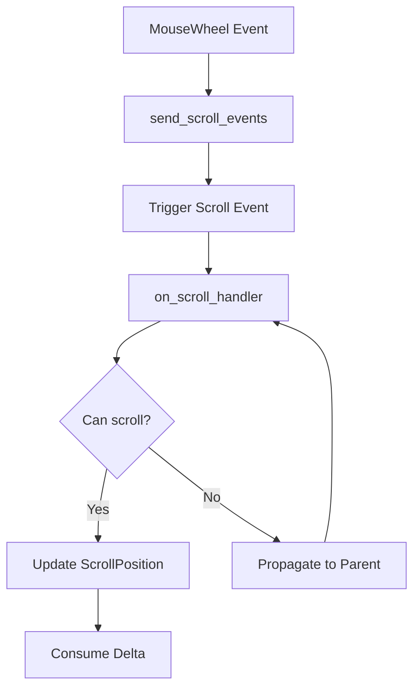

+++
title = "#19586 Robust Scrolling Example"
date = "2025-07-14T00:00:00"
draft = false
template = "pull_request_page.html"
in_search_index = true

[taxonomies]
list_display = ["show"]

[extra]
current_language = "en"
available_languages = {"en" = { name = "English", url = "/pull_request/bevy/2025-07/pr-19586-en-20250714" }, "zh-cn" = { name = "中文", url = "/pull_request/bevy/2025-07/pr-19586-zh-cn-20250714" }}
labels = ["C-Examples", "A-UI"]
+++

## Robust Scrolling Example: Technical Analysis

### Basic Information
- **Title**: Robust Scrolling Example
- **PR Link**: https://github.com/bevyengine/bevy/pull/19586
- **Author**: tim-blackbird
- **Status**: MERGED
- **Labels**: C-Examples, A-UI, S-Ready-For-Final-Review, X-Uncontroversial
- **Created**: 2025-06-11T18:33:11Z
- **Merged**: 2025-07-14T20:43:01Z
- **Merged By**: alice-i-cecile

### Description Translation
**Objective**  
A more robust scrolling example that doesn't require `Pickable { should_block_lower: false, .. }` or `Pickable::IGNORE`, and properly handles nested scrolling nodes.

The current example shows nested scrolling, but this is only functional because the parent scrolls along a different axis than the children.

**Solution**  
Instead of only scrolling the top node that is found in the `HoverMap` we trigger the `OnScroll` event on it.  
This event then propagates up the hierarchy until any scrolling node that has room to scroll along that axis consumes the event.

The now redundant `Pickable` components were removed from the example.  
The "Nested Scrolling Lists" portion was adjusted to show the new reliable nested scrolling.

**Testing**  
Check out the example. It should work just as it did before.

---

### The Story of This Pull Request

#### The Problem and Context
The existing scrolling example had two significant limitations in its UI scrolling implementation. First, it required manual configuration of `Pickable` components with `should_block_lower: false` to enable nested scrolling behavior. This workaround was necessary because the original implementation directly modified scroll positions without proper event propagation. Second, the nested scrolling demonstration only functioned correctly when parent and child containers scrolled along different axes (horizontal vs vertical), failing to demonstrate true bidirectional nested scrolling.

These limitations stemmed from the direct modification approach in `update_scroll_position`, which:
1. Applied scroll delta to all hovered entities simultaneously
2. Lacked hierarchical propagation logic
3. Didn't respect scroll boundaries or overflow constraints

#### The Solution Approach
The PR introduces an event-driven approach using a custom `Scroll` event with automatic propagation. Key design decisions:
1. Replace direct component modification with event propagation
2. Implement scroll delta consumption at each node
3. Remove all `Pickable` workarounds from the example
4. Demonstrate true bidirectional nested scrolling

The solution leverages Bevy's entity event system with `auto_propagate` and `traversal = &'static ChildOf` to automatically propagate scroll events through the UI hierarchy.

#### The Implementation
The core changes involve:
1. Creating a new `Scroll` event type
2. Implementing event propagation logic
3. Replacing the direct modification system with event handlers

The `on_scroll_handler` system contains the scroll logic:
```rust
fn on_scroll_handler(
    mut trigger: On<Scroll>,
    mut query: Query<(&mut ScrollPosition, &Node, &ComputedNode)>,
) {
    let target = trigger.target();
    let delta = &mut trigger.event_mut().delta;

    let Ok((mut scroll_position, node, computed)) = query.get_mut(target) else {
        return;
    };

    let max_offset = (computed.content_size() - computed.size()) * computed.inverse_scale_factor();

    if node.overflow.x == OverflowAxis::Scroll && delta.x != 0. {
        // Scroll logic for X axis
        let max = if delta.x > 0. {
            scroll_position.x >= max_offset.x
        } else {
            scroll_position.x <= 0.
        };

        if !max {
            scroll_position.x += delta.x;
            delta.x = 0.;  // Consume X delta
        }
    }

    // Similar logic for Y axis
    // ...
}
```
Key aspects:
1. Calculates maximum scroll offset based on content size
2. Checks scroll boundaries before applying delta
3. Consumes scroll delta when applied
4. Stops propagation when delta is fully consumed

#### Technical Insights
The propagation mechanism uses Bevy's entity event system with `auto_propagate`:
```rust
#[derive(Event, EntityEvent, Debug)]
#[entity_event(auto_propagate, traversal = &'static ChildOf)]
struct Scroll {
    delta: Vec2,
}
```
This configuration automatically propagates the event from child to parent entities. The handler consumes portions of the scroll delta at each node, allowing:
1. Inner scroll containers to handle scrolling first
2. Unconsumed delta to propagate to parent containers
3. Natural handling of nested scroll areas regardless of axis

#### The Impact
These changes provide:
1. Proper nested scrolling without workarounds
2. Removal of all `Pickable` configuration from the example
3. True bidirectional nested scrolling demonstration
4. More robust scrolling behavior respecting boundaries

The example now demonstrates proper UI scrolling patterns that can be used as a reference implementation. The event-driven approach aligns better with Bevy's ECS architecture and provides a foundation for more complex scrolling behaviors.

### Visual Representation



### Key Files Changed

#### `examples/ui/scroll.rs` (+98/-71)
This file contains the scrolling example. Changes include:
1. Replacement of direct scroll modification with event system
2. Removal of all `Pickable` workarounds
3. Improved nested scrolling demonstration

Key modifications:
```rust
// Before: Direct scroll modification system
pub fn update_scroll_position(
    mut mouse_wheel_events: EventReader<MouseWheel>,
    hover_map: Res<HoverMap>,
    mut scrolled_node_query: Query<&mut ScrollPosition>,
    keyboard_input: Res<ButtonInput<KeyCode>>,
) {
    // ... direct scroll position modification
}

// After: Event-driven approach
fn send_scroll_events(
    mut mouse_wheel_events: EventReader<MouseWheel>,
    hover_map: Res<HoverMap>,
    keyboard_input: Res<ButtonInput<KeyCode>>,
    mut commands: Commands,
) {
    // ... triggers Scroll events
}

#[derive(Event, EntityEvent, Debug)]
#[entity_event(auto_propagate, traversal = &'static ChildOf)]
struct Scroll {
    delta: Vec2,
}

fn on_scroll_handler(
    mut trigger: On<Scroll>,
    mut query: Query<(&mut ScrollPosition, &Node, &ComputedNode)>,
) {
    // ... handles scroll with propagation
}
```

Nested scrolling example improvement:
```rust
// Before: Different axes with Pickable workaround
(
    Node {
        // ... 
        overflow: Overflow::scroll_x(), // Different axis
    },
    Pickable { should_block_lower: false, .. }
)

// After: Bidirectional with proper propagation
(
    Node {
        // ...
        overflow: Overflow::scroll(), // Same axis
    },
    // No Pickable component
)
```

### Further Reading
1. [Bevy UI Documentation](https://bevyengine.org/learn/book/features/ui/)
2. [Bevy Events System](https://bevyengine.org/learn/book/features/events/)
3. [Entity Events RFC](https://github.com/bevyengine/rfcs/blob/main/rfcs/45-entity-events.md)
4. [UI Overflow Handling](https://github.com/bevyengine/bevy/blob/main/crates/bevy_ui/src/overflow.rs)