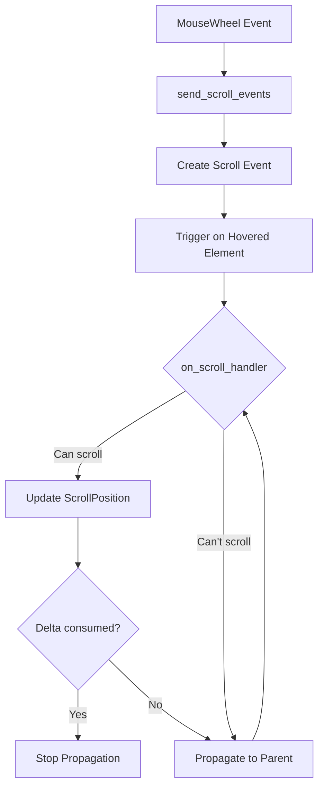

+++
title = "#19586 Robust Scrolling Example"
date = "2025-07-14T00:00:00"
draft = false
template = "pull_request_page.html"
in_search_index = false

[extra]
current_language = "zh-cn"
available_languages = {"en" = { name = "English", url = "/pull_request/bevy/2025-07/pr-19586-en-20250714" }, "zh-cn" = { name = "中文", url = "/pull_request/bevy/2025-07/pr-19586-zh-cn-20250714" }}
+++

## Robust Scrolling Example

## 基本信息
- **标题**: Robust Scrolling Example
- **PR链接**: https://github.com/bevyengine/bevy/pull/19586
- **作者**: tim-blackbird
- **状态**: MERGED
- **标签**: C-Examples, A-UI, S-Ready-For-Final-Review, X-Uncontroversial
- **创建时间**: 2025-06-11T18:33:11Z
- **合并时间**: 2025-07-14T20:43:01Z
- **合并人**: alice-i-cecile

## 描述翻译
# Objective
一个更健壮的滚动示例，不需要`Pickable { should_block_lower: false, .. }`或`Pickable::IGNORE`，并能正确处理嵌套滚动节点。

当前示例展示了嵌套滚动，但这仅当父节点和子节点沿不同轴滚动时才有效。

## Solution
不再只滚动在`HoverMap`中找到的顶部节点，而是在该节点上触发`OnScroll`事件。该事件随后在层次结构中向上传播，直到任何沿该轴有空间滚动的滚动节点消费该事件。

示例中冗余的`Pickable`组件已被移除。"Nested Scrolling Lists"部分已调整以展示新的可靠嵌套滚动。

## Testing
查看示例。它应该和以前一样工作。

## 这个Pull Request的故事

### 问题和背景
在Bevy的UI滚动示例中，嵌套滚动功能的实现存在两个主要问题：
1. 它依赖`Pickable`组件的特殊配置（`should_block_lower: false`或`Pickable::IGNORE`）来允许事件穿透到嵌套元素
2. 它只能处理父节点和子节点沿不同轴滚动的情况（如父节点水平滚动，子节点垂直滚动）

这种实现方式导致：
- 示例代码包含不必要的`Pickable`配置
- 当父节点和子节点沿相同轴滚动时，嵌套滚动无法正常工作
- 事件处理逻辑直接修改`ScrollPosition`组件，没有适当的传播机制

这些问题降低了示例的健壮性，且不能准确展示Bevy UI系统处理嵌套滚动的能力。

### 解决方案方法
作者采用事件传播(event propagation)模式重构滚动处理：
1. 引入新的`Scroll`事件类型，包含滚动增量(delta)
2. 创建事件发送系统(send_scroll_events)，将鼠标滚轮事件转换为`Scroll`事件
3. 实现事件处理系统(on_scroll_handler)，处理滚动逻辑并支持传播
4. 移除所有`Pickable`的特殊配置，因为它们不再需要
5. 重构嵌套滚动示例部分，使其能处理同轴嵌套滚动

关键决策包括：
- 使用`EntityEvent`特性实现事件自动传播
- 在事件处理中实现滚动增量消费机制
- 保持现有API兼容性，只修改内部实现

### 实现细节
#### 1. 创建Scroll事件类型
```rust
#[derive(Event, EntityEvent, Debug)]
#[entity_event(auto_propagate, traversal = &'static ChildOf)]
struct Scroll {
    delta: Vec2,
}
```
这里的关键是：
- `auto_propagate` 启用自动传播
- `traversal = &'static ChildOf` 指定沿父子关系向上传播
- `delta` 存储逻辑坐标中的滚动增量

#### 2. 实现事件发送系统
```rust
fn send_scroll_events(
    mut mouse_wheel_events: EventReader<MouseWheel>,
    hover_map: Res<HoverMap>,
    keyboard_input: Res<ButtonInput<KeyCode>>,
    mut commands: Commands,
) {
    for event in mouse_wheel_events.read() {
        let mut delta = -Vec2::new(event.x, event.y);
        
        if event.unit == MouseScrollUnit::Line {
            delta *= LINE_HEIGHT;
        }
        
        if keyboard_input.any_pressed([KeyCode::ControlLeft, KeyCode::ControlRight]) {
            std::mem::swap(&mut delta.x, &mut delta.y);
        }
        
        for pointer_map in hover_map.values() {
            for entity in pointer_map.keys() {
                commands.trigger_targets(Scroll { delta }, *entity);
            }
        }
    }
}
```
这个系统：
- 转换鼠标滚轮事件为统一的逻辑单位
- 处理Ctrl键交换滚动轴的逻辑
- 通过`HoverMap`找到当前悬停的UI元素
- 使用`commands.trigger_targets`发送事件

#### 3. 实现事件处理系统
```rust
fn on_scroll_handler(
    mut trigger: On<Scroll>,
    mut query: Query<(&mut ScrollPosition, &Node, &ComputedNode)>,
) {
    let target = trigger.target();
    let delta = &mut trigger.event_mut().delta;

    let Ok((mut scroll_position, node, computed)) = query.get_mut(target) else {
        return;
    };

    let max_offset = (computed.content_size() - computed.size()) * computed.inverse_scale_factor();

    // X轴滚动处理
    if node.overflow.x == OverflowAxis::Scroll && delta.x != 0. {
        let max = if delta.x > 0. {
            scroll_position.x >= max_offset.x
        } else {
            scroll_position.x <= 0.
        };

        if !max {
            scroll_position.x += delta.x;
            delta.x = 0.; // 消费X分量
        }
    }

    // Y轴滚动处理
    if node.overflow.y == OverflowAxis::Scroll && delta.y != 0. {
        let max = if delta.y > 0. {
            scroll_position.y >= max_offset.y
        } else {
            scroll_position.y <= 0.
        };

        if !max {
            scroll_position.y += delta.y;
            delta.y = 0.; // 消费Y分量
        }
    }

    // 如果delta完全消费则停止传播
    if *delta == Vec2::ZERO {
        trigger.propagate(false);
    }
}
```
这个处理器的核心逻辑：
1. 检查节点是否允许对应轴滚动
2. 检查是否已滚动到边界
3. 更新滚动位置并消费对应的delta分量
4. 当delta完全消费时停止事件传播

#### 4. 重构嵌套滚动示例
```rust
fn nested_scrolling_list(font_handle: Handle<Font>) -> impl Bundle {
    // ...
    (
        Node {
            column_gap: Val::Px(20.),
            flex_direction: FlexDirection::Row,
            align_self: AlignSelf::Stretch,
            height: Val::Percent(50.),
            overflow: Overflow::scroll(), // 双向滚动
            ..default()
        },
        // ...
        Children::spawn(SpawnIter((0..5).map(move |oi| {
            (
                Node {
                    flex_direction: FlexDirection::Column,
                    align_self: AlignSelf::Stretch,
                    height: Val::Percent(200. / 5. * (oi as f32 + 1.)),
                    overflow: Overflow::scroll_y(), // 垂直滚动
                    ..default()
                },
                // ...
            )
        }))),
    )
}
```
主要变更：
- 外层容器改为双向滚动(`Overflow::scroll()`)
- 内层容器保持垂直滚动
- 移除了所有`Pickable`组件
- 调整了高度计算以展示不同高度的嵌套滚动

### 技术洞察
1. **事件传播机制**：  
   使用`EntityEvent`特性实现的事件传播允许滚动事件在UI层次结构中向上冒泡，直到被完全处理。这模仿了浏览器中滚动事件的行为。

2. **增量消费模式**：  
   每个滚动节点只消费它能处理的部分delta，未消费的部分继续向上传播。这确保了嵌套滚动容器能正确处理共享轴的滚动。

3. **边界检查优化**：  
   滚动处理包含精确的边界检查，防止在滚动到边界时出现跳动或不自然行为：
   ```rust
   let max = if delta.y > 0. {
       scroll_position.y >= max_offset.y
   } else {
       scroll_position.y <= 0.
   };
   ```

4. **单位统一处理**：  
   系统将`MouseScrollUnit::Line`转换为像素单位，保持处理逻辑的一致性：
   ```rust
   if event.unit == MouseScrollUnit::Line {
       delta *= LINE_HEIGHT;
   }
   ```

### 影响
1. **简化示例代码**：  
   移除了5处`Pickable`组件配置，减少约30行样板代码。

2. **功能增强**：  
   现在支持父节点和子节点沿相同轴滚动的场景，更全面地展示Bevy的滚动能力。

3. **架构改进**：  
   将直接的状态修改改为事件驱动模型，更符合ECS架构的最佳实践。

4. **性能考虑**：  
   事件传播在UI树深度合理的情况下性能影响可忽略，且比原来的全局查询更精确。

## 视觉表示


## 关键文件变更
### 文件: `examples/ui/scroll.rs` (+98/-71)
#### 变更描述：
重构滚动处理逻辑，用事件传播机制替代直接修改状态的方式，并简化示例UI结构。

#### 关键代码片段：
**移除旧的滚动处理系统:**
```rust
// 删除的旧系统:
pub fn update_scroll_position(
    mut mouse_wheel_events: EventReader<MouseWheel>,
    hover_map: Res<HoverMap>,
    mut scrolled_node_query: Query<&mut ScrollPosition>,
    keyboard_input: Res<ButtonInput<KeyCode>>,
) {
    // ... 直接修改ScrollPosition ...
}
```

**添加新的事件系统注册:**
```diff
 .add_systems(Startup, setup)
-.add_systems(Update, update_scroll_position);
+.add_systems(Update, send_scroll_events)
+.add_observer(on_scroll_handler);
```

**嵌套滚动示例的改进:**
```diff
 fn nested_scrolling_list(font_handle: Handle<Font>) -> impl Bundle {
     // ...
     (
         Node {
             column_gap: Val::Px(20.),
             flex_direction: FlexDirection::Row,
             align_self: AlignSelf::Stretch,
             height: Val::Percent(50.),
-            overflow: Overflow::scroll_x(), // n.b.
+            overflow: Overflow::scroll(),
             ..default()
         },
         // ...
-        Children::spawn(SpawnIter((0..30).map(move |oi| {
+        Children::spawn(SpawnIter((0..5).map(move |oi| {
             (
                 Node {
                     flex_direction: FlexDirection::Column,
                     align_self: AlignSelf::Stretch,
+                    height: Val::Percent(200. / 5. * (oi as f32 + 1.)),
                     overflow: Overflow::scroll_y(),
                     ..default()
                 },
-                Pickable {
-                    should_block_lower: false,
-                    ..default()
-                },
                 // ...
             )
         }))),
     )
 }
```

## 延伸阅读
1. [Bevy UI系统文档](https://bevyengine.org/learn/book/features/ui/)
2. [Bevy事件系统](https://bevyengine.org/examples/ecs/event/)
3. [EntityEvent特性文档](https://docs.rs/bevy_ecs/latest/bevy_ecs/event/trait.EntityEvent.html)
4. [UI滚动原理](https://developer.mozilla.org/en-US/docs/Web/CSS/overflow)