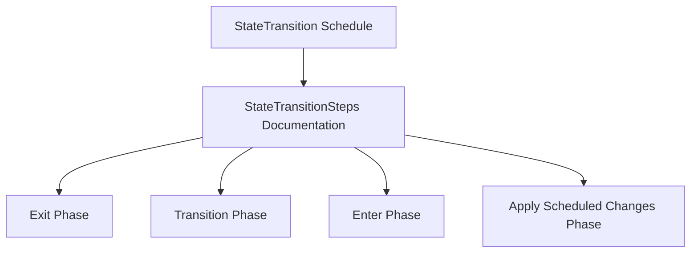

+++
title = "#19597 doc improvement for StateTransition"
date = "2025-07-07T00:00:00"
draft = false
template = "pull_request_page.html"
in_search_index = true

[taxonomies]
list_display = ["show"]

[extra]
current_language = "en"
available_languages = {"en" = { name = "English", url = "/pull_request/bevy/2025-07/pr-19597-en-20250707" }, "zh-cn" = { name = "中文", url = "/pull_request/bevy/2025-07/pr-19597-zh-cn-20250707" }}
labels = ["C-Docs", "A-States"]
+++

## doc improvement for StateTransition

### Basic Information
- **Title**: doc improvement for StateTransition
- **PR Link**: https://github.com/bevyengine/bevy/pull/19597
- **Author**: Wuketuke
- **Status**: MERGED
- **Labels**: C-Docs, S-Ready-For-Final-Review, A-States
- **Created**: 2025-06-12T14:26:58Z
- **Merged**: 2025-07-07T20:11:20Z
- **Merged By**: alice-i-cecile

### Description Translation
Fixes #19594  
The exact problem is described in that issue.  
I improved the docs to guide anyone who has the the same issue I had.  
I kept myself minimal, since the problem is relatively niche, hopefully it will be enough if anyone else has that problem

### The Story of This Pull Request

**The Problem and Context**  
The PR addresses issue #19594 where users encountered confusion about the `StateTransition` schedule's internal structure. The original documentation for `StateTransition` described when the schedule runs (during `PreStartup` and `PreUpdate`) and provided a usage example, but omitted critical information about its internal segmentation into distinct phases. This gap caused confusion for developers trying to hook into specific state transition moments, particularly when working with Bevy's state management system.

**The Solution Approach**  
The solution focuses on minimal but impactful documentation enhancement. Rather than restructuring existing content or adding extensive explanations, we add a single sentence directing users to the existing `StateTransitionSteps` documentation. This approach maintains documentation conciseness while providing the necessary pointer to detailed phase information. The change is intentionally targeted to avoid information overload while solving the specific confusion point.

**The Implementation**  
The implementation adds exactly two lines to the existing doc comment for the `StateTransition` schedule struct. The key addition references `StateTransitionSteps` which already documents the four-phase structure (exit, transition, enter, and scheduled change application). This creates a clear linkage between the schedule and its phase documentation without duplicating content. The change appears at the end of the existing example section where users are most likely looking for implementation guidance.

**Technical Insights**  
The solution demonstrates effective documentation practices by:
1. Creating discoverability through cross-references (`StateTransitionSteps`)
2. Maintaining a single source of truth (phase details remain in `StateTransitionSteps`)
3. Using minimal changes for maximum impact
4. Preserving existing documentation flow while adding critical context

**The Impact**  
This change immediately resolves the documented confusion by providing clear direction to the phase documentation. Developers encountering the `StateTransition` schedule will now understand its segmented nature and know exactly where to find phase implementation details. The change maintains backward compatibility while improving future developer experience with Bevy's state systems.

### Visual Representation



### Key Files Changed

**crates/bevy_state/src/state/transitions.rs**  
Added documentation reference to clarify the schedule's phase structure.

Code diff:
```rust
// File: crates/bevy_state/src/state/transitions.rs
// Before:
/// 
/// This schedule is run during [`PreStartup`] (once) and [`PreUpdate`] (every frame).
///
/// # Example
/// 
/// ```
/// // Code example
/// ```
///
/// [`PreStartup`]: https://docs.rs/bevy/latest/bevy/prelude/struct.PreStartup.html
/// [`PreUpdate`]: https://docs.rs/bevy/latest/bevy/prelude/struct.PreUpdate.html
#[derive(ScheduleLabel, Clone, Debug, PartialEq, Eq, Hash, Default)]
pub struct OnTransition<S: States> {

// After:
/// 
/// This schedule is run during [`PreStartup`] (once) and [`PreUpdate`] (every frame).
///
/// # Example
/// 
/// ```
/// // Code example
/// ```
///
/// This schedule is split up into four phases, as described in [`StateTransitionSteps`].
///
/// [`PreStartup`]: https://docs.rs/bevy/latest/bevy/prelude/struct.PreStartup.html
/// [`PreUpdate`]: https://docs.rs/bevy/latest/bevy/prelude/struct.PreUpdate.html
#[derive(ScheduleLabel, Clone, Debug, PartialEq, Eq, Hash, Default)]
pub struct OnTransition<S: States> {
```

### Further Reading
1. [Bevy States Documentation](https://docs.rs/bevy/latest/bevy/state/index.html)  
2. [StateTransitionSteps Implementation](https://github.com/bevyengine/bevy/blob/main/crates/bevy_state/src/state/transitions.rs#L15-L34)  
3. [Bevy Documentation Guidelines](https://github.com/bevyengine/bevy/blob/main/docs/plugins_guidelines.md#documentation)