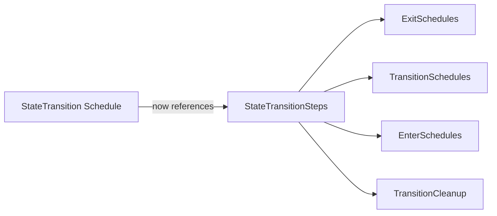

+++
title = "#19597 doc improvement for StateTransition"
date = "2025-07-07T00:00:00"
draft = false
template = "pull_request_page.html"
in_search_index = false

[extra]
current_language = "zh-cn"
available_languages = {"en" = { name = "English", url = "/pull_request/bevy/2025-07/pr-19597-en-20250707" }, "zh-cn" = { name = "中文", url = "/pull_request/bevy/2025-07/pr-19597-zh-cn-20250707" }}
labels = ["C-Docs", "A-States"]
+++

# doc improvement for StateTransition

## Basic Information
- **Title**: doc improvement for StateTransition
- **PR Link**: https://github.com/bevyengine/bevy/pull/19597
- **Author**: Wuketuke
- **Status**: MERGED
- **Labels**: C-Docs, S-Ready-For-Final-Review, A-States
- **Created**: 2025-06-12T14:26:58Z
- **Merged**: 2025-07-07T20:11:20Z
- **Merged By**: alice-i-cecile

## Description Translation
Fixes #19594  
该问题的具体描述已在issue中说明。  
我改进了文档，以指导遇到与我相同问题的任何人。  
我尽量保持简洁，因为这个问题相对小众，希望如果其他人遇到同样的问题，这些文档已足够。

## The Story of This Pull Request

该PR源于issue #19594中报告的具体文档缺陷。在Bevy的状态管理系统中，`StateTransition`调度(schedule)负责处理状态转换逻辑，但原有文档未明确说明其内部执行阶段划分。这导致开发者在需要拦截特定状态转换阶段时，难以定位正确的执行点。

开发者(Wuketuke)在实现状态转换逻辑时，发现需要访问状态转换的中间阶段，但文档未提供相关指引。通过查阅源码，发现`StateTransition`实际被拆分为四个明确定义的阶段，由`StateTransitionSteps`枚举管理。然而，这一关键信息未在`StateTransition`的文档注释中体现，导致开发者需要额外的时间成本来追溯实现细节。

解决方案直接明了：在`StateTransition`的文档注释中增加对执行阶段划分的说明，并指向详细描述各阶段的`StateTransitionSteps`。这种改动符合Bevy文档的最佳实践——在高层抽象处提供导航线索，避免开发者陷入源码追溯。代码修改仅增加两行文档注释：
1. 明确指出该调度分为四个阶段
2. 提供到`StateTransitionSteps`的引用链接

工程决策考虑了最小侵入性原则。由于问题本质是文档缺失而非功能缺陷，解决方案严格限定在文档层面，未涉及任何逻辑变更。这种处理方式既解决了具体问题，又保持了代码的稳定性。

技术层面，此修改强化了Bevy状态模块的API discoverability。通过显式建立`StateTransition`与`StateTransitionSteps`的文档关联，开发者能更快理解：
1. 状态转换的生命周期阶段划分
2. 各阶段的具体执行顺序
3. 如何通过调度标签(targeted schedule labels)拦截特定转换阶段

该修改对性能无影响，因其仅涉及文档元数据。架构上，它完善了状态转换机制的自描述性，降低了后续开发者的认知成本。未来改进可考虑在Bevy Book的状态管理章节同步补充此关系说明。

## Visual Representation



## Key Files Changed

### `crates/bevy_state/src/state/transitions.rs`
**修改说明**：在`StateTransition`调度的文档注释中增加阶段划分说明，提升API可发现性。  
**代码对比**：
```rust
// 修改前:
/// }
///
/// [`PreStartup`]: https://docs.rs/bevy/latest/bevy/prelude/struct.PreStartup.html
/// [`PreUpdate`]: https://docs.rs/bevy/latest/bevy/prelude/struct.PreUpdate.html
#[derive(ScheduleLabel, Clone, Debug, PartialEq, Eq, Hash, Default)]

// 修改后:
/// }
///
/// This schedule is split up into four phases, as described in [`StateTransitionSteps`].
///
/// [`PreStartup`]: https://docs.rs/bevy/latest/bevy/prelude/struct.PreStartup.html
/// [`PreUpdate`]: https://docs.rs/bevy/latest/bevy/prelude/struct.PreUpdate.html
#[derive(ScheduleLabel, Clone, Debug, PartialEq, Eq, Hash, Default)]
```

## Further Reading
1. [Bevy States官方文档](https://docs.rs/bevy/latest/bevy/ecs/schedule/trait.States.html)  
2. [状态转换机制源码分析](https://github.com/bevyengine/bevy/blob/main/crates/bevy_state/src/state/transitions.rs)  
3. [Bevy状态管理设计讨论](https://github.com/bevyengine/bevy/discussions/19594)