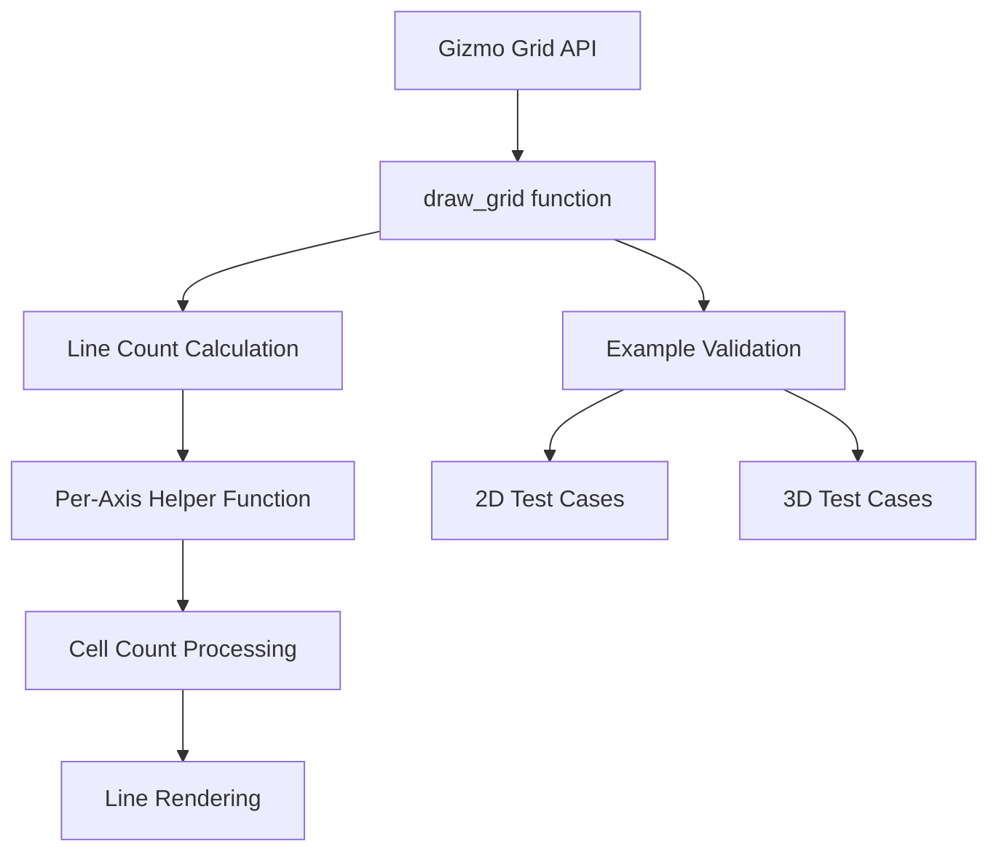

+++
title = "#19697 Bug fix in Gizmo grid"
date = "2025-07-29T00:00:00"
draft = false
template = "pull_request_page.html"
in_search_index = true

[taxonomies]
list_display = ["show"]

[extra]
current_language = "en"
available_languages = {"en" = { name = "English", url = "/pull_request/bevy/2025-07/pr-19697-en-20250729" }, "zh-cn" = { name = "中文", url = "/pull_request/bevy/2025-07/pr-19697-zh-cn-20250729" }}
labels = ["C-Bug", "A-Gizmos", "M-Deliberate-Rendering-Change"]
+++

## Bug Fix in Gizmo Grid Rendering

### Basic Information
- **Title**: Bug fix in Gizmo grid
- **PR Link**: https://github.com/bevyengine/bevy/pull/19697
- **Author**: theotherphil
- **Status**: MERGED
- **Labels**: C-Bug, S-Ready-For-Final-Review, A-Gizmos, M-Deliberate-Rendering-Change
- **Created**: 2025-06-17T18:59:45Z
- **Merged**: 2025-07-29T20:39:30Z
- **Merged By**: alice-i-cecile

### Description
Fix https://github.com/bevyengine/bevy/issues/19480

#### Solution
Fix calculation of line counts in each direction

#### Testing
Added grids to the gizmos screens of testbed/example_3d and testbed/example_2d.


### The Story of This Pull Request

#### The Problem
The grid gizmo implementation had a miscalculation in determining how many lines to draw when toggling outer edges. When users enabled outer edges using `outer_edges_x()`, `outer_edges_y()`, or `outer_edges_z()`, the grid would render with an incorrect number of lines. This violated user expectations about grid rendering behavior and made the feature unreliable for visual debugging. The core issue was in the line count calculation logic that didn't properly account for the edge inclusion flags across different axes.

#### The Solution Approach
The fix required rethinking how line counts are calculated when outer edges are enabled. Instead of using a vectorized approach that treated all axes uniformly, we needed:
1. A per-axis calculation that respects each axis's outer edge flag independently
2. Proper handling of edge cases like zero cell counts
3. Clear separation between cell counts and line counts

The solution introduces a helper function that calculates line counts based on:
- Whether outer edges should be included for that axis
- The number of cells along the perpendicular axes

#### Implementation Details
The main change replaces the monolithic line count calculation with a targeted approach:

```rust
// New helper function
#[inline]
fn cell_count_to_line_count(include_outer: bool, cell_count: u32) -> u32 {
    if include_outer {
        cell_count.saturating_add(1)
    } else {
        cell_count.saturating_sub(1).max(1)
    }
}

// Per-axis line count calculation
let x_line_count = UVec2::new(
    cell_count_to_line_count(outer_edges[0], cell_count.y),
    cell_count_to_line_count(outer_edges[0], cell_count.z),
);
```

This approach:
1. Clearly separates the logic for each axis
2. Uses saturating arithmetic to prevent underflow
3. Ensures at least one line is always drawn
4. Maintains the existing API while fixing internal calculations

The parameter documentation was also updated to clarify that these methods affect edges *parallel* to each axis, not *along* them:

```rust
/// Declare that the outer edges of the grid parallel to the x axis should be drawn.
pub fn outer_edges_x(mut self) -> Self {
    self.outer_edges[0] = true;
    self
}
```

#### Testing Strategy
To verify the fix, we added comprehensive test cases in both 2D and 3D examples:
- Multiple grid configurations with all combinations of outer edges toggled
- Visual verification through screenshots
- Consistent positioning to allow side-by-side comparison

The test code systematically exercises all edge flag combinations:

```rust
// 2D testing
for i in 0..4 {
    let mut grid = gizmos.grid(...);
    if i & 1 > 0 { grid = grid.outer_edges_x(); }
    if i & 2 > 0 { grid.outer_edges_y(); }
}

// 3D testing
for i in 0..8 {
    let mut grid = gizmos.grid_3d(...);
    if i & 1 > 0 { grid = grid.outer_edges_x(); }
    if i & 2 > 0 { grid = grid.outer_edges_y(); }
    if i & 4 > 0 { grid.outer_edges_z(); }
}
```

#### Impact
This fix:
1. Corrects grid rendering behavior when outer edges are enabled
2. Maintains backward compatibility with existing API usage
3. Provides clear visual verification through enhanced examples
4. Improves the reliability of grid gizmos for debugging purposes

The solution demonstrates how localized calculations can have significant visual impact, and how systematic testing of configuration combinations can effectively validate rendering logic.

### Visual Representation



### Key Files Changed

1. **crates/bevy_gizmos/src/grid.rs** (+31/-12)
   - Fixed line count calculation logic for grid rendering
   - Added helper function for proper edge handling
   - Improved documentation clarity

```rust
// Before: Incorrect vectorized calculation
let outer_edges_u32 = UVec3::from(outer_edges.map(|v| v as u32));
let line_count = outer_edges_u32 * cell_count.saturating_add(UVec3::ONE)
    + (UVec3::ONE - outer_edges_u32) * cell_count.saturating_sub(UVec3::ONE);

// After: Correct per-axis calculation
#[inline]
fn cell_count_to_line_count(include_outer: bool, cell_count: u32) -> u32 {
    if include_outer {
        cell_count.saturating_add(1)
    } else {
        cell_count.saturating_sub(1).max(1)
    }
}

let x_line_count = UVec2::new(
    cell_count_to_line_count(outer_edges[0], cell_count.y),
    cell_count_to_line_count(outer_edges[0], cell_count.z),
);
```

2. **examples/testbed/2d.rs** (+28/-2)
   - Added comprehensive grid tests with all outer edge combinations
   - Positioned grids for visual comparison

```rust
// Added test code
for i in 0..4 {
    let x = 200.0 * (1.0 + (i % 2) as f32);
    let y = 150.0 * (0.5 - (i / 2) as f32);
    let mut grid = gizmos.grid(...);
    if i & 1 > 0 { grid = grid.outer_edges_x(); }
    if i & 2 > 0 { grid.outer_edges_y(); }
}
```

3. **examples/testbed/3d.rs** (+24/-3)
   - Extended 3D grid tests with all axis flag combinations
   - Adjusted camera position for better visibility

```rust
// Added test code
for i in 0..8 {
    let x = 1.5 * (i % 4) as f32;
    let y = 1.0 * (0.5 - (i / 4) as f32);
    let mut grid = gizmos.grid_3d(...);
    if i & 1 > 0 { grid = grid.outer_edges_x(); }
    if i & 2 > 0 { grid = grid.outer_edges_y(); }
    if i & 4 > 0 { grid.outer_edges_z(); }
}
```

### Further Reading
1. [Original Issue #19480](https://github.com/bevyengine/bevy/issues/19480) - Details the bug report and reproduction steps
2. [Bevy Gizmos Documentation](https://docs.rs/bevy_gizmos/latest/bevy_gizmos/) - Official API reference
3. [Saturating Arithmetic in Rust](https://doc.rust-lang.org/std/primitive.u32.html#method.saturating_add) - Explanation of overflow-safe operations
4. [Combinatorial Testing Techniques](https://en.wikipedia.org/wiki/Combinatorial_testing) - Background on systematic configuration testing