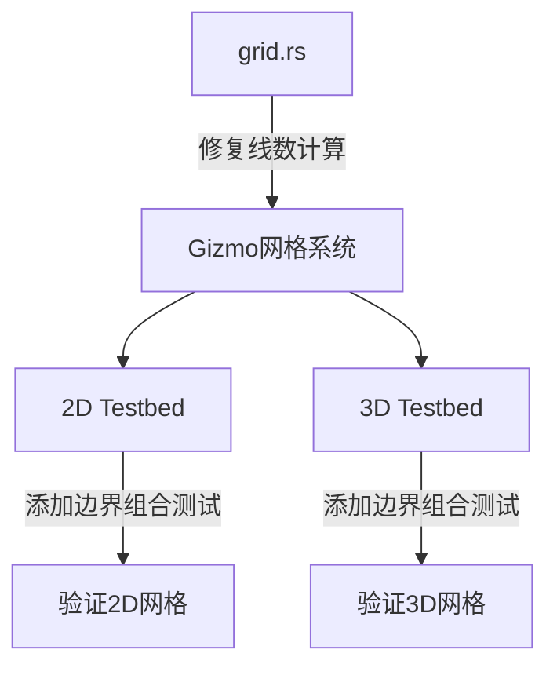

+++
title = "#19697 Bug fix in Gizmo grid"
date = "2025-07-29T00:00:00"
draft = false
template = "pull_request_page.html"
in_search_index = false

[extra]
current_language = "zh-cn"
available_languages = {"en" = { name = "English", url = "/pull_request/bevy/2025-07/pr-19697-en-20250729" }, "zh-cn" = { name = "中文", url = "/pull_request/bevy/2025-07/pr-19697-zh-cn-20250729" }}
labels = ["C-Bug", "A-Gizmos", "M-Deliberate-Rendering-Change"]
+++

# Bug fix in Gizmo grid

## Basic Information
- **Title**: Bug fix in Gizmo grid
- **PR Link**: https://github.com/bevyengine/bevy/pull/19697
- **Author**: theotherphil
- **Status**: MERGED
- **Labels**: C-Bug, S-Ready-For-Final-Review, A-Gizmos, M-Deliberate-Rendering-Change
- **Created**: 2025-06-17T18:59:45Z
- **Merged**: 2025-07-29T20:39:30Z
- **Merged By**: alice-i-cecile

## Description Translation
修复 https://github.com/bevyengine/bevy/issues/19480

### 解决方案
修正每个方向上线段数量的计算

### 测试
在 testbed/example_3d 和 testbed/example_2d 的 gizmos 屏幕中添加了网格


## The Story of This Pull Request

### 问题背景
在 Bevy 引擎的 Gizmo 网格系统中，当网格单元数量较少时，网格线渲染存在缺陷。具体表现为：当启用 outer_edges 选项时，网格边界线未能正确渲染；当禁用时，内部网格线数量计算错误。这导致开发者无法准确依赖网格进行调试和可视化，影响开发体验。

问题源于计算每个方向网格线数量的逻辑缺陷。原实现在计算线数时使用了向量运算，但未正确处理边界条件：
```rust
// 原错误实现
let outer_edges_u32 = UVec3::from(outer_edges.map(|v| v as u32));
let line_count = outer_edges_u32 * cell_count.saturating_add(UVec3::ONE)
    + (UVec3::ONE - outer_edges_u32) * cell_count.saturating_sub(UVec3::ONE);
```
此公式在单元数为1时会产生负数或零值，导致网格线缺失。

### 解决方案
核心修复是重构线数计算逻辑，引入专用函数处理边界条件：
```rust
#[inline]
fn cell_count_to_line_count(include_outer: bool, cell_count: u32) -> u32 {
    if include_outer {
        cell_count.saturating_add(1)
    } else {
        cell_count.saturating_sub(1).max(1)
    }
}
```
该函数明确处理两种情况：
1. 当包含外边界时：线数 = 单元数 + 1
2. 当不包含外边界时：线数 = max(单元数 - 1, 1)，确保至少1条线

在三维网格中，每个轴向的线数计算需考虑两个垂直方向的单元数：
```rust
let x_line_count = UVec2::new(
    cell_count_to_line_count(outer_edges[0], cell_count.y),
    cell_count_to_line_count(outer_edges[0], cell_count.z),
);
```
这种设计确保：
- X轴向的线数由Y和Z方向的单元数决定
- 计算过程解耦各轴向依赖
- 明确处理单元数为1的边界情况

### 验证策略
为验证修复效果，在测试用例中添加了系统化的网格验证：
1. 2D 测试床添加4种边界组合(00,01,10,11)
```rust
for i in 0..4 {
    // ...
    if i & 1 > 0 { grid = grid.outer_edges_x(); }
    if i & 2 > 0 { grid.outer_edges_y(); }
}
```
2. 3D 测试床添加8种边界组合(000 到 111)
```rust
for i in 0..8 {
    // ...
    if i & 1 > 0 { grid = grid.outer_edges_x(); }
    if i & 2 > 0 { grid = grid.outer_edges_y(); }
    if i & 4 > 0 { grid.outer_edges_z(); }
}
```
这种穷举测试确保所有边界条件都被覆盖，包括：
- 单单元网格
- 混合启用/禁用边界
- 不同轴向配置

### 工程影响
此修复：
1. 确保网格在所有单元数量下正确渲染
2. 提升API可靠性：outer_edges_x/y/z方法行为符合预期
3. 通过测试用例防止回归
4. 优化代码结构：使用专用函数替代复杂向量运算，提升可读性

修改同时更新了文档注释，明确outer_edges方法作用的是平行于轴向的边界：
```rust
- /// Declare that the outer edges of the grid along the x axis should be drawn.
+ /// Declare that the outer edges of the grid parallel to the x axis should be drawn.
```

## Visual Representation


## Key Files Changed

### File: crates/bevy_gizmos/src/grid.rs
修复网格线数计算的核心逻辑
```rust
// Before:
let outer_edges_u32 = UVec3::from(outer_edges.map(|v| v as u32));
let line_count = outer_edges_u32 * cell_count.saturating_add(UVec3::ONE)
    + (UVec3::ONE - outer_edges_u32) * cell_count.saturating_sub(UVec3::ONE);

// After:
#[inline]
fn cell_count_to_line_count(include_outer: bool, cell_count: u32) -> u32 {
    if include_outer {
        cell_count.saturating_add(1)
    } else {
        cell_count.saturating_sub(1).max(1)
    }
}

let x_line_count = UVec2::new(
    cell_count_to_line_count(outer_edges[0], cell_count.y),
    cell_count_to_line_count(outer_edges[0], cell_count.z),
);
```

### File: examples/testbed/2d.rs
添加2D网格验证用例
```rust
// 添加在draw_gizmos函数内
for i in 0..4 {
    let x = 200.0 * (1.0 + (i % 2) as f32);
    let y = 150.0 * (0.5 - (i / 2) as f32);
    let mut grid = gizmos.grid(
        Vec3::new(x, y, 0.0),
        UVec2::new(5, 4),
        Vec2::splat(30.),
        Color::WHITE,
    );
    if i & 1 > 0 {
        grid = grid.outer_edges_x();
    }
    if i & 2 > 0 {
        grid.outer_edges_y();
    }
}
```

### File: examples/testbed/3d.rs
添加3D网格验证用例
```rust
// 添加在draw_gizmos函数内
for i in 0..8 {
    let x = 1.5 * (i % 4) as f32;
    let y = 1.0 * (0.5 - (i / 4) as f32);
    let mut grid = gizmos.grid_3d(
        Isometry3d::from_translation(Vec3::new(x, y, 0.0)),
        UVec3::new(5, 4, 3),
        Vec3::splat(0.175),
        Color::WHITE,
    );
    if i & 1 > 0 {
        grid = grid.outer_edges_x();
    }
    if i & 2 > 0 {
        grid = grid.outer_edges_y();
    }
    if i & 4 > 0 {
        grid.outer_edges_z();
    }
}
```

## Further Reading
1. [Bevy Gizmos 官方文档](https://docs.rs/bevy_gizmos/latest/bevy_gizmos/) - 了解Gizmo系统API
2. [原始Issue #19480](https://github.com/bevyengine/bevy/issues/19480) - 问题详细描述
3. [Saturating Arithmetic](https://doc.rust-lang.org/std/num/struct.Saturating.html) - Rust饱和运算机制
4. [UVec2/UVec3 类型文档](https://docs.rs/bevy/latest/bevy/math/struct.UVec2.html) - Bevy无符号向量类型