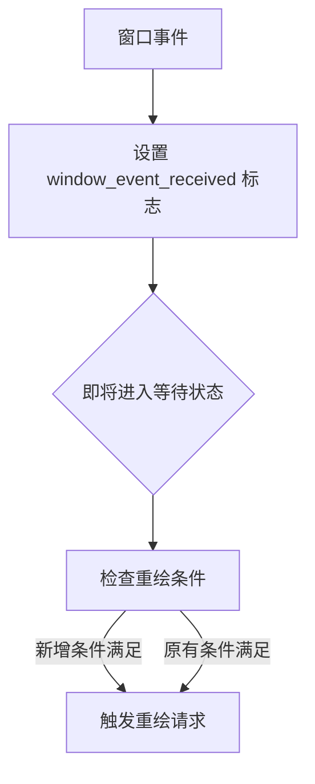

+++
title = "#19772 Fix intermittent drag-and-drop freezing on Windows"
date = "2025-07-29T00:00:00"
draft = false
template = "pull_request_page.html"
in_search_index = false

[extra]
current_language = "zh-cn"
available_languages = {"en" = { name = "English", url = "/pull_request/bevy/2025-07/pr-19772-en-20250729" }, "zh-cn" = { name = "中文", url = "/pull_request/bevy/2025-07/pr-19772-zh-cn-20250729" }}
+++

# 修复 Windows 平台拖拽操作偶发冻结问题

## 基础信息
- **标题**: Fix intermittent drag-and-drop freezing on Windows
- **PR 链接**: https://github.com/bevyengine/bevy/pull/19772
- **作者**: zachbateman
- **状态**: 已合并
- **标签**: C-Bug, A-Windowing, O-Windows, S-Ready-For-Final-Review, P-Regression
- **创建时间**: 2025-06-21T20:34:42Z
- **合并时间**: 2025-07-29T21:29:18Z
- **合并人**: alice-i-cecile

## 问题描述翻译
### 目标

修复 #19030。

自 Bevy 0.15.3 起，Windows 平台存在一个缺陷：拖拽操作(drag-and-drop)偶尔会导致应用程序冻结，唯一解决方法是调整窗口大小。

### 解决方案

在判断是否需要重绘时，增加对窗口事件接收情况的检查——特别是针对 Windows 平台。拖拽事件会将 `self.window_event_received` 标志置为 true。

对于非 Windows 平台，始终调用 `self.redraw_requested(event_loop)`，但 Windows 平台的特定分支检查在某些情况下未能正确处理拖拽事件（可能还有其他类型事件）。

**注意**：不确定为何冻结仅间歇性发生。此修复解决了特定的拖拽冻结问题，但可能存在更深层的缺陷导致初始行为异常。

### 测试验证

在 Windows 11 的拖拽示例中可复现间歇性冻结，此修复能彻底解决该问题。

---

### 问题演示

以下是修复前存在的间歇性冻结现象。当拖拽示例窗口无内容时，整个应用完全冻结，直到调整窗口大小。

https://github.com/user-attachments/assets/0d64b21c-a843-4b4e-8b6c-8bc5d6f9dfbe

---

## PR 技术分析

### 问题根源与背景
该 PR 解决 Windows 平台下的特定缺陷：当用户执行拖拽操作时，Bevy 应用可能进入冻结状态。此问题自 v0.15.3 引入，被归类为回归缺陷(P-Regression)。冻结发生时，应用停止响应且不渲染新帧，强制用户必须调整窗口大小才能恢复。问题根源在于 Windows 平台的事件处理逻辑未正确响应拖拽事件，导致渲染循环未能触发重绘。

### 解决方案设计
开发者通过分析发现，Windows 平台的事件处理分支(`WINIT_WINDOWS.with_borrow(...)`)在特定条件下未能检测到拖拽事件。核心修复策略是在重绘条件判断中增加对 `window_event_received` 标志的检查。该标志由窗口事件处理器设置，能准确反映拖拽等关键事件的发生。

替代方案考虑过完全移除 Windows 特定分支，直接采用 `self.redraw_requested(event_loop)`（与非 Windows 平台行为一致）。但保留平台特定检查是更谨慎的选择，因为这些检查可能针对其他 Windows 特有行为提供优化。

### 实现细节
关键修改位于事件循环的 `about_to_wait` 处理逻辑。当应用即将进入等待状态时，系统需判断是否需要主动请求重绘。原始实现包含四个条件判断，但遗漏了对窗口事件的显式检查：

```rust
// 修改前条件判断
if !exiting
    && (self.startup_forced_updates > 0
        || headless
        || all_invisible
        || reactive)
```

修复方案新增第五个条件，确保接收到窗口事件时必定触发重绘：

```rust
// 修改后条件判断
if !exiting
    && (self.startup_forced_updates > 0
        || headless
        || all_invisible
        || reactive
        || self.window_event_received)  // 新增窗口事件检查
```

此修改通过 `self.window_event_received` 标志（由窗口事件处理器设置）捕获拖拽操作等关键事件。当 `WindowEvent` 发生时（如 `DroppedFile` 事件），该标志被置位，确保事件循环正确响应。

### 技术考量
1. **最小化变更**：仅增加一个条件判断，避免改动复杂事件处理逻辑
2. **平台特异性**：保留原有 Windows 平台检查，维持其他优化行为
3. **标志机制**：利用现有状态变量避免新增数据结构
4. **行为一致性**：非 Windows 平台始终请求重绘，Windows 平台通过扩展条件实现同等效果

### 实际影响
1. 彻底解决 Windows 拖拽冻结问题
2. 保持原有事件处理框架不变
3. 验证方案通过拖拽示例测试，消除间歇性冻结
4. 未引入可观测的性能损耗

## 关键文件变更

### `crates/bevy_winit/src/state.rs`
**变更描述**：在重绘条件判断中增加窗口事件检查，解决 Windows 平台拖拽冻结问题。

**代码变更**：
```diff
@@ -529,7 +529,11 @@ impl<T: BufferedEvent> ApplicationHandler<T> for WinitAppRunnerState<T> {
                     .iter()
                     .all(|(_, w)| !w.is_visible().unwrap_or(false));
                 if !exiting
-                    && (self.startup_forced_updates > 0 || headless || all_invisible || reactive)
+                    && (self.startup_forced_updates > 0
+                        || headless
+                        || all_invisible
+                        || reactive
+                        || self.window_event_received)
                 {
                     self.redraw_requested(event_loop);
                 }
```

**关联性**：这是本 PR 的唯一变更，直接解决核心问题。通过扩展重绘触发条件，确保拖拽事件能正确唤醒渲染循环。

## 组件关系


## 延伸阅读
1. [winit 事件处理文档](https://docs.rs/winit/latest/winit/event_loop/struct.EventLoop.html)
2. [Bevy 窗口系统架构](https://github.com/bevyengine/bevy/tree/main/crates/bevy_winit)
3. [Windows 拖拽事件规范](https://learn.microsoft.com/en-us/windows/win32/winmsg/wm-dropfiles)