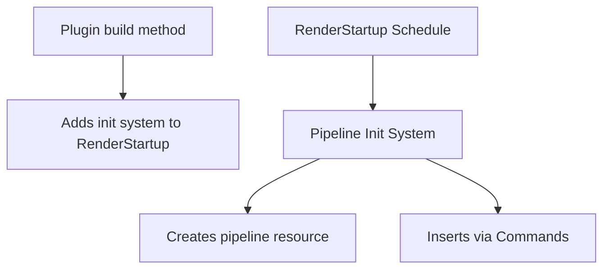

+++
title = "#19901 Use `RenderStartup` in `bevy_ui`."
date = "2025-07-05T00:00:00"
draft = false
template = "pull_request_page.html"
in_search_index = true

[taxonomies]
list_display = ["show"]

[extra]
current_language = "en"
available_languages = {"en" = { name = "English", url = "/pull_request/bevy/2025-07/pr-19901-en-20250705" }, "zh-cn" = { name = "中文", url = "/pull_request/bevy/2025-07/pr-19901-zh-cn-20250705" }}
labels = ["A-Rendering", "C-Code-Quality", "D-Straightforward"]
+++

# Technical Analysis: RenderStartup in bevy_ui

## Basic Information
- **Title**: Use `RenderStartup` in `bevy_ui`.
- **PR Link**: https://github.com/bevyengine/bevy/pull/19901
- **Author**: andriyDev
- **Status**: MERGED
- **Labels**: A-Rendering, C-Code-Quality, S-Ready-For-Final-Review, D-Straightforward
- **Created**: 2025-07-01T04:22:52Z
- **Merged**: 2025-07-05T04:26:56Z
- **Merged By**: alice-i-cecile

## Description Translation
# Objective

- Progress towards #19887.

## Solution

- Convert `FromWorld` impls into systems that run in `RenderStartup`.
- Move `UiPipeline` init to `build_ui_render` instead of doing it separately in `finish`.

Note: I am making several of these systems pub so that users could order their systems relative to them. This is to match the fact that these types previously were FromWorld so users could initialize them.

## Testing

- Ran `ui_material`, `ui_texture_slice`, `box_shadow`, and `gradients` examples and it still worked.

## The Story of This Pull Request

### The Problem and Context
The Bevy UI rendering system previously initialized several pipeline resources using the `FromWorld` trait implementation. This approach had two main limitations:

1. **Implicit initialization**: `FromWorld` runs when resources are first accessed, making initialization timing unpredictable
2. **Plugin lifecycle issues**: Initialization was spread between `build` and `finish` methods in plugins, creating maintenance overhead

These issues became apparent while working toward #19887, which aims to improve rendering system initialization. The existing approach made it difficult for users to control initialization order relative to their own systems.

### The Solution Approach
The solution converts all pipeline initialization from `FromWorld` implementations to explicit systems running in the `RenderStartup` schedule. This approach provides:

1. **Explicit initialization timing**: Systems run at a predictable point in the render app startup
2. **Direct ordering control**: Public systems allow users to explicitly order initialization relative to their own systems
3. **Simplified plugin lifecycle**: Removes the need for separate `finish` methods in plugins

The key engineering decisions were:
- Replacing `FromWorld` with command-based resource insertion
- Moving all initialization into `build` methods
- Making initialization systems public for user ordering control

### The Implementation
Each pipeline resource now has a dedicated initialization system that creates the resource and inserts it using commands. For example, the `UiPipeline` initialization changed from a `FromWorld` impl to a system:

```rust
// Before (FromWorld implementation)
impl FromWorld for UiPipeline {
    fn from_world(world: &mut World) -> Self {
        let render_device = world.resource::<RenderDevice>();
        // ... layout creation logic ...
        UiPipeline {
            view_layout,
            image_layout,
            shader: load_embedded_asset!(world, "ui.wgsl"),
        }
    }
}

// After (explicit system)
pub fn init_ui_pipeline(
    mut commands: Commands,
    render_device: Res<RenderDevice>,
    asset_server: Res<AssetServer>,
) {
    let view_layout = render_device.create_bind_group_layout(...);
    let image_layout = render_device.create_bind_group_layout(...);
    
    commands.insert_resource(UiPipeline {
        view_layout,
        image_layout,
        shader: load_embedded_asset!(asset_server.as_ref(), "ui.wgsl"),
    });
}
```

Plugin setup was simplified by removing `finish` methods and adding the initialization systems directly in `build`:

```rust
// Before
fn build(&self, app: &mut App) {
    // ... other setup ...
}

fn finish(&self, app: &mut App) {
    if let Some(render_app) = app.get_sub_app_mut(RenderApp) {
        render_app.init_resource::<UiPipeline>();
    }
}

// After
fn build(&self, app: &mut App) {
    // ... other setup ...
    app.add_systems(RenderStartup, init_ui_pipeline);
    // finish method completely removed
}
```

### Technical Insights
The key technical changes include:

1. **Resource initialization pattern**:
   - Uses standard ECS patterns instead of special-case `FromWorld`
   - Improves compatibility with system ordering APIs

2. **Asset loading**:
   - Changes from `load_embedded_asset!(world, ...)` to `load_embedded_asset!(asset_server.as_ref(), ...)`
   - Uses the asset server directly instead of through the world

3. **System parameterization**:
   - Initialization systems take only necessary resources (`RenderDevice`, `AssetServer`)
   - Avoids full world access for better encapsulation

### The Impact
These changes provide concrete improvements:

1. **Explicit control**: Users can now order systems relative to pipeline initialization
2. **Simplified maintenance**: Removes 5 separate `finish` methods across plugins
3. **Progress toward #19887**: Advances the larger goal of rendering system improvements
4. **Preserved functionality**: All existing examples (`ui_material`, `box_shadow`, etc.) continue working as verified by tests

The changes also demonstrate a pattern for converting implicit initialization to explicit systems, which could be applied to other parts of the codebase.

## Visual Representation



## Key Files Changed

### crates/bevy_ui_render/src/pipeline.rs (+27/-27)
Converts `UiPipeline` from `FromWorld` to explicit system initialization.

**Key changes:**
```rust
// Before
impl FromWorld for UiPipeline {
    fn from_world(world: &mut World) -> Self {
        let render_device = world.resource::<RenderDevice>();
        // ... layout creation ...
        UiPipeline { ... }
    }
}

// After
pub fn init_ui_pipeline(mut commands: Commands, ...) {
    // ... layout creation ...
    commands.insert_resource(UiPipeline { ... });
}
```

### crates/bevy_ui_render/src/box_shadow.rs (+19/-24)
Converts `BoxShadowPipeline` initialization to a system and removes plugin finish method.

**Key changes:**
```rust
// Before
impl Plugin for BoxShadowPlugin {
    fn finish(&self, app: &mut App) {
        render_app.init_resource::<BoxShadowPipeline>();
    }
}

// After
impl Plugin for BoxShadowPlugin {
    fn build(&self, app: &mut App) {
        app.add_systems(RenderStartup, init_box_shadow_pipeline);
    }
    // finish method removed
}
```

### crates/bevy_ui_render/src/gradient.rs (+19/-24)
Same pattern applied to `GradientPipeline`.

### crates/bevy_ui_render/src/ui_material_pipeline.rs (+36/-42)
Converts `UiMaterialPipeline` initialization to a generic system function.

**Key changes:**
```rust
// Before
impl<M: UiMaterial> FromWorld for UiMaterialPipeline<M> { ... }

// After
pub fn init_ui_material_pipeline<M: UiMaterial>(mut commands: Commands, ...) {
    // ... pipeline creation ...
    commands.insert_resource(UiMaterialPipeline::<M> { ... });
}
```

### crates/bevy_ui_render/src/ui_texture_slice_pipeline.rs (+30/-35)
Converts `UiTextureSlicePipeline` initialization to a system.

## Further Reading
1. [Bevy Render Schedules Documentation](https://docs.rs/bevy_render/latest/bevy_render/renderer/struct.RenderSet.html)
2. [ECS System Ordering](https://bevy-cheatbook.github.io/programming/system-order.html)
3. [Bevy Plugin Development](https://bevy-cheatbook.github.io/programming/plugins.html)