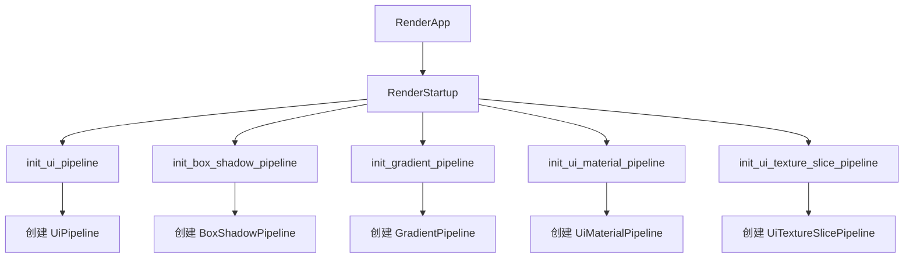

+++
title = "#19901 RenderStartup in bevy_ui"
date = "2025-07-05T00:00:00"
draft = false
template = "pull_request_page.html"
in_search_index = false

[extra]
current_language = "zh-cn"
available_languages = {"en" = { name = "English", url = "/pull_request/bevy/2025-07/pr-19901-en-20250705" }, "zh-cn" = { name = "中文", url = "/pull_request/bevy/2025-07/pr-19901-zh-cn-20250705" }}
+++

# 使用 RenderStartup 优化 bevy_ui 初始化流程

## 基础信息
- **标题**: RenderStartup in bevy_ui
- **PR 链接**: https://github.com/bevyengine/bevy/pull/19901
- **作者**: andriyDev
- **状态**: 已合并
- **标签**: A-Rendering, C-Code-Quality, S-Ready-For-Final-Review, D-Straightforward
- **创建时间**: 2025-07-01T04:22:52Z
- **合并时间**: 2025-07-05T04:26:56Z
- **合并人**: alice-i-cecile

## 描述翻译
### 目标
- 推进 #19887 的进展

### 解决方案
- 将 `FromWorld` 实现转换为在 `RenderStartup` 中运行的系统
- 将 `UiPipeline` 初始化移动到 `build_ui_render` 中，而不是在 `finish` 中单独进行

注意：我将其中几个系统设为公开(pub)，以便用户可以相对于这些系统安排他们的系统顺序。这是为了匹配这些类型以前是 FromWorld 的事实，因此用户可以初始化它们。

### 测试
- 运行了 `ui_material`、`ui_texture_slice`、`box_shadow` 和 `gradients` 示例，功能仍然正常工作

## 变更分析

### 问题背景
在 Bevy 引擎的渲染管线初始化中，多个 UI 相关资源（如 `UiPipeline`、`BoxShadowPipeline` 等）使用 `FromWorld` trait 进行初始化。这种方式存在两个主要问题：

1. **初始化时机不明确**：`FromWorld` 在资源首次访问时隐式初始化，难以控制初始化顺序
2. **生命周期管理问题**：初始化逻辑分散在 `finish` 方法中，与渲染应用的启动流程耦合

具体到代码实现，之前的模式是在 Plugin 的 `finish` 方法中调用 `init_resource`：
```rust
fn finish(&self, app: &mut App) {
    if let Some(render_app) = app.get_sub_app_mut(RenderApp) {
        render_app.init_resource::<UiPipeline>();
    }
}
```
这种方式导致初始化逻辑与插件生命周期管理耦合，且难以处理资源间的依赖关系。

### 解决方案
PR 的核心策略是将资源初始化迁移到 `RenderStartup` 系统阶段：
1. 移除所有 `FromWorld` trait 实现
2. 为每个资源创建显式的初始化系统
3. 在渲染应用构建时注册这些系统到 `RenderStartup` 阶段
4. 移除 `finish` 方法中的初始化逻辑

这种改变带来几个关键优势：
- **明确的初始化阶段**：所有渲染资源在 `RenderStartup` 阶段统一初始化
- **依赖注入**：通过系统参数自动处理资源依赖
- **顺序控制**：用户可以显式控制初始化系统的执行顺序

### 具体实现
#### 1. 从 `FromWorld` 到初始化系统
典型变更模式是移除 `FromWorld` 实现，替换为接收依赖项的系统：

**box_shadow.rs 变更示例**
```rust
// 之前
impl FromWorld for BoxShadowPipeline {
    fn from_world(world: &mut World) -> Self {
        let render_device = world.resource::<RenderDevice>();
        // ... 资源创建逻辑 ...
    }
}

// 之后
pub fn init_box_shadow_pipeline(
    mut commands: Commands,
    render_device: Res<RenderDevice>,
    asset_server: Res<AssetServer>,
) {
    let view_layout = render_device.create_bind_group_layout(/* ... */);
    commands.insert_resource(BoxShadowPipeline {
        view_layout,
        shader: load_embedded_asset!(asset_server.as_ref(), "box_shadow.wgsl"),
    });
}
```

#### 2. 渲染应用配置
在插件构建中注册初始化系统：

```rust
// lib.rs 变更
impl Plugin for UiRenderPlugin {
    fn build(&self, app: &mut App) {
        // ...
        app.add_systems(RenderStartup, init_ui_pipeline)
        // ...
    }
    
    // 移除 finish 方法
}
```

#### 3. 依赖项处理
初始化系统通过参数声明依赖：
```rust
pub fn init_ui_pipeline(
    mut commands: Commands,
    render_device: Res<RenderDevice>,  // 显式依赖 RenderDevice
    asset_server: Res<AssetServer>,    // 显式依赖 AssetServer
) {
    // ...
}
```
这种方式比 `FromWorld` 更清晰地表达了资源依赖关系。

#### 4. 泛型资源处理
对于泛型资源如 `UiMaterialPipeline<M>`，实现类型特定的初始化系统：

```rust
pub fn init_ui_material_pipeline<M: UiMaterial>(
    mut commands: Commands,
    render_device: Res<RenderDevice>,
    asset_server: Res<AssetServer>,
) {
    let ui_layout = M::bind_group_layout(&render_device);
    // ...
    commands.insert_resource(UiMaterialPipeline::<M> { /* ... */ });
}
```

### 技术洞察
1. **RenderStartup 阶段优势**：
   - 在渲染图构建前执行
   - 保证在渲染系统运行前完成初始化
   - 提供明确的资源初始化点

2. **依赖反转**：
   ```mermaid
   graph LR
       A[初始化系统] --> B[RenderDevice]
       A --> C[AssetServer]
       A --> D[其他资源]
   ```
   系统参数显式声明依赖，不再需要直接访问 World

3. **资源加载优化**：
   使用 `load_embedded_asset!` 宏时直接传入 `&AssetServer`：
   ```rust
   shader: load_embedded_asset!(asset_server.as_ref(), "box_shadow.wgsl")
   ```
   比之前的 `world` 参数更精确地表达依赖关系

### 影响评估
1. **正向影响**：
   - 初始化逻辑更集中明确
   - 减少插件生命周期方法的耦合
   - 提高代码可读性和可维护性
   - 为系统排序提供更多控制

2. **用户影响**：
   - 公开(pub)初始化系统允许用户自定义执行顺序
   - 不影响现有功能（通过示例测试验证）

3. **性能考量**：
   - 初始化发生在启动阶段，不影响运行时性能
   - 资源创建逻辑本身未改变，无额外开销

## 关键文件变更

### 1. `crates/bevy_ui_render/src/pipeline.rs` (+27/-27)
**变更描述**：将 `UiPipeline` 从 `FromWorld` 迁移到 `RenderStartup` 系统  
**关键代码**：
```rust
// 之前
impl FromWorld for UiPipeline {
    fn from_world(world: &mut World) -> Self {
        let render_device = world.resource::<RenderDevice>();
        // ... 创建 view_layout 和 image_layout ...
        UiPipeline {
            view_layout,
            image_layout,
            shader: load_embedded_asset!(world, "ui.wgsl"),
        }
    }
}

// 之后
pub fn init_ui_pipeline(
    mut commands: Commands,
    render_device: Res<RenderDevice>,
    asset_server: Res<AssetServer>,
) {
    let view_layout = render_device.create_bind_group_layout(/* ... */);
    let image_layout = render_device.create_bind_group_layout(/* ... */);
    commands.insert_resource(UiPipeline {
        view_layout,
        image_layout,
        shader: load_embedded_asset!(asset_server.as_ref(), "ui.wgsl"),
    });
}
```

### 2. `crates/bevy_ui_render/src/ui_material_pipeline.rs` (+36/-42)
**变更描述**：迁移泛型 UI 材质管线初始化  
**关键代码**：
```rust
// 之前
impl<M: UiMaterial> FromWorld for UiMaterialPipeline<M> {
    fn from_world(world: &mut World) -> Self {
        // ... 复杂的世界资源访问 ...
    }
}

// 之后
pub fn init_ui_material_pipeline<M: UiMaterial>(
    mut commands: Commands,
    render_device: Res<RenderDevice>,
    asset_server: Res<AssetServer>,
) {
    let ui_layout = M::bind_group_layout(&render_device);
    // ... 创建布局 ...
    commands.insert_resource(UiMaterialPipeline::<M> {
        // ... 字段初始化 ...
    });
}
```

### 3. `crates/bevy_ui_render/src/box_shadow.rs` (+19/-24)
**变更描述**：迁移阴影管线初始化  
**关键代码**：
```rust
// 之前
impl Plugin for BoxShadowPlugin {
    fn finish(&self, app: &mut App) {
        if let Some(render_app) = app.get_sub_app_mut(RenderApp) {
            render_app.init_resource::<BoxShadowPipeline>();
        }
    }
}

// 之后
impl Plugin for BoxShadowPlugin {
    fn build(&self, app: &mut App) {
        // ...
        app.add_systems(RenderStartup, init_box_shadow_pipeline)
        // ...
    }
    // 移除 finish 方法
}
```

### 4. `crates/bevy_ui_render/src/gradient.rs` (+19/-24)
**变更描述**：迁移渐变管线初始化  
**关键代码**：
```rust
// 之前
impl FromWorld for GradientPipeline {
    fn from_world(world: &mut World) -> Self {
        // ...
    }
}

// 之后
pub fn init_gradient_pipeline(
    mut commands: Commands,
    render_device: Res<RenderDevice>,
    asset_server: Res<AssetServer>,
) {
    // ...
    commands.insert_resource(GradientPipeline {
        view_layout,
        shader: load_embedded_asset!(asset_server.as_ref(), "gradient.wgsl"),
    });
}
```

### 5. `crates/bevy_ui_render/src/lib.rs` (关键变更点)
**变更描述**：整合 UI 渲染初始化流程  
**关键代码**：
```rust
impl Plugin for UiRenderPlugin {
    fn build(&self, app: &mut App) {
        // ...
        app.add_systems(RenderStartup, init_ui_pipeline)  // 注册主 UI 管线
        // ...
    }
    
    // 移除 finish 方法
}
```

### 6. `crates/bevy_ui_render/src/ui_texture_slice_pipeline.rs` (+30/-35)
**变更描述**：迁移纹理切片管线初始化  
**关键代码**：
```rust
pub fn init_ui_texture_slice_pipeline(
    mut commands: Commands,
    render_device: Res<RenderDevice>,
    asset_server: Res<AssetServer>,
) {
    // ... 创建布局 ...
    commands.insert_resource(UiTextureSlicePipeline {
        view_layout,
        image_layout,
        shader: load_embedded_asset!(asset_server.as_ref(), "ui_texture_slice.wgsl"),
    });
}
```

## 架构关系


## 总结
该 PR 通过将 UI 渲染资源的初始化从 `FromWorld` 迁移到 `RenderStartup` 系统，实现了以下改进：
1. 初始化逻辑更集中明确，全部在统一阶段完成
2. 消除插件 `finish` 方法中的特殊处理
3. 通过系统参数显式声明资源依赖
4. 保持原有功能不变，通过示例测试验证
5. 提供更灵活的系统排序控制

这是典型的代码质量改进，符合 Bevy 引擎向更明确、更声明式的资源初始化发展的趋势。

## 延伸阅读
1. [Bevy 系统阶段文档](https://bevyengine.org/learn/book/getting-started/stages/)
2. [ECS 资源管理最佳实践](https://github.com/bevyengine/bevy/discussions/3972)
3. [RenderStartup 技术讨论](https://github.com/bevyengine/bevy/pull/19887)