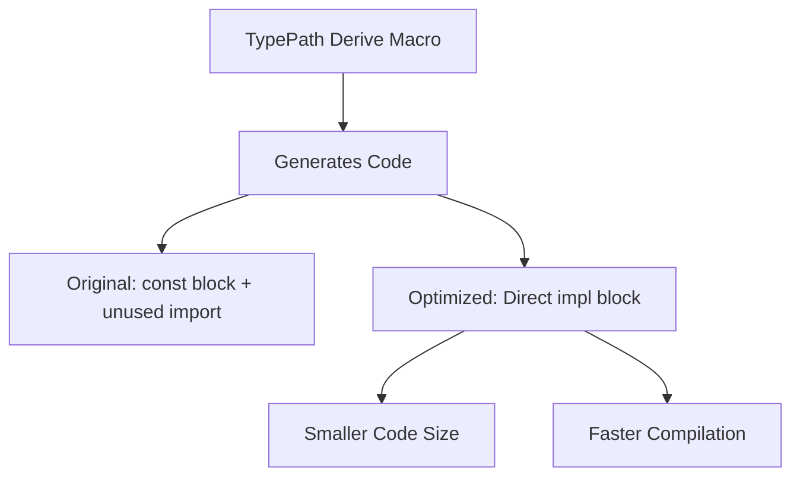

+++
title = "#19902 bevy_reflect: remove unnecessary `const _` around `TypePath` impl"
date = "2025-07-13T00:00:00"
draft = false
template = "pull_request_page.html"
in_search_index = true

[taxonomies]
list_display = ["show"]

[extra]
current_language = "en"
available_languages = {"en" = { name = "English", url = "/pull_request/bevy/2025-07/pr-19902-en-20250713" }, "zh-cn" = { name = "中文", url = "/pull_request/bevy/2025-07/pr-19902-zh-cn-20250713" }}
labels = ["C-Performance", "A-Reflection", "D-Straightforward", "D-Macros"]
+++

## Title  
bevy_reflect: remove unnecessary `const _` around `TypePath` impl

## Basic Information  
- **Title**: bevy_reflect: remove unnecessary `const _` around `TypePath` impl  
- **PR Link**: https://github.com/bevyengine/bevy/pull/19902  
- **Author**: nnethercote  
- **Status**: MERGED  
- **Labels**: C-Performance, S-Ready-For-Final-Review, A-Reflection, D-Straightforward, D-Macros  
- **Created**: 2025-07-01T06:59:25Z  
- **Merged**: 2025-07-13T22:59:05Z  
- **Merged By**: alice-i-cecile  

## Description Translation  
# Objective  

Derived `TypePath` impls have a `const _` block in order to hold a `use alloc::string::ToString` import. But that import is useless.  

Avoiding it helps with https://github.com/bevyengine/bevy/issues/19873.  

## Solution  

Remove the `use` and `const _`.  

## Testing  

I used cargo expand to confirm the `const _ ` is no longer produced.  

`-Zmacro-stats` output tells me this reduces the size of the `Reflect` code produced for `bevy_ui` from 1_880_486 bytes to 1_859_634 bytes, a 1.1% drop.  

## The Story of This Pull Request  

This pull request addresses a minor but impactful inefficiency in Bevy's reflection system. The core issue was in the code generation for derived `TypePath` implementations, which contained an unused import statement wrapped in a `const _` block. This construction served no functional purpose but added unnecessary bloat to the generated code.  

The problem originated from how the `bevy_reflect` derive macro generated implementations for the `TypePath` trait. The macro produced code that looked like this:  

```rust
const _: () = {
    extern crate alloc;
    use alloc::string::ToString;
    
    impl ... {
        // TypePath methods
    }
};
```  

The `const _` block was originally intended to scope the `alloc` import and prevent namespace pollution. However, the `ToString` import inside it was never actually used in the implementation. This meant every derived `TypePath` implementation included dead code - the unused import and its containing block.  

The solution was straightforward: remove both the unused `use alloc::string::ToString` statement and the surrounding `const _` block. This simplification changed the generated code to a direct implementation:  

```rust
impl ... {
    // TypePath methods
}
```  

This change has concrete benefits for code size and compilation efficiency. When using `cargo expand` to inspect macro output, the author confirmed the `const _` block was eliminated. More importantly, measurements with `-Zmacro-stats` showed the generated reflection code for `bevy_ui` decreased from 1,880,486 bytes to 1,859,634 bytes - a 1.1% reduction. While this seems modest, it accumulates across all reflection-heavy projects using Bevy, helping address binary bloat concerns like those tracked in issue #19873.  

The change required no complex engineering decisions since the removed code was demonstrably dead. The implementation maintains identical functionality while producing cleaner, more efficient output. This demonstrates how small optimizations in foundational systems like reflection can yield measurable improvements throughout the engine.  

## Visual Representation  



## Key Files Changed  

### crates/bevy_reflect/derive/src/impls/typed.rs  
**Changes**: Removed unnecessary `const _` block and unused import from `TypePath` derive implementation  
**Why**: The code was dead and contributed to binary bloat  
**Impact**: Reduces generated code size by ~1.1% for reflection-heavy crates  

**Code Comparison**:  
```rust
// Before:
quote! {
    #primitive_assert

    const _: () = {
        extern crate alloc;
        use alloc::string::ToString;

        impl #impl_generics #bevy_reflect_path::TypePath ... {
            // methods
        }
    };
}

// After:
quote! {
    #primitive_assert

    impl #impl_generics #bevy_reflect_path::TypePath ... {
        // methods
    }
}
```

## Further Reading  
- [Rust `const _` blocks](https://doc.rust-lang.org/reference/items/constant-items.html)  
- [Bevy Reflection System](https://bevyengine.org/learn/book/migration-guides/0.12-to-0.13/#reflect-changes)  
- [cargo expand utility](https://github.com/dtolnay/cargo-expand)  
- [Macro Expansion Statistics](https://doc.rust-lang.org/unstable-book/compiler-flags/macro-stats.html)