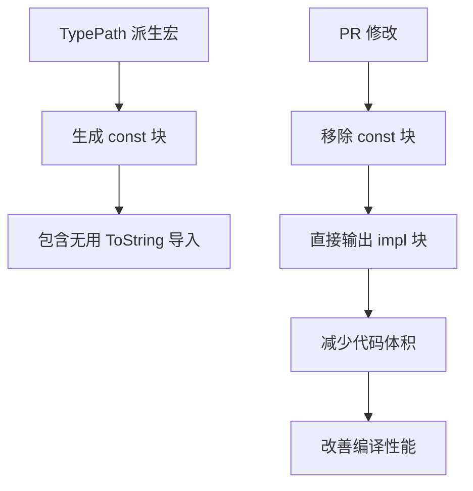

+++
title = "#19902 bevy_reflect: remove unnecessary `const _` around `TypePath` impl"
date = "2025-07-13T00:00:00"
draft = false
template = "pull_request_page.html"
in_search_index = false

[extra]
current_language = "zh-cn"
available_languages = {"en" = { name = "English", url = "/pull_request/bevy/2025-07/pr-19902-en-20250713" }, "zh-cn" = { name = "中文", url = "/pull_request/bevy/2025-07/pr-19902-zh-cn-20250713" }}
+++

## 技术报告：PR #19902 分析

### 基础信息
- **标题**: bevy_reflect: remove unnecessary `const _` around `TypePath` impl
- **PR链接**: https://github.com/bevyengine/bevy/pull/19902
- **作者**: nnethercote
- **状态**: MERGED
- **标签**: C-Performance, S-Ready-For-Final-Review, A-Reflection, D-Straightforward, D-Macros
- **创建时间**: 2025-07-01T06:59:25Z
- **合并时间**: 2025-07-13T22:59:05Z
- **合并者**: alice-i-cecile

### 描述翻译
**目标**  
派生的 `TypePath` 实现包含 `const _` 块来容纳 `use alloc::string::ToString` 导入。但该导入是无用的。  
避免此导入有助于解决 https://github.com/bevyengine/bevy/issues/19873。

**解决方案**  
移除 `use` 和 `const _`。

**测试**  
使用 cargo expand 确认 `const _` 不再生成。  
`-Zmacro-stats` 输出显示，该修改使 `bevy_ui` 的 `Reflect` 代码从 1_880_486 字节减少到 1_859_634 字节，减少 1.1%。

---

### PR 技术分析

#### 问题背景
在 Bevy 的反射系统中，通过派生宏生成的 `TypePath` 实现包含一个多余的代码结构：
```rust
const _: () = {
    extern crate alloc;
    use alloc::string::ToString;  // 实际未使用的导入
    
    // TypePath 实现...
};
```
这个 `const _` 块原本设计用于隔离 `alloc` crate 的导入，防止命名冲突。但其中包含的 `ToString` 导入未被实际使用，导致：
1. 不必要的编译开销
2. 增加生成的代码量
3. 影响编译性能（关联 issue #19873）

#### 解决方案
直接移除冗余结构，保留核心实现：
```rust
impl #impl_generics #bevy_reflect_path::TypePath for #type_path #ty_generics #where_reflect_clause {
    // 方法实现保持不变...
}
```
关键修改点：
1. 删除整个 `const _` 包装块
2. 移除未使用的 `ToString` 导入
3. 保留原有 `TypePath` trait 的方法实现逻辑不变

#### 技术验证
作者采用两种验证方式：
1. **cargo expand**：直接观察宏展开结果，确认 `const _` 块不再生成
2. **量化指标**：使用 Rust 的 `-Zmacro-stats` 标志测量代码体积变化：
   ```
   Before: 1_880_486 bytes 
   After:  1_859_634 bytes
   Reduction: 20,852 bytes (1.1%)
   ```
这种优化在大型项目中具有累积效应，特别是对于频繁使用反射的系统。

#### 实现影响
修改仅涉及派生宏的输出结构，不会：
1. 改变 `TypePath` 的公共 API 或功能
2. 影响现有用户代码
3. 引入兼容性变更

优化效果直接体现在编译过程：
- 减少编译器处理的 AST 节点数量
- 降低 LLVM IR 生成复杂度
- 改善增量编译性能

---

### 关键文件变更
**文件路径**: `crates/bevy_reflect/derive/src/impls/typed.rs`  
**修改说明**: 重构 `TypePath` 派生宏实现，移除冗余代码结构

#### 代码变更对比
```rust
// 修改前
pub(crate) fn impl_type_path(meta: &ReflectMeta) -> TokenStream {
    // ...准备代码...
    quote! {
        #primitive_assert

        // 冗余的 const 块
        const _: () = {
            extern crate alloc;
            use alloc::string::ToString;  // 未使用的导入

            impl #impl_generics #bevy_reflect_path::TypePath ... {
                // 方法实现...
            }
        };
    }
}

// 修改后
pub(crate) fn impl_type_path(meta: &ReflectMeta) -> TokenStream {
    // ...准备代码（不变）...
    quote! {
        #primitive_assert

        // 直接实现 TypePath
        impl #impl_generics #bevy_reflect_path::TypePath ... {
            // 相同的方法实现...
        }
    }
}
```

#### 变更要点
1. 移除 `const _: () = {...}` 包装层
2. 删除未使用的 `extern crate alloc` 和 `use` 语句
3. 保持核心 trait 实现逻辑不变
4. 减少 7 行代码（-23/+16）

---

### 技术图示


---

### 延伸阅读
1. [Rust 宏开发指南](https://doc.rust-lang.org/reference/macros-by-example.html)
2. [cargo-expand 工具文档](https://github.com/dtolnay/cargo-expand)
3. [Rust 编译性能优化技巧](https://github.com/rust-lang/rustc-perf/blob/master/docs/optimizations.md)
4. [关联 issue #19873: 编译性能优化](https://github.com/bevyengine/bevy/issues/19873)

---

### 完整代码变更
```diff
diff --git a/crates/bevy_reflect/derive/src/impls/typed.rs b/crates/bevy_reflect/derive/src/impls/typed.rs
index da8254d149339..b158973a7b613 100644
--- a/crates/bevy_reflect/derive/src/impls/typed.rs
+++ b/crates/bevy_reflect/derive/src/impls/typed.rs
@@ -106,34 +106,27 @@ pub(crate) fn impl_type_path(meta: &ReflectMeta) -> TokenStream {
     quote! {
         #primitive_assert
 
-        // To ensure alloc is available, but also prevent its name from clashing, we place the implementation inside an anonymous constant
-        const _: () = {
-            extern crate alloc;
-
-            use alloc::string::ToString;
-
-            impl #impl_generics #bevy_reflect_path::TypePath for #type_path #ty_generics #where_reflect_clause {
-                fn type_path() -> &'static str {
-                    #long_type_path
-                }
+        impl #impl_generics #bevy_reflect_path::TypePath for #type_path #ty_generics #where_reflect_clause {
+            fn type_path() -> &'static str {
+                #long_type_path
+            }
 
-                fn short_type_path() -> &'static str {
-                    #short_type_path
-                }
+            fn short_type_path() -> &'static str {
+                #short_type_path
+            }
 
-                fn type_ident() -> Option<&'static str> {
-                    #type_ident
-                }
+            fn type_ident() -> Option<&'static str> {
+                #type_ident
+            }
 
-                fn crate_name() -> Option<&'static str> {
-                    #crate_name
-                }
+            fn crate_name() -> Option<&'static str> {
+                #crate_name
+            }
 
-                fn module_path() -> Option<&'static str> {
-                    #module_path
-                }
+            fn module_path() -> Option<&'static str> {
+                #module_path
             }
-        };
+        }
     }
 }
```