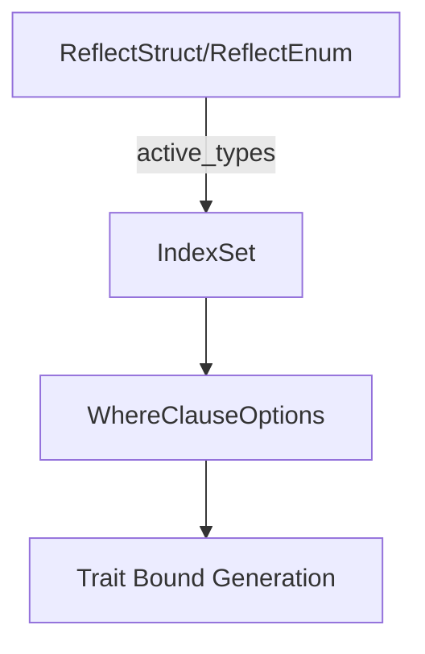

+++
title = "#19922"
date = "2025-07-14T00:00:00"
draft = false
template = "pull_request_page.html"
in_search_index = true

[taxonomies]
list_display = ["show"]

[extra]
current_language = "en"
available_languages = {"en" = { name = "English", url = "/pull_request/bevy/2025-07/pr-19922-en-20250714" }, "zh-cn" = { name = "中文", url = "/pull_request/bevy/2025-07/pr-19922-zh-cn-20250714" }}
+++

## Analysis of PR #19922: bevy_reflect: Use `active_types` instead of `active_fields` where appropriate

### The Problem and Context
This PR addresses minor inefficiencies in Bevy's reflection system introduced by #19876. The core issue was unnecessary data conversions when gathering active reflection types. Both `ReflectStruct` and `ReflectEnum` were collecting active field types into an `IndexSet` to deduplicate them, then converting this set into a `Vec`, only to later convert it into a boxed slice. These redundant conversions created avoidable memory allocations and processing overhead.

The problem was particularly relevant for:
1. **Performance-sensitive operations**: Reflection is used extensively in Bevy for serialization, deserialization, and editor tooling
2. **Large structs/enums**: The conversion overhead scaled with the number of fields
3. **Derive macros**: These changes affect the code generated by `#[derive(Reflect)]`

### The Solution Approach
The solution centered on consistently using `IndexSet<Type>` throughout the type processing pipeline instead of repeatedly converting between collection types. Key decisions included:

1. Preserving the deduplication benefits of `IndexSet` while eliminating intermediate conversions
2. Modifying `WhereClauseOptions` to directly consume the `IndexSet`
3. Propagating these changes through both struct and enum reflection logic
4. Maintaining identical public APIs while improving internal efficiency

### The Implementation
The changes were implemented through targeted modifications in two files:

**1. `derive_data.rs` (Struct and Enum handling)**
```rust
// Before: 
pub fn active_types(&self) -> Vec<Type> {
    self.active_fields()
        .map(|field| field.reflected_type().clone())
        .collect::<IndexSet<_>>()
        .into_iter()
        .collect::<Vec<_>>()
}

// After:
pub fn active_types(&self) -> IndexSet<Type> {
    self.active_fields()
        .map(|field| field.reflected_type().clone())
        .collect::<IndexSet<_>>()
}
```
- Eliminates two conversion steps (`IndexSet` → `Vec` → `BoxedSlice`)
- Returns `IndexSet` directly for immediate use

```rust
// Before:
WhereClauseOptions::new_with_fields(self.meta(), self.active_types().into_boxed_slice())

// After:
WhereClauseOptions::new_with_types(self.meta(), self.active_types())
```
- Avoids converting `Vec` to boxed slice
- Directly passes the already-deduplicated type set

**2. `where_clause_options.rs` (Trait Bound Generation)**
```rust
// Before:
pub(crate) struct WhereClauseOptions<'a, 'b> {
    meta: &'a ReflectMeta<'b>,
    active_fields: Box<[Type]>,
}

// After:
pub(crate) struct WhereClauseOptions<'a, 'b> {
    meta: &'a ReflectMeta<'b>,
    active_types: IndexSet<Type>,
}
```
- Stores types in their original deduplicated collection
- Eliminates boxed slice allocation

```rust
// Before:
Some(self.active_fields.iter().filter_map(...)

// After:
Some(self.active_types.iter().filter_map(...)
```
- Maintains identical filtering logic
- Operates directly on the deduplicated set

### Technical Insights
Key technical aspects of this optimization:

1. **Collection Efficiency**: 
   - `IndexSet` provides O(1) lookups while preserving insertion order
   - Avoiding intermediate collections reduces allocation pressure
   - Eliminates Vec → BoxedSlice conversion (heap allocation + memcpy)

2. **Type Processing**:
   - The `active_types` method now returns exactly what its consumers need
   - The deduplication happens once at the source
   - Changes are localized to the reflection internals

3. **Zero-Cost Abstraction**:
   - Public APIs remain unchanged (`active_types()` still available)
   - Derive macro output remains identical
   - Improvements are purely internal optimizations

### The Impact
These changes provide concrete benefits:

1. **Performance Gains**:
   - Eliminates 1-2 allocations per reflected type
   - Reduces memory copying during reflection setup
   - Especially beneficial for types with many fields

2. **Code Quality**:
   - More consistent use of collection types
   - Clearer data flow between components
   - Reduced complexity in trait bound generation

3. **Foundation for Future Optimizations**:
   - Sets precedent for direct use of efficient collections
   - Demonstrates how to optimize reflection internals
   - Provides cleaner structure for subsequent reflection improvements

### Visual Representation


### Key Files Changed

**1. crates/bevy_reflect/derive/src/derive_data.rs**
- Changed how active types are collected and propagated
- Before:
```rust
pub fn active_types(&self) -> Vec<Type> {
    // Collect via `IndexSet` to eliminate duplicate types.
    self.active_fields()
        .map(|field| field.reflected_type().clone())
        .collect::<IndexSet<_>>()
        .into_iter()
        .collect::<Vec<_>>()
}
```
- After:
```rust
pub fn active_types(&self) -> IndexSet<Type> {
    // Collect into an `IndexSet` to eliminate duplicate types.
    self.active_fields()
        .map(|field| field.reflected_type().clone())
        .collect::<IndexSet<_>>()
}
```

**2. crates/bevy_reflect/derive/src/where_clause_options.rs**
- Modified to directly consume IndexSet instead of boxed slice
- Before:
```rust
pub(crate) struct WhereClauseOptions<'a, 'b> {
    meta: &'a ReflectMeta<'b>,
    active_fields: Box<[Type]>,
}
```
- After:
```rust
pub(crate) struct WhereClauseOptions<'a, 'b> {
    meta: &'a ReflectMeta<'b>,
    active_types: IndexSet<Type>,
}
```

### Further Reading
1. [IndexSet Documentation](https://docs.rs/indexmap/latest/indexmap/set/struct.IndexSet.html) - Details about the collection used
2. [Original Reflection PR (#19876)](https://github.com/bevyengine/bevy/pull/19876) - Predecessor to these optimizations
3. [Bevy Reflection Book](https://bevyengine.org/learn/book/features/reflection/) - Core reflection concepts
4. [Rust Performance Patterns](https://nnethercote.github.io/perf-book/) - General optimization techniques