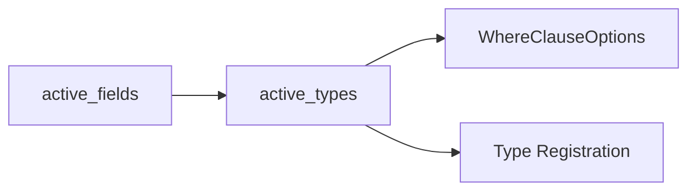

+++
title = "#19922 bevy_reflect: Use `active_types` instead of `active_fields` where appropriate"
date = "2025-07-14T00:00:00"
draft = false
template = "pull_request_page.html"
in_search_index = false

[extra]
current_language = "zh-cn"
available_languages = {"en" = { name = "English", url = "/pull_request/bevy/2025-07/pr-19922-en-20250714" }, "zh-cn" = { name = "中文", url = "/pull_request/bevy/2025-07/pr-19922-zh-cn-20250714" }}
labels = ["C-Performance", "C-Code-Quality", "A-Reflection"]
+++

# bevy_reflect: Use `active_types` instead of `active_fields` where appropriate

## Basic Information
- **Title**: bevy_reflect: Use `active_types` instead of `active_fields` where appropriate
- **PR Link**: https://github.com/bevyengine/bevy/pull/19922
- **Author**: nnethercote
- **Status**: MERGED
- **Labels**: C-Performance, C-Code-Quality, S-Ready-For-Final-Review, A-Reflection
- **Created**: 2025-07-02T01:57:24Z
- **Merged**: 2025-07-14T20:45:10Z
- **Merged By**: alice-i-cecile

## Description Translation
# Objective

基于 #19876 的后续修复，在适当位置使用 `active_types` 替代 `active_fields`。

对 #19873 有轻微帮助。

## Solution

- 描述用于实现上述目标的解决方案。

## Testing

我检查了 `cargo expand` 的输出并运行了 `cargo run -p ci`。

## The Story of This Pull Request

这个 PR 起源于对 bevy_reflect 系统内部效率的优化需求。在之前的实现中，反射系统处理结构体(struct)和枚举(enum)类型时，`active_types()` 方法会返回一个 `Vec<Type>`。该方法首先通过 `IndexSet` 去重字段类型，随后又立即将集合转换为向量(Vec)。这种实现方式在 #19876 的后续审查中被识别出存在不必要的性能开销。

问题的核心在于类型集合的处理路径。当反射系统生成 where 子句选项(WhereClauseOptions)时，它只需要去重后的类型集合进行迭代。但原有实现却经历了"集合→向量→切片"的转换过程：

```rust
// 原有实现
active_fields().map(...).collect::<IndexSet<_>>()  // 创建集合
    .into_iter()                                 // 转换为迭代器
    .collect::<Vec<_>>()                         // 再转换为向量
```

这种转换在性能敏感的代码路径中尤其值得优化，特别是在处理包含大量字段的类型时。每次调用都会产生额外的内存分配和数据处理开销。

解决方案直接明了：修改 `active_types()` 使其直接返回 `IndexSet<Type>` 类型。这一改动移除了冗余的类型转换：

```rust
// 优化后实现
active_fields().map(...).collect::<IndexSet<_>>()  // 直接返回集合
```

这一变化触发了级联修改。首先需要更新 `where_clause_options()` 方法，使其直接使用 `IndexSet` 而非向量切片。这通过将 `WhereClauseOptions::new_with_fields()` 替换为 `new_with_types()` 实现，后者直接接收索引集合作为参数。

在枚举类型的实现中，`impl_get_type_registration` 方法同样得到优化。原实现通过 `active_fields().map(StructField::reflected_type)` 重新计算类型集合，而优化后直接复用已计算的 `active_types().iter()`，避免了重复工作。

这些修改统一了类型处理路径：`active_types()` 现在直接提供去重后的类型集合，所有下游消费者都直接使用该集合。这消除了中间转换步骤，减少了内存分配和数据处理开销。

在验证方面，作者通过 `cargo expand` 检查了宏展开结果，并运行 CI 测试确保没有破坏现有功能。这种谨慎是必要的，因为反射系统是 Bevy ECS 的核心基础设施。

## Visual Representation



## Key Files Changed

### 1. `crates/bevy_reflect/derive/src/derive_data.rs`
- 将 `active_types()` 返回类型从 `Vec<Type>` 改为 `IndexSet<Type>`
- 移除冗余的集合转换操作
- 更新 `where_clause_options()` 和 `impl_get_type_registration()` 使用新接口

```rust
// Before:
pub fn active_types(&self) -> Vec<Type> {
    self.active_fields()
        .map(|field| field.reflected_type().clone())
        .collect::<IndexSet<_>>()
        .into_iter()
        .collect::<Vec<_>>()
}

// After:
pub fn active_types(&self) -> IndexSet<Type> {
    self.active_fields()
        .map(|field| field.reflected_type().clone())
        .collect::<IndexSet<_>>()
}
```

### 2. `crates/bevy_reflect/derive/src/where_clause_options.rs`
- 重构 `WhereClauseOptions` 使用 `IndexSet<Type>`
- 用 `new_with_types()` 替代 `new_with_fields()`
- 更新类型迭代逻辑

```rust
// Before:
pub fn new_with_fields(meta: &'a ReflectMeta<'b>, active_fields: Box<[Type]>) -> Self {
    Self { meta, active_fields }
}

// After:
pub fn new_with_types(meta: &'a ReflectMeta<'b>, active_types: IndexSet<Type>) -> Self {
    Self { meta, active_types }
}
```

## Further Reading
1. [PR #19876: 初始优化方案](https://github.com/bevyengine/bevy/pull/19876)
2. [Issue #19873: 反射系统性能优化](https://github.com/bevyengine/bevy/issues/19873)
3. [IndexSet 文档](https://docs.rs/indexmap/latest/indexmap/set/struct.IndexSet.html)